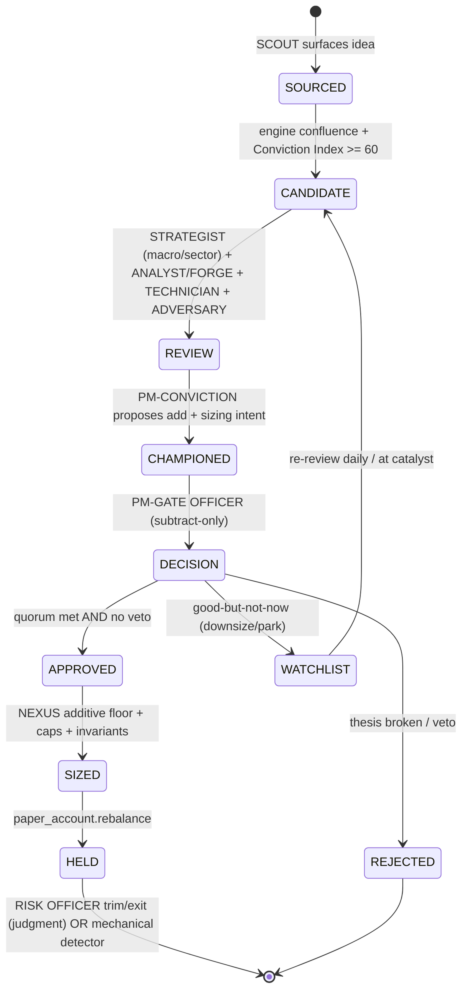

# Mastermind — The Desk: Multi-Role Organizational Architecture & Accountability/Learning Loop

**Version 1.0 · 2026-06-22**

---

## Abstract

The Mastermind Flagship paper book today auto-buys any name that clears two gates (engine confluence + a Conviction Index ≥ 60), with no seat judging *entry timing*, the *top-down backdrop*, or *judgment-based exits* — and no decision graded after the fact. This document redesigns the Flagship into an institutional **desk**: a right-name-AND-right-time funnel governed by **separation of powers** and **subtract-only safety**, where a passing score is mere CANDIDACY, an add requires a conjunctive **quorum** of positive sign-offs plus no Gate-Officer veto, good-but-not-now names are parked on a first-class **WATCHLIST**, and every decision type is logged as a falsifiable thesis, graded leakage-free vs SPY, and fed back through per-role calibration, KPIs, attribution, reputation, and **self-mirror** memory under a weekly **CIO** review. The deterministic engine (NEXUS) keeps the sole additive-sizing authority and enforces all hard invariants; judgment may only ever de-risk.

---

## Reading Guide

- **Start here, then read Ch01 → Ch02.** Ch01 is the thesis and the diagnosis; Ch02 is the constitutional org chart and authority model. Everything downstream cites them.
- **Ch01 §1.5.1 and Ch02 §2.3 are the canonical authority matrices.** Where any later chapter's table disagrees, those two win.
- **Ch07 is the build spec.** It is authoritative for all on-disk artifacts, paths, schemas, the `nexus()` extension, and the phased plan. When a path or parameter conflicts, Ch07 §7.1–7.3 governs.
- **The Canonical Brief §D is the single source of truth for role names and term definitions.** Use the exact names in the Glossary below.
- **Honesty over Alpha is binding.** No threshold is tuned to the one-day result or to IREN/KMT/FSS; nothing changes desk behavior until it clears effective-n / MIN_N significance.
- **Chapter file numbering does not match Ch01 §1.7's promised titles** — see Open Question #1. Use the Table of Contents below for the actual file → content mapping.

---

## Table of Contents

| # | File | Title | One-line | Key contents |
|---|---|---|---|---|
| 00 | `00-index.md` | **Index & Front Matter** | This document. | Abstract · reading guide · TOC · glossary · decision log · open questions. |
| 01 | `01-summary-and-diagnosis.md` | **Executive Summary, Design Philosophy & Diagnosis** | Why the pipeline is "score-passes → auto-buy", and the redesign thesis. | The four-gates/one-loop mission · 7 design principles (separation of powers, subtract-only, confirmation-over-prediction, concentration, watchlist, accountability, honesty) · the diagnosis (n=1 is noise; the durable structural flaw) · the entry state machine · **§1.5.1 canonical authority matrix + tie-breaks** · scope per book. |
| 02 | `02-organization-structure.md` | **The Desk: Organizational Structure & Decision Rights** | Who sits at the desk and what each may do. | Org chart · per-seat role profiles (mandate/inputs/outputs/rights/tier/cadence/metric) · **§2.3 canonical authority matrix** · **§2.4 conjunctive quorum** · §2.5 deadlock/tie-breaks · Flagship-vs-Brain-books · NEXUS/`committee.py` mapping. |
| 03 | `03-buy-pipeline-and-watchlist.md` | **The Buy Pipeline & Watchlist Subsystem** | The seven-stage BUY funnel and the WATCHLIST. | Idea state machine · candidacy redefined (necessary, not sufficient) · `E_macro`/`E_tech` scores + decision table · concentration mandates (`MAX_NAMES=12`, caps) · entry staging (`_INITIAL_SIZE_FRACTION=0.7`) · watchlist sub-states / TTL / decay (`MAX_WATCH=40`) · quorum + per-stage decision artifact. |
| 04 | `04-sell-pipeline.md` | **The Sell Pipeline & Risk Officer / Exit Manager** | The judgment exit layer atop mechanical detectors. | Risk Officer mandate (trim/exit only) · the Exit Thesis written at entry · mechanical ⊕ judgment daily review · trim ladder vs full exit · re-entry rule (broken-thesis full funnel) · **never-blow-to-cash floor** (`max_exits_per_session`, `min_invested_fraction=0.20`) · every exit graded. |
| 05 | `05-accountability-learning-loop.md` | **The Accountability & Learning Loop** | How every decision becomes a graded prediction. | The core loop + invariants LL-1..LL-4 · per-decision-type grading specs + counterfactuals · mechanisms (calibration / shadow ablation / universe predictions / self-mirror) · CIO weekly review · statistical honesty · cross-book application. |
| 06 | `06-kpis-rewards-attribution.md` | **KPIs, Rewards / Reputation & Credit Assignment** | Per-seat measurement, bounded rewards, Brinson attribution. | Measurement substrate · per-role KPI tables · reward levers (influence/budget/reputation/memory/authority, all `≤1.0`) · Goodhart defenses · Brinson-adapted credit assignment (allocation/selection/timing/sizing/exit/veto). |
| 07 | `07-data-contracts-and-build-plan.md` | **Data Contracts, Module Mapping & Phased Build Plan** | The authoritative build spec. | Storage conventions · all artifact schemas (`data/committee/<asof>/<TICKER>/<seat>.json` etc.) · role→module map · **`nexus()` quorum/subtract-only extension** · scheduler order of operations · **phased plan P1–P6** anchored to 2026-07-17 · watchlist state machine · grader correctness table · open questions. |
| 08 | `08-failure-mode-register.md` | **Failure-Mode Register & Residual Risk** | The core invariants and the 40-hole register that stress-tests them. | The core invariants (separation of powers, subtract-only both sides, quorum, no-ETF, never-to-cash, everything gradable) · the red-team failure-mode register (categories A–D) · phase gates · defense-in-depth summary + honest residual risks. |

---

## Glossary (canonical role names & key terms — Brief §D)

### Roles (the Flagship desk)

| Role (canonical) | A.k.a. | One-line mandate |
|---|---|---|
| **SCOUT** | — | Haiku/Sonnet sourcing agent; daily candidate ideas + one-line thesis + why-now. Surfacing only. |
| **MACRO STRATEGIST** | Regime & Rotation Officer | Top-down read: is the regime/sector/rotation/breadth/crowding backdrop supportive **now**? Subtract-only (withhold/park). |
| **ANALYST / FORGE** | — | Bottom-up underwriter (existing); thesis, fair value, viability, falsifier, check-by. Sees everything. |
| **TECHNICIAN / TACTICIAN** | — | Price structure / RS / impulse / extension. Verdict: enter-now / staged-starter / wait. Subtract-only. |
| **ADVERSARY / SENTINEL** | — | Blind devil's-advocate bear (existing; to be broadened). Never sees the bull score. Contributes a stance; NEXUS enforces the drop. |
| **PM — CONVICTION** | Idea Champion | Proposes/champions adds, sets target sizing **intent**. Cannot self-approve. |
| **PM — GATE OFFICER** | Chief Investment Risk / Veto | FINAL APPROVE/VETO/WITHHOLD; subtract-only on entries; owns concentration / no-ETF / max-names / min-conviction. |
| **RISK OFFICER / EXIT MANAGER** | — | Owns held positions; trim + exit only; daily falsifier checks atop mechanical detectors. |
| **CIO / META-PM** | — | Weekly oversight; tunes role weights/mandates/reputation past significance. Does not trade. |
| **NEXUS** | — | Deterministic synthesis clerk + invariant enforcer + record-keeper. Sole additive sizer. Not a seat. |
| **GRADER / CALIBRATION** | — | Engine (not a seat): labels every decision leakage-free vs SPY, feeds per-role calibration. |

### Key terms

- **Conviction Index** — `round(0.5·engine_score + 0.5·research_score)`, 0–100; ≥60 confirms a new buy (56 held, 4-pt hysteresis). A pass makes a name a **CANDIDATE**, not an auto-buy (target-state redefinition).
- **Falsifier** — the specific condition + check-by date that proves a thesis wrong; `falsifier.check.kind=="rel_return"` makes it gradable.
- **Subtract-only** — LLM judgment may only de-risk (veto/trim/exit/withhold/downsize/park); the deterministic engine owns additive sizing. No seat both pumps and approves size.
- **Quorum (conjunctive)** — an add requires **all** named positive sign-offs (Strategist non-hostile, Technician enter/staged, Sentinel not high-confidence-OPPOSE, PM-Conviction champion, Gate-Officer APPROVE) **AND** no Gate-Officer veto. Not a count — every arm is individually necessary.
- **NEXUS additive floor** — NEXUS provides the *minimum* authorized size (engine-derived, up to `name_cap`); PM-Conviction intent above it is advisory; realized size is capped at `name_cap=0.08` and `SECTOR_MAX_FRACTION=0.50`; subtract-only seats may only cut below.
- **Watchlist** — first-class state for good-but-not-now names; re-reviewed daily / at catalyst; never dropped, never force-bought. TTL 20 td (WATCH) / 10 td (ARMED); `MAX_WATCH=40`. Promotion re-enters at MACRO STRATEGIST (skips SCOUT/FORGE) and re-clears quorum.
- **Self-mirror** — injecting each role's own graded track record into its daily prompt (system-prompt prefix block; quality-gated, contradiction-checked).
- **Calibration multiplier** — `max(0.5, min(1.0, reliability/mean_conf))`; shrinks confidence by track record; inert below `MIN_N=12`; never inflates.
- **Effective-n** — count of independent (date-clustered, non-overlapping ~21-bday) observations; the honest sample size. Behavior changes only past significance thresholds.
- **Attribution** — Brinson-style split of active return into allocation (sector call) / selection (name pick) / interaction, extended with timing / sizing / exit / veto legs; credit per signal, not total P&L.
- **Never-blow-to-cash** — the sell-side floor: ≤ `max_exits_per_session` exits and ≥ `min_invested_fraction=0.20` of NAV per session; throttled exits are deferred, not lost.

---

## Decision Log (the load-bearing design decisions)

| # | Decision | One-line rationale |
|---|---|---|
| 1 | **Candidacy, not auto-buy** | A high Conviction Index certifies the *thesis*, not the *entry*; a pass is a CANDIDATE that must clear the funnel. |
| 2 | **Separation of powers** | No seat may both pump conviction and approve the size it implies — generalizes the existing SENTINEL blindness invariant across the whole desk. |
| 3 | **Subtract-only (both sides)** | LLM judgment may only de-risk; NEXUS alone adds size and enforces caps — bounds reward-hacking and keeps sizing deterministic. |
| 4 | **Two PMs + Gate-Officer veto** | A champion (PM-Conviction, proposes intent) split from an approver (Gate-Officer, final APPROVE/VETO/WITHHOLD) so enthusiasm cannot self-authorize. |
| 5 | **Strategist + Technician timing seats** | Install the absent top-down (backdrop-now) and entry-timing (chart-now) judgments using signals already in the surface but read by no seat at entry today. |
| 6 | **Watchlist as first-class state** | Good-but-not-now names are parked and re-reviewed, never silently dropped or force-bought — closes the "non-buy vanishes" hole. |
| 7 | **Judgment exit layer** | A Risk Officer lays daily falsifier checks atop the mechanical detectors so a quietly-broken thesis is not held to a mechanical trigger. |
| 8 | **Self-mirror memory** | Inject each role's own graded track record into its prompt: cheapest, highest-ROI, reversible, per-role, falsifiable — vs the cost/opacity of fine-tuning. |
| 9 | **Weekly CIO review** | One non-trading meta-seat re-weights role influence — only past effective-n/MIN_N significance, bounded, reversible, never self-promoting. |
| 10 | **Attribution-based reward** | Credit by Brinson component (allocation/selection/timing/sizing/exit), counterfactual-anchored, risk-adjusted — never raw P&L; idea generation credited separately from sizing/timing. |
| 11 | **Everything gradable, leakage-free** | Every decision type is a falsifiable thesis graded vs SPY (21-bday, leakage-free anchoring); no ungraded decisions enter the book. |
| 12 | **Honesty over Alpha / significance gating** | n=1 is noise; the one-day result and IREN/KMT/FSS tune nothing; grades move the desk only past MIN_N=12 / `_MIN_DATES=8` / shrinkage. |

---

## Open Questions for the User

Items #2–#3 are **structural gaps** in the draft set (per-seat specs not yet drafted); the rest carry concrete defaults (Ch07 §7.8) that ship unless overridden.

1. **Chapter numbering — RESOLVED.** Ch01 §1.7 and every cross-reference in Ch02–Ch08 have been rewritten to point at the **actual** files (Ch02 = Organization, Ch03 = Buy Pipeline, Ch04 = Sell Pipeline, Ch05 = Accountability, Ch06 = KPIs, Ch07 = Data Contracts/Build Plan, Ch08 = Failure-Mode Register). This index's TOC is authoritative; no further action needed.
2. **Per-seat reasoning specs are not yet drafted** (the SCOUT/STRATEGIST/TECHNICIAN/PM/GATE-OFFICER seat-input schemas). Missing: MACRO STRATEGIST `_strategist_input(...)` and TECHNICIAN `_technician_input(...)` context schemas with the technician blindness invariant (no `combined`/`viability`/`fair_value`); PM-CONVICTION `_pm_conviction_input(...)` and GATE-OFFICER `_gate_officer_input(...)` schemas (incl. whether Gate-Officer should see PM-Conviction's confidence — anchoring risk); and the SENTINEL broadening spec (new chart/thesis-fragility lenses mapped to signals while preserving the blindness invariant). **Required before Phase 3** (Ch07 §7.5).
3. **`committee.py` orchestration extension** — the `assess()` API change adding the Strategist/Technician/PM-Conviction/Gate-Officer stages and the extended `nexus()` signature (Ch07 §7.3) needs a dedicated IO/wiring spec.
4. **(A) Opus cost budget per night** — `MAX_OPUS_SEATS_PER_NIGHT` cap; SCOUT=Haiku, STRATEGIST/TECHNICIAN=Sonnet (Opus on regime `state_signature` change), PM-CONVICTION/GATE-OFFICER/SENTINEL=Opus. Confirm the nightly dollar ceiling.
5. **(B) No-broad-ETF hardness** — keep scoped to the conviction/alpha sleeve only (Leadership sleeve unchanged)? Confirm the hard wall.
6. **(C) Concentration target** — `MAX_NAMES=12`, `MIN_CONVICTION=60`. (Quorum is conjunctive — no `QUORUM_MIN` to tune.) Confirm 12.
7. **(D) PM-Conviction mandatory** — confirm a champion is a *required* arm of the quorum, not one vote of N.
8. **(E) Brain-book guardrails** — Brain books get self-mirror (P1) + Risk-Officer exits (P4) only; full funnel stays Flagship-first. Confirm.
9. **(F) Significance method for CIO authority changes** — reuse `predictions.py` Newey-West HAC + clustering, `MIN_N=12`. Confirm the effective-n bar for *authority* (vs confidence) changes.
10. **(G) Watchlist size cap — DECIDED** `MAX_WATCH=40`, TTL 20/10 td, lowest-scored eviction. Confirm.
11. **(H) Self-mirror Phase-1 seat set — DECIDED (default)** inject into FORGE + SENTINEL + Brain Opus prompts in P1; extend to Strategist/Technician/PM-Conviction in P3+. Confirm the P1 set.
# Chapter 01 — Executive Summary, Design Philosophy & Diagnosis

## 1.1 Abstract

The Mastermind Flagship paper book today operates as a two-gate **auto-buy** machine: a regime-level rebuild trigger (`brain/gate.py:should_run`) opens the nightly book build, the **Conviction Index** (`round(0.5*engine_score + 0.5*research_score)`, `research_paper.py:127`) must clear **60**, and the moment both gates pass, `bot/phase2.py` underwrites a FORGE paper, sizes the name, and `paper_account.rebalance()` **buys it immediately at the live price**. No seat on the desk performs the human-analyst job of judging the *whole market* — sector rotation, baskets, breadth, crowding, short/medium-term technicals, price impulse — or **entry timing for this name right now**. Nor is there a judgment-based *exit*: held names are released only by mechanical detectors (D5 time-stop, hard vetoes, caps, hysteresis). This redesign converts a passing score from an **auto-buy into mere CANDIDACY**, then routes every candidate through an institutional review desk governed by **separation of powers** and **subtract-only safety**: SCOUT sources, MACRO STRATEGIST confirms the backdrop is supportive *now*, ANALYST/FORGE underwrites, TECHNICIAN rules on the chart, ADVERSARY/SENTINEL tries to break it, PM-CONVICTION champions, and PM-GATE OFFICER holds final APPROVE/VETO/WITHHOLD authority. An add requires a **quorum** of positive sign-offs and no Gate-Officer veto; good-but-not-now names are **parked on a first-class WATCHLIST**, never force-bought, never blown to cash. RISK OFFICER/EXIT MANAGER layers daily falsifier checks atop the mechanical detectors. Every decision — add, veto, withhold, size, trim, exit, watchlist promotion — is logged as a falsifiable, gradable thesis, graded leakage-free versus SPY, and fed back through per-role calibration, KPIs, attribution, reputation, and **self-mirror** memory, with a weekly CIO/META-PM tuning role influence *only* past statistical-significance thresholds.

## 1.2 Mission — What "Execution Perfection" Means

Investing here is treated as serious work with no room for errors. "Execution perfection" is not a single metric; it is the conjunction of four gates and one loop, each of which is presently unowned or under-owned:

| Pillar | The question it answers | Owned today by | Owned in the target desk |
|---|---|---|---|
| **Right name** | Is the underlying thesis sound, fairly valued, viable? | FORGE + engine confluence (exists) | ANALYST/FORGE, MACRO STRATEGIST |
| **Right time** | Should we enter *this name right now*, stage a starter, or wait? | **nobody** (catalyst gate only scales size, never blocks — `conviction.py:168-173`) | TECHNICIAN + MACRO STRATEGIST |
| **Right size** | How much, given conviction, caps, concentration discipline? | deterministic engine (`size_mult`, `name_cap=0.08`, `SECTOR_MAX_FRACTION=0.50`) | NEXUS (additive floor) + PM-CONVICTION (intent) + PM-GATE OFFICER (subtract) |
| **Right exit** | Has the thesis been invalidated; should we trim/exit *on judgment*? | **nobody** (only mechanical D5 time-stop, hard vetoes, hysteresis) | RISK OFFICER / EXIT MANAGER |
| **The loop** | Did each decision-type prove correct, and who was miscalibrated? | partial (`outcomes`/`scorer`/`calibration`/`predictions`/`shadow_books`) | the GRADER/CALIBRATION engine + CIO/META-PM |

Execution perfection means all five hold simultaneously, every decision is **falsifiable** (a probability, a check-by date, and an explicit invalidation condition), and **no behavior changes on noise** — a grade alters the desk only after it clears effective-n and MIN_N significance gates.

## 1.3 Design Philosophy — The Spine of the System

Seven principles, each binding and each mapped to a concrete mechanism. They are the load-bearing constraints every later chapter must honor.

### 1.3.1 Separation of powers
Distinct seats hold distinct, non-overlapping mandates. No single seat may both **pump size** and **approve** it. PM-CONVICTION may champion a name and state target sizing intent but **cannot self-approve**; PM-GATE OFFICER holds the only APPROVE/VETO/WITHHOLD authority and is structurally barred from sourcing or pumping. This is the organizational generalization of the existing **SENTINEL blindness** invariant (`brain/committee.py:44-127`, proven `test_committee.py:52-61`): an adversary that never sees the bull score. We extend that blindness discipline across the whole desk.

### 1.3.2 Subtract-only safety (both gates)
LLM judgment may **only de-risk**. On entry, a seat can REJECT, downsize, or send to WATCHLIST; it can never *force-add* a name the desk did not surface. On exits, a seat can TRIM or EXIT; it can never add to a loser on a hunch. The **deterministic engine (NEXUS) owns the additive sizing floor** and enforces caps, no-leverage, no-broad-ETF, and quorum. This generalizes the existing committee invariant (`committee.py:9`, enforced 139-146): `forge_confirmed==False → drop`, no rescue.

```
                 LLM judgment  ──can move──>  size DOWN / veto / park / trim / exit
                 LLM judgment  ──CANNOT──>    size UP / force-add / rescue a loser
                 NEXUS engine  ──owns──>      additive floor, caps, quorum, invariants
```

### 1.3.3 Confirmation over prediction
We cannot time ignition; we detect what has already turned. Every decision is falsifiable and probabilistic: a stated probability, a check-by date, and the specific condition that proves it wrong (`falsifier.check.kind=="rel_return"` makes it gradable via `brain/outcomes.py`). The TECHNICIAN's "enter now" is itself a confirmation call — base/breakout confirmed, RS confirmed — not a prophecy of the next tick.

### 1.3.4 Concentration for alpha
The alpha book holds few, high-conviction names — not "too many random things." Enforced by position-count discipline, the **no-broad-ETF mandate** (sector ETFs enter *only* via the separate Leadership sleeve, `phase2.py:193-209`, never the conviction sleeve), a **min-conviction floor** (≥60 new / 56 held), and the existing caps (`name_cap=0.08`, `SECTOR_MAX_FRACTION=0.50`). PM-CONVICTION argues *for* concentration into best ideas; PM-GATE OFFICER owns the discipline that prevents diffusion.

### 1.3.5 Watchlist as first-class state
A name that is right but not right *now* is **parked, not dropped and not force-bought**. The WATCHLIST is a real, persisted state re-reviewed daily and at anticipated catalysts (earnings `next_date`, options `gamma_flip`/expected-move windows). This closes the structural hole where today a non-buy simply vanishes from the build.

### 1.3.6 Accountability / learning loop closes on every decision type
Add, veto, withhold, size, trim, exit, and watchlist-promotion are **all** logged as falsifiable theses and graded leakage-free versus SPY (`rel_return` over a 21-bday horizon, both legs anchored to last close ≤ entry). Grades feed per-role calibration, KPIs, attribution (Brinson allocation/selection/interaction), reputation, and **self-mirror** memory injection — each role sees its own graded track record in its daily prompt.

### 1.3.7 Honesty over alpha
We never claim to know more than the market. **n=1 is noise.** No grade changes desk behavior until it clears `effective-n` (date-clustered, non-overlapping ~21-bday observations), `MIN_N=12` cold-start inertia, and shrinkage. The calibration multiplier `max(0.5, min(1.0, reliability/mean_conf))` can only *shrink* a seat's confidence, never inflate it, and is inert below MIN_N.

## 1.4 The Diagnosis

### 1.4.1 The trigger event — and why it is, by itself, noise
The autonomous **US Brain** outperformed the **Flagship** on **one day**. Per Honesty-over-Alpha this is **statistically meaningless** and must be treated as noise: a single sample cannot reject any hypothesis, and we explicitly refuse to redesign on it. The individual committee artifacts that surfaced — **IREN** (06-18), **KMT**, **FSS** — are **anecdotes, not evidence**, and this document forbids overfitting to them as named case studies. They are cited only as *existence proofs* of a structural gap, never as a sample to be optimized against.

> **Rule (binding on all chapters):** No threshold, weight, or mandate in this redesign may be tuned to make IREN/KMT/FSS or the one-day result come out "right." Tuning is permitted only against statistically significant, date-clustered track records.

### 1.4.2 The durable structural flaw (independent of the result)
Even setting the one-day result aside entirely, the Flagship has a real, durable defect: **passing the two gates IS an automatic buy.** The build path is mechanical end-to-end:

```
gate.should_run  ──run──>  conviction.build  ──confirmed (≥60, viability≠avoid, recommend)──>
   confirmed_sized  ──committee (subtract-only)──>  book verdict "add"  ──>
   position_log.update  ──>  paper_account.rebalance  ──BUYS AT LIVE PRICE NOW──
```

At no node does any seat judge the holistic, top-down, *right-now* picture:

| Judgment a human PM performs | Where it lives in the Flagship today |
|---|---|
| Whole-market / regime read at entry | gate.py uses regime only to decide *whether to rebuild the whole book*, not to vet a name |
| Sector rotation / leadership / baskets | not consumed at entry (Leadership sleeve is separate, equal-weight ETFs) |
| Breadth / divergences / crowding | available in `bot_mcp.get_divergences`/`get_intel_hub` — **no seat reads it at entry** |
| Short/medium-term technicals, RS, impulse | available in `get_fundamentals` tech block (`pct_vs_50dma`, `pct_vs_200dma`, `rsi14`, `off_52w_high_pct`) — **no seat reads it at entry** |
| Catalyst/anticipation timing | `get_anticipation` exists — only the size-scaling catalyst gate touches it, and it **never blocks a buy** |
| Entry timing for THIS name NOW | **nobody** |
| Judgment-based exit | **nobody** (only mechanical detectors) |

The only timing-adjacent voice is **SENTINEL**, and it is structurally inadequate for the job: (a) it is macro/portfolio-fit only — it sees no chart; (b) it is frequently **not run** (no LLM available → defaults to CONFIRM at full size); and (c) it is subtract-only at the *thesis* level, not a timing veto. The committee record bears this out: the single instance of any timing commentary was SENTINEL flagging contracting liquidity on one name — the desk **bought it anyway at 66%**. Other names received **zero** chart or timing scrutiny. The pipeline is constitutionally *thesis-quality-focused*; **entry timing is not a scored dimension anywhere**, and neither is judgment-based exit.

### 1.4.3 How the autonomous brain implicitly did the missing job
The autonomous US Brain is a free-form Opus paper book: a single reasoning pass holds the regime, sector picture, and name in one context and *implicitly* performs the holistic read — it can decline to buy a good name in a hostile tape, or wait. It is not better because it is smarter; it is differently structured. It fuses top-down and timing judgment that the Flagship's pipeline has *factored out and then never reassembled*. The Flagship's strength — explicit separation, deterministic sizing, gradability — is exactly what makes it omit the holistic call. The redesign keeps the Flagship's rigor **and** restores the holistic judgment as *explicit, separately-graded seats*, rather than collapsing back into an ungradable single pass.

### 1.4.4 The two faulty assumptions, named
1. **"Good on paper" == "buy now."** A high Conviction Index certifies the *thesis*, not the *entry*. The build treats them as identical; they are not.
2. **The engine/research scores are infallible.** `engine_score` and the deterministic `research_score` (and even an LLM-emitted one) can be **miscalibrated**, and today there is **no holistic override** — no seat may say "the number is high but the setup is wrong, withhold." The 50/50 blend (`combined = round(0.5*engine_score + 0.5*research_score)`) is a fixed, untuned weight with no human check on either input at decision time.

## 1.5 The Thesis of the Redesign

**Convert gate-pass into CANDIDACY, then run an institutional review before committing capital.** The new entry state machine:



The thesis in prose:
1. A passing score makes a name a **CANDIDATE**, not a buy.
2. **MACRO STRATEGIST** confirms the regime/sector/rotation/breadth/crowding backdrop is supportive *now*.
3. **ANALYST/FORGE** underwrites the thesis, fair value, viability, falsifier, check-by.
4. **TECHNICIAN** rules on the chart: **enter now / staged starter / wait-for-setup**.
5. **ADVERSARY/SENTINEL** (broadened beyond macro/portfolio fit) tries to break it; may argue REJECT/WITHHOLD.
6. **PM-CONVICTION** champions inclusion and states sizing intent — but cannot self-approve.
7. **PM-GATE OFFICER** holds final APPROVE/VETO/WITHHOLD, subtract-only on entries.
8. An add requires a **quorum** of positive sign-offs **AND** no Gate-Officer veto; **NEXUS** then owns the additive sizing floor and enforces caps/no-ETF/no-leverage.
9. Good-but-not-now → **WATCHLIST** (first-class, re-reviewed, never force-bought, never blown to cash).
10. A **judgment EXIT layer** (RISK OFFICER) lays daily falsifier checks atop the mechanical detectors.
11. Everything is wrapped in an **accountability loop**: KPIs, attribution, reward/reputation, weekly CIO review, and self-mirror memory.

### 1.5.1 Authority matrix (canonical — binding on Chapters 02 and 03)

| Seat | Source | Size UP | Size DOWN | Veto / Reject | Park (Watchlist) | Trim/Exit held | Final authority |
|---|---|---|---|---|---|---|---|
| SCOUT | ✅ | — | — | — | — | — | — |
| MACRO STRATEGIST | — | — | ✅ (down/withhold) | ✅ (withhold) | ✅ | — | — |
| ANALYST / FORGE | — | (states FV only) | — | implicit (viability=avoid) | — | — | — |
| TECHNICIAN | — | — | ✅ (staged starter) | ✅ (wait) | ✅ | — | — |
| ADVERSARY / SENTINEL | — | — | — | Contributes⁵ (REJECT/WITHHOLD) | — | — | — |
| PM – CONVICTION | proposes | intent only | — | — | — | — | — |
| PM – GATE OFFICER | — | — | ✅ | ✅ | ✅ | — | ✅ **APPROVE/VETO/WITHHOLD** |
| RISK OFFICER / EXIT MGR | — | — | — | — | — | ✅ | ✅ (on held only) |
| CIO / META-PM | — | — | — | — | — | — | tunes weights only, **does not trade** |
| NEXUS (engine) | — | **owns additive floor** | enforces caps | enforces invariants/quorum | — | enforces detectors | — |

⁵ ADVERSARY/SENTINEL **contributes** a bear stance; it does not *own* veto authority. NEXUS *enforces* the drop deterministically when SENTINEL fires OPPOSE@conf≥0.6 (matching Ch02 §2.3 footnote 4 / §2.4). The Gate Officer holds the only owned Veto authority.

**Tie-breaks and edge cases (all holes patched):**
- **No LLM available for a seat** → that seat defaults to its **safe/subtract-only** value, never to CONFIRM-full-size. (This corrects the current SENTINEL "no LLM → CONFIRM" default.)
- **Quorum tie / exactly at threshold** → fails closed: a name on the quorum boundary goes to **WATCHLIST**, not APPROVED.
- **Gate-Officer veto with otherwise-full quorum** → veto wins; subtract-only is absolute on entries.
- **PM-CONVICTION sizing intent above the NEXUS engine floor** → advisory only; NEXUS provides the *additive floor* (the minimum authorized size derived from engine sizing, up to `name_cap`). Realized size is capped at `name_cap` and `SECTOR_MAX_FRACTION`; intent may only be *reduced* by downstream subtract-only seats, never raised above engine caps.
- **Held name fails Risk-Officer falsifier but no mechanical detector fired** → judgment exit is permitted (trim/exit only); the two layers are additive, the stricter wins.
- **Watchlist name re-clears all gates at a later review** → promoted to CANDIDATE and re-runs the full funnel; it is never auto-bought on its prior pass.
- **Never to cash:** no path forces the book to liquidate; exits free capital to other candidates/watchlist, not to a forced all-cash state.

## 1.6 Scope

| Book | Treatment under this redesign |
|---|---|
| **Flagship** | Full desk: SCOUT → STRATEGIST → FORGE → TECHNICIAN → ADVERSARY → PM-CONVICTION → GATE OFFICER, quorum + subtract-only, WATCHLIST, judgment exits, full accountability loop. |
| **Heavyweight** (Flagship-subset) | Inherits the full desk by construction (it is a Flagship subset), with the same invariants. |
| **US Brain / CN Brain / HK Brain** | Remain **discretionary** free-form Opus books — *not* converted to the desk — but gain the **accountability loop**, a **RISK/EXIT overlay**, and **self-mirror** memory so their decisions are graded and they learn from their own track record. |
| **Self-Directed** | Manual; receives the accountability/grading loop only (no automated seats). |

The desk is built for the Flagship because that is the book whose *mechanism* — not whose one-day result — is structurally flawed. The discretionary brains already perform the holistic read implicitly; what they lack is *grading and memory*, which the loop supplies.

## 1.7 Forward References

This chapter is the thesis; the build spec unfolds across:

- **Chapter 02 — The Desk: Organizational Structure & Decision Rights:** the constitutional org chart, all per-seat role profiles (mandate/inputs/outputs/rights/tier/cadence/metric), the §2.3 authority matrix, the §2.4 conjunctive quorum, the §2.5 deadlock/tie-breaks, Flagship-vs-Brain-books, and the high-level NEXUS/`committee.py` mapping.
- **Chapter 03 — The Buy Pipeline & Watchlist Subsystem:** the seven-stage idea state machine, candidacy redefined (necessary, not sufficient), the `E_macro`/`E_tech` scores + decision table, concentration mandates (incl. `name_cap`), entry staging, the WATCHLIST subsystem, and the per-stage decision artifact.
- **Chapter 04 — The Sell Pipeline & Risk Officer / Exit Manager:** the Risk Officer mandate, the Exit Thesis written at entry, the mechanical⊕judgment daily review, trim ladder vs full exit, re-entry, the never-blow-to-cash floor, and the exit-grading overview.
- **Chapter 05 — The Accountability & Learning Loop:** the core loop, per-decision-type grading specs + counterfactuals, the mechanisms (calibration multipliers, shadow ablation books, universe predictions, self-mirror), the CIO weekly review, statistical honesty (effective-n, the 2026-07-17 first-resolution window), and cross-book application.
- **Chapter 06 — KPIs, Rewards / Reputation & Credit Assignment:** per-role KPI tables, reward/reputation levers (influence/budget/memory/authority), Goodhart defenses, and the Brinson-style attribution / credit assignment (incl. `brain/attribution.py`).
- **Chapter 07 — Data Contracts, Module Mapping & Phased Build Plan:** storage conventions, all artifact schemas, the role→module map, the `committee.py`/`nexus()` API extension, the scheduler order-of-operations, the phased build plan P1–P6, the watchlist state machine, the grader correctness table, and open questions.
- **Chapter 08 — Failure-Mode Register & Residual Risk:** the core invariants, the failure-mode register that stress-tests them, the phase gates, and defense-in-depth.
# Chapter 02 — The Desk: Organizational Structure & Decision Rights

> *Cross-references:* Chapter 01 — *Executive Summary, Design Philosophy & Diagnosis* (why the current pipeline is "score-passes → auto-buy"); Chapter 03 — *The Buy Pipeline & Watchlist Subsystem* (the entry-decision flow in detail); Chapter 04 — *The Sell Pipeline & Risk Officer / Exit Manager* (judgment exits, watchlist as a held-name state); Chapter 05 — *The Accountability & Learning Loop* (grading, calibration); Chapter 06 — *KPIs, Rewards / Reputation & Credit Assignment* (per-role KPIs, attribution); Chapter 07 — *Data Contracts, Module Mapping & Phased Build Plan* (the `committee.py`/`nexus()` API extension, artifact schemas, build plan); Chapter 08 — *Failure-Mode Register & Residual Risk*.

This chapter is the constitutional centerpiece of the Flagship desk. It defines **who sits at the desk, what each seat is allowed to do, and how an addition gets approved**. The governing principle is **separation of powers under subtract-only safety**: no LLM seat may both pump conviction and approve the size it implies; the deterministic engine (NEXUS) owns the additive sizing floor and enforces every hard invariant; an add requires a **quorum** of positive sign-offs and survives a final Gate-Officer veto. Where today "passing two gates IS a buy" (`bot/phase2.py` line 220 → `paper_account.rebalance()`), the target desk inserts a graded, falsifiable, multi-seat funnel between *candidate* and *fill*.

---

## 2.1 The Org Chart

```
                                  ┌─────────────────────────────┐
                                  │   CIO / META-PM  (weekly)   │
                                  │  oversight · reputation ·   │
                                  │  role-weight tuning · KPIs  │
                                  │      DOES NOT TRADE         │
                                  └──────────────┬──────────────┘
                                                 │ tunes weights / mandates
                                                 │ (gated on effective-n)
   ── SOURCING / TOP-DOWN ──────────────────────▼───────────────────────────────
        ┌──────────┐        ┌─────────────────────────────────┐
        │  SCOUT   │───────▶│        MACRO STRATEGIST         │
        │ Haiku/   │ ideas  │  (Regime & Rotation Officer)    │
        │ Sonnet   │        │  is the backdrop SUPPORTIVE     │
        └──────────┘        │           NOW?                  │
                            └───────────────┬─────────────────┘
                                  macro PASS │ (else → hard WITHHOLD)
   ── BOTTOM-UP RESEARCH & CRITIQUE ────────▼───────────────────────────────────
   ┌─────────────────┐   ┌──────────────────┐   ┌───────────────────────────┐
   │ ANALYST / FORGE │   │  TECHNICIAN /    │   │   ADVERSARY / SENTINEL    │
   │ thesis · FV ·   │   │  TACTICIAN       │   │  blind bear · REJECT /    │
   │ viability ·     │   │  enter / staged /│   │  WITHHOLD · never sees    │
   │ falsifier       │   │  WAIT            │   │  the bull score           │
   └────────┬────────┘   └────────┬─────────┘   └─────────────┬─────────────┘
            │                     │                           │
   ── DECISION / AUTHORITY ───────▼───────────────────────────▼────────────────
                       ┌────────────────────────┐
                       │   PM — CONVICTION      │  proposes/champions add,
                       │   (Idea Champion)      │  sets target sizing INTENT
                       │   CANNOT self-approve  │
                       └───────────┬────────────┘
                                   │ proposal + intent
                                   ▼
                       ┌────────────────────────┐
                       │  PM — GATE OFFICER     │  FINAL: APPROVE / VETO /
                       │  (Chief Investment     │  WITHHOLD.  SUBTRACT-ONLY
                       │   Risk / Veto)         │  on entries.
                       └───────────┬────────────┘
              APPROVE (+ quorum)   │   VETO / WITHHOLD → WATCHLIST
                                   ▼
   ── DETERMINISTIC SPINE ──────────────────────────────────────────────────────
                       ┌────────────────────────┐
                       │        NEXUS           │  synthesis clerk · invariant
                       │  caps · no-ETF ·       │  enforcer · additive sizing
                       │  no-leverage · quorum  │  floor · record-keeper
                       │  GRADER / CALIBRATION  │  (engine, NOT a seat)
                       └───────────┬────────────┘
                                   ▼
                  paper_account.rebalance() / queue_orders()
   ── HELD-BOOK OVERLAY (parallel, daily) ──────────────────────────────────────
                       ┌────────────────────────┐
                       │ RISK OFFICER / EXIT MGR│  TRIM + EXIT ONLY · daily
                       │  falsifier checks atop  │  mechanical detectors (D5
                       │  the mechanical engine  │  time-stop, caps, hysteresis)
                       └────────────────────────┘
```

Three flows are distinct and must not be conflated: the **entry funnel** (left-to-right, top-to-bottom into NEXUS), the **held-book overlay** (Risk Officer, runs every build over the existing book regardless of any new candidate), and the **oversight loop** (CIO weekly, reads the grader and re-weights — never injects a trade).

---

## 2.2 Role Profiles

Each profile fixes: **mandate · mindset · inputs (real signals/artifacts) · outputs · decision rights · model tier + reasoning effort · cadence · primary success metric** (graded per Chapter 05). Signal names are the live dashboard surface exposed in `brain/bot_mcp.py`.

### SCOUT
- **Mandate.** Source candidate ideas daily; widen the funnel mouth beyond what the engine already ranks.
- **Mindset.** High-recall, low-precision sieve. Cheap, fast, disposable. "What deserves a look today?"
- **Inputs.** `get_standouts` (RS / breadth leaders), `get_themes` (active baskets), `get_divergences` (crowding/divergence alerts), `get_intel_hub` (sector_heat), `get_anticipation` (catalyst index / earnings `next_date`), plus open-web search (WebSearch).
- **Outputs.** A ranked candidate list, each row `{ticker, one_line_thesis, why_now, source}` — a falsifiable *why-now* hint, not a thesis.
- **Decision rights.** **propose-add: Contributes** (surfacing only). Nothing else. Cannot size, approve, or veto.
- **Tier / effort.** Haiku default; Sonnet on a thin candidate day. Low reasoning effort.
- **Cadence.** Daily, pre-funnel.
- **Success metric.** Forward hit-rate of *surfaced* names that later cleared the desk and beat SPY (idea-generation alpha; Chapter 06 attribution credits sourcing separately from sizing).

### MACRO STRATEGIST (Regime & Rotation Officer)
- **Mandate.** Own the top-down judgment that is *absent* today: **is the macro / sector / rotation backdrop supportive for this name RIGHT NOW?**
- **Mindset.** Confirmation over prediction. Rotation, liquidity, breadth, crowding — not single-name fundamentals.
- **Inputs.** `get_regime` (quad, scores, `liquidity_overlay`, `sector_rs_top`) — `data/regime/latest.json` is canonical; `get_standouts` + `get_intel_hub` sector_heat (rotation/breadth); `get_themes` (theme leadership); `get_divergences` (crowding/divergence_alerts).
- **Outputs.** `{backdrop: SUPPORTIVE|NEUTRAL|HOSTILE, sector_stance, rotation_note, crowding_flag, falsifier, check_by, confidence}` per candidate's sector/theme.
- **Decision rights.** **withhold-to-watchlist: Owns** (a HOSTILE backdrop is a **hard withhold**, §2.5). propose-add / set-size / approve: None. **Subtract-only** — Strategist can stop or park, never force-buy.
- **Tier / effort.** Sonnet default (aligns with `config/agents.yml` `narrative-analyst`); Opus promotion when the regime `state_signature` changes from the prior build (regime calls are foundational on a regime shift). High effort.
- **Cadence.** Daily; one regime read serves all candidates that day.
- **Success metric.** Calibration of `backdrop` stance vs realized sector relative return; allocation (sector-call) component of Brinson attribution (Chapter 06).

### ANALYST / FORGE
- **Mandate.** Bottom-up underwriting (existing seat, `brain/research_paper.py`). Full bull thesis, economic hypothesis, fair value, viability, falsifier, check-by.
- **Mindset.** Buy-side underwriter; build the strongest defensible *long* case and then state what would prove it wrong.
- **Inputs.** Full engine read (`get_decision_matrix`, `get_fundamentals`), regime, theme/news context — FORGE sees everything.
- **Outputs.** The FORGE paper + `score_breakdown()`: `engine_score = clamp(50 + confluence*50,0,100)`, `research_score`, `combined = round(0.5*engine_score + 0.5*research_score)`, `viability`, `recommend`, `falsifier`. `confirmed = (combined≥60 ∧ viability≠avoid ∧ recommend=True)`.
- **Decision rights.** **propose-add: Contributes** (a name with `confirmed=False` is hard-blocked downstream — subtract-only invariant at `committee.py:9`, enforced 139-146). Does not approve or size.
- **Tier / effort.** Sonnet standard; Opus for the highest-conviction or most ambiguous names. High effort.
- **Cadence.** Daily, per surviving candidate.
- **Success metric.** FORGE calibration: `prob_correct` vs realized falsifier outcome (`brain/calibration.py:_forge_reliability`, MIN_N=12).

### TECHNICIAN / TACTICIAN
- **Mandate.** Judge the chart: does THIS name deserve an entry **now**, a **staged starter**, or a **WAIT-for-setup**? This consumes signals that *already exist in the surface but no seat reads at entry today*.
- **Mindset.** Price structure and tape, not story. RS vs leader, impulse, base/breakout quality, extension/distribution, support/stop geometry.
- **Inputs.** `get_fundamentals` tech block (`pct_vs_50dma`, `pct_vs_200dma`, `rsi14`, `off_52w_high_pct`); `get_anticipation` (vol_cone, horizons, earnings proximity); `get_options` (gamma_flip, magnets, expected_move, walls) for entry geometry.
- **Outputs.** `{verdict: ENTER_NOW|STAGED_STARTER|WAIT, rs_note, impulse, extension, stop_ref, falsifier, check_by, confidence}`.
- **Decision rights.** **set-size: Contributes** (verdict can only *reduce* intent — STAGED_STARTER caps entry tranche; **WAIT → watchlist**, §2.5); **withhold-to-watchlist: Owns** (a WAIT is binding, never an add). Subtract-only.
- **Tier / effort.** Sonnet standard; Opus for breakout-vs-distribution edge cases. Medium–high effort.
- **Cadence.** Daily, per surviving candidate; re-runs on watchlist names at catalyst.
- **Success metric.** Entry-timing alpha — forward return of ENTER_NOW fills vs the same name entered T+N (timing/entry grading, MISSING today, built in Chapter 07).

### ADVERSARY / SENTINEL
- **Mandate.** Blind devil's-advocate bear / thesis-breaker (existing, `brain/committee.py:44-127`; **broadened** per Chapter 07 beyond pure macro/portfolio fit toward thesis-fragility).
- **Mindset.** Assume the bull thesis is wrong; find the strongest reason NOT to own it now.
- **Inputs.** **Structurally restricted** — only the engine decision matrix (`engine_decision_matrix`), `engine_synthesis` (size_authority, confluence, vetoes, divergences, quad), `macro_regime`, and `portfolio` context. **Never** sees `combined`, `research_score`, `viability`, `fair_value`, or `size_mult` (proven `test_committee.py:52-61`). This blindness is a hard invariant — preserved when broadened.
- **Outputs.** `{stance: SUPPORT|CONDITIONAL|OPPOSE, strongest_bear, macro_fit, portfolio_fit, crowding, narrative_maturity, better_alternative, conditions[], confidence, raw_confidence}` (`sentinel_assess`).
- **Decision rights.** **veto-add: Contributes** (OPPOSE high-confidence → NEXUS drops; OPPOSE → trim 0.5; CONDITIONAL → trim 0.66 — `nexus()` lines 157-168). **Subtract-only**; can only de-escalate, never rescue or escalate.
- **Tier / effort.** Opus (`role="deep"`, max_tokens≈1100). High effort.
- **Cadence.** Daily, per confirmed candidate.
- **Success metric.** SENTINEL calibration: stance vs realized rel-return, CONDITIONAL excluded (`brain/calibration.py`); de-confidence multiplier applied at `committee.py:111-115`, raw preserved for grading.

### PM — CONVICTION (Idea Champion)
- **Mandate.** Champion the best ideas into the book and state **target sizing intent**; argue for concentration into highest-conviction names.
- **Mindset.** Portfolio-builder. Where should the book lean harder? Which surviving candidate earns real weight?
- **Inputs.** Full funnel output for each survivor — FORGE breakdown, Strategist backdrop, Technician verdict, SENTINEL stance, current book composition, sector/name caps.
- **Outputs.** `{ticker, proposal: ADD, target_size_intent, conviction_rationale, falsifier, check_by}`. *Intent*, not authority.
- **Decision rights.** **propose-add: Owns**; **set-size: Contributes** (intent only — NEXUS owns the additive floor). **Cannot self-approve** — the champion and the approver are separate seats by constitution.
- **Tier / effort.** Opus. High effort.
- **Cadence.** Daily, per surviving candidate.
- **Success metric.** Selection (name-pick) component of Brinson attribution; realized alpha of championed-and-filled names vs SPY, sized-weighted.

### PM — GATE OFFICER (Chief Investment Risk / Veto)
- **Mandate.** FINAL authority on an addition: **APPROVE / VETO / WITHHOLD**. Owns concentration discipline, the no-broad-ETF mandate, max-names, and the min-conviction floor.
- **Mindset.** Capital preservation and portfolio coherence over any single idea. The seat that says "no" so the desk does not own "too many random things."
- **Inputs.** The PM-Conviction proposal + full funnel dossier; live book state; caps (`name_cap=0.08`, `SECTOR_MAX_FRACTION=0.50`), `_MANUAL_EXCLUDE`, max-names.
- **Outputs.** `{decision: APPROVE|VETO|WITHHOLD, downsize_to?, watchlist_reason?, falsifier, check_by}`.
- **Decision rights.** **approve-add: Owns**, **veto-add: Owns**, **withhold-to-watchlist: Owns**, **set-size: Contributes** (downsize only). **SUBTRACT-ONLY on entries**: may reject, downsize, or park; **can NEVER force-add a name the desk did not surface**, and cannot increase size above PM-Conviction's intent or NEXUS's floor.
- **Tier / effort.** Opus. High effort.
- **Cadence.** Daily, per proposed add.
- **Success metric.** Veto/withhold calibration — counterfactual return of vetoed names vs SPY (a good veto precedes underperformance; veto grading is MISSING today, built in Chapter 07); drawdown/concentration of the live book.

### RISK OFFICER / EXIT MANAGER
- **Mandate.** Own **held positions**: trim and exit only. Daily falsifier / thesis-invalidation checks layered atop the mechanical detectors.
- **Mindset.** Pure risk lens on what is already owned. "Has this thesis quietly broken? Is the original falsifier tripped?"
- **Inputs.** Held book (`portfolio/position_log.py`), each name's stored falsifier/check-by from the ledger (`brain/ledger.py`), live tech/regime, mechanical detector state (D5 time-stop, caps, hysteresis bar 56).
- **Outputs.** `{ticker, action: HOLD|TRIM|EXIT, scale, invalidation_reason, falsifier_status, check_by}`.
- **Decision rights.** **trim: Owns**, **exit: Owns**. **SUBTRACT-ONLY** — never adds, never re-sizes up, never re-enters a sold name (that path is the full entry funnel). Operates *atop* mechanical detectors, not instead of them.
- **Tier / effort.** Opus. High effort.
- **Cadence.** Daily, over the entire held book (runs even when `gate.should_run`=False — the hard-exit sweep, `gate.py:140-160`, is its mechanical floor).
- **Success metric.** Exit-timing alpha — return avoided after EXIT vs holding to the mechanical trigger (exit grading is MISSING today, built in Chapter 07).

### CIO / META-PM (Performance & Accountability)
- **Mandate.** Weekly oversight across all books/roles. Review KPIs, attribution, calibration; tune role-influence weights, mandates, reputation; promote/demote a role's authority. **DOES NOT TRADE.**
- **Mindset.** "What is working / who is miscalibrated." Statistical honesty over narrative.
- **Inputs.** `brain/scorer.py` (Brier/hit-rate), `brain/calibration.py` (per-agent multipliers), `portfolio/predictions.py` (universe rank-IC/Brier, Newey-West HAC, `effective_n`), `portfolio/shadow_books.py` (counterfactual leaderboard), `portfolio/readiness.py` (threshold watcher).
- **Outputs.** Weekly memo + role-weight/mandate deltas; reputation updates. Changes are config/weight edits, never a trade ticket.
- **Decision rights.** **override: Owns** — but only over *role influence/mandate*, never over a single trade. Gated on significance: a weight change requires `effective_n` past `_MIN_DATES=8` / calibration `n≥MIN_N=12` / shadow `max_resolved≥5` (`readiness.py`).
- **Tier / effort.** Opus. Maximum effort.
- **Cadence.** Weekly.
- **Success metric.** Whether re-weighting decisions improved forward book Brier/IC vs the `prod` shadow book (meta-calibration).

### NEXUS (deterministic spine)
- **Mandate.** Synthesis clerk, record-keeper, and **invariant enforcer**. Not an LLM seat — a pure, exhaustively testable function (`brain/committee.py:nexus`).
- **Mindset.** None — deterministic. It encodes the constitution in code.
- **Inputs.** FORGE breakdown, Strategist/Technician/SENTINEL verdicts, PM-Conviction intent, Gate-Officer decision, caps/exclusions.
- **Outputs.** `{action: confirm|trim|drop, scale, lean, rationale, quorum_met, invariants_checked}` + durable per-name artifacts (`data/committee/<asof>/<ticker>/`).
- **Decision rights.** Enforces: **subtract-only** (never escalates/rescues — `forge_confirmed=False → drop`), **caps** (`name_cap`, `SECTOR_MAX_FRACTION`), **no-leverage**, **no-broad-ETF** in the alpha sleeve, **quorum** (§2.4), and the **additive sizing floor** (the *only* component allowed to add size — every LLM seat can only subtract from it).
- **Tier / cadence.** Deterministic; every build.
- **Success metric.** Zero invariant violations (audited via artifacts); this is a correctness guarantee, not a performance metric.

### GRADER / CALIBRATION SUBSYSTEM (engine, not a seat)
- **Mandate.** Close the accountability loop. Label every decision-type outcome leakage-free vs SPY and feed per-role calibration.
- **Inputs.** `brain/outcomes.py` (`label_thesis`, rel_return over 21 bday, leakage-free anchoring `req_end=min(final_end,asof)`); the thesis ledger; committee artifacts.
- **Outputs.** Per-agent multipliers in `(FLOOR=0.5, 1.0]` (`brain/calibration.py`), Brier/hit-rate (`brain/scorer.py`), readiness flags.
- **Decision rights.** None over trades. Applied at `committee.py:111-115` on raw_conf *before* NEXUS sees it; **never inflates**, inert below MIN_N=12.
- **Cadence.** Recomputed each build from latest resolved outcomes.
- **Success metric.** Coverage — every decision type (add/veto/withhold/size/trim/exit/watchlist) is gradable (Chapter 07 fills the MISSING graders).

---

## 2.3 The Authority Matrix

Actions: **propose-add · approve-add · veto-add · set-size · trim · exit · withhold-to-watchlist · override**. `Owns` = final authority; `Contributes` = input only; `None` = no rights.

| Role | propose-add | approve-add | veto-add | set-size | trim | exit | withhold→WL | override |
|---|---|---|---|---|---|---|---|---|
| **SCOUT** | Contributes | None | None | None | None | None | None | None |
| **MACRO STRATEGIST** | None | None | None | None | None | None | **Owns** | None |
| **ANALYST / FORGE** | Contributes | None | None | None | None | None | None | None |
| **TECHNICIAN** | None | None | None | Contributes | None | None | **Owns** | None |
| **ADVERSARY / SENTINEL** | None | None | Contributes | None | None | None | None | None |
| **PM — CONVICTION** | **Owns** | None | None | Contributes | None | None | None | None |
| **PM — GATE OFFICER** | None | **Owns** | **Owns** | Contributes¹ | None | None | **Owns** | None |
| **RISK OFFICER / EXIT MGR** | None | None | None | None² | **Owns** | **Owns** | None | None |
| **CIO / META-PM** | None | None | None | None | None | None | None | **Owns**³ |
| **NEXUS** | None | None⁴ | None⁴ | **Owns** | None⁴ | None⁴ | None | None |

¹ Gate Officer's `set-size` is **downsize-only** (never above PM-Conviction intent / NEXUS floor). ² Risk Officer's trim/exit *implies* size reduction but it cannot set entry size. ³ CIO `override` is over **role influence / mandate**, never a single trade. ⁴ NEXUS *enforces* the outcomes of approve/veto/trim/exit deterministically; it never *originates* them.

**Subtract-only ledger (who can only de-risk):** MACRO STRATEGIST, TECHNICIAN, ADVERSARY/SENTINEL, PM-GATE OFFICER (on entries), RISK OFFICER/EXIT MANAGER. The **only** component permitted to add size is **NEXUS**, and only up to the engine-derived floor. PM-Conviction expresses *intent*, which NEXUS may meet or any subtract-only seat may cut — but never exceed.

---

## 2.4 Quorum & Sign-Off Rules for an Addition

An addition fills **only if all of the following hold** (any failure → not a buy):

1. **FORGE confirmed** — `confirmed = (combined≥60 ∧ viability≠avoid ∧ recommend=True)`. Hard prerequisite; without it NEXUS drops (subtract-only invariant). *Required.*
2. **MACRO STRATEGIST backdrop ≠ HOSTILE.** SUPPORTIVE or NEUTRAL. HOSTILE is a hard withhold (§2.5). *Required positive sign-off.*
3. **TECHNICIAN verdict ∈ {ENTER_NOW, STAGED_STARTER}.** A WAIT routes to watchlist. STAGED_STARTER permits entry but caps the first tranche. *Required positive sign-off.*
4. **ADVERSARY/SENTINEL not a high-confidence OPPOSE.** OPPOSE@conf≥0.6 forces NEXUS drop; OPPOSE/CONDITIONAL only de-size. *Required: no decisive veto.*
5. **PM — CONVICTION proposes the add** with target sizing intent. *Required: a champion.*
6. **PM — GATE OFFICER decision = APPROVE.** *Required: final approval, and no veto.*

**Quorum definition.** The required positive sign-offs are FORGE-confirmed + Strategist(non-hostile) + Technician(enter/staged) + a PM-Conviction champion + Gate-Officer APPROVE, **with no Gate-Officer veto and no SENTINEL high-conviction OPPOSE.** This is a **conjunctive quorum** — every gate is necessary; none is sufficient alone. **Nobody can force an add**: even unanimous enthusiasm cannot override a Gate-Officer veto, and the Gate Officer cannot conjure a name PM-Conviction never championed. NEXUS verifies the quorum bit before any `rebalance()` call and records `quorum_met` in the artifact.

---

## 2.5 Deadlock & Tie-Break Rules

The default resolution of *any* unresolved disagreement is **WITHHOLD → WATCHLIST** (never force-buy, never blow to cash). Specific rules, in precedence order:

| # | Situation | Resolution |
|---|---|---|
| 1 | **MACRO STRATEGIST backdrop = HOSTILE** | **Hard withhold → watchlist.** Overrides all downstream enthusiasm. The name is re-reviewed daily until the backdrop turns. |
| 2 | **TECHNICIAN verdict = WAIT** | **Watchlist, not buy.** Re-reviewed daily and at the next anticipated catalyst (`get_anticipation` horizon). Never a fill. |
| 3 | **SENTINEL = OPPOSE @ conf ≥ 0.6** (post-calibration) | NEXUS **drops**; routes to watchlist with the bear case attached. Calibration shrink (`committee.py:111-115`) can demote a historically-wrong adversary below the 0.6 bar — then it only trims, per existing logic. |
| 4 | **PM-CONVICTION (ADD) vs GATE OFFICER (VETO/WITHHOLD)** | **Gate Officer wins → watchlist.** The champion cannot overrule the veto seat — separation of powers. Disagreement is logged as two gradable theses (Chapter 05) so the desk learns who was right. |
| 5 | **PM-CONVICTION (ADD) vs GATE OFFICER (APPROVE but downsize)** | Add fills at the **smaller** of {Conviction intent, Gate downsize, NEXUS floor}. Subtract-only: the lowest non-zero size wins. |
| 6 | **FORGE confirmed but quorum incomplete** (e.g., no champion) | **Withhold → watchlist.** Confirmation alone is *not* a buy (the core redefinition). |
| 7 | **All seats silent / no LLM available** | Degrade gracefully: FORGE+engine decision passes through, SENTINEL skipped (`committee.py` graceful-degrade). **But** with the funnel installed, a missing Strategist or Technician verdict = **missing required sign-off = withhold** (fail-safe to *not buying*, never fail-open to a buy). |
| 8 | **Risk Officer EXIT vs mechanical detector HOLD** | **Exit wins** (subtract-only always permits de-risking). |
| 9 | **Two seats tie on a size cut** | Apply the **largest** cut (most conservative). |

The invariant across every row: **ties and ambiguity resolve toward *less* risk** — withhold, downsize, or watchlist — never toward an unreviewed buy.

---

## 2.6 Flagship Desk vs the Autonomous Brains

The full desk is reserved for the **Flagship** (the disciplined, concentration-for-alpha alpha book). The regional **Brain** books (US / CN / HK) are deliberately *single discretionary Opus* mandates with a thin safety overlay — they are free-form by design and must not be over-engineered into a committee.

| Seat / Guardrail | **Flagship** | **US/CN/HK Brain** | **Self-Directed** |
|---|---|---|---|
| SCOUT | ✅ full | ❌ (Opus self-sources) | ❌ (manual) |
| MACRO STRATEGIST | ✅ | ↺ folded into the single Opus | ❌ |
| ANALYST / FORGE | ✅ | ↺ folded into the single Opus | ❌ |
| TECHNICIAN | ✅ | ↺ folded into the single Opus | ❌ |
| ADVERSARY / SENTINEL | ✅ | ❌ | ❌ |
| PM — CONVICTION | ✅ | ↺ single Opus is its own champion | 👤 human |
| PM — GATE OFFICER | ✅ full veto | ⚠️ **guardrails only** (ETF/concentration/max-names/min-conviction enforced deterministically) | ⚠️ deterministic caps |
| RISK OFFICER / EXIT MGR | ✅ | ✅ (risk/exit overlay) | ⚠️ mechanical only |
| CIO / META-PM | ✅ | ✅ (shared weekly oversight) | ✅ (read-only) |
| Self-mirror memory | ✅ per-role | ✅ single-agent | ❌ |
| NEXUS invariants | ✅ full | ✅ (caps/no-ETF/no-leverage) | ✅ (caps) |

**Reading.** A Brain book = **one discretionary Opus** that internalizes Strategist/Analyst/Technician judgment in a single free-form pass, **+** a Risk/Exit overlay (trim/exit only), **+** self-mirror memory, **+** Gate-style *deterministic* guardrails (no broad ETFs in the alpha sleeve, concentration/max-names/min-conviction). It has **no separate adversary and no multi-seat quorum** — its discipline is the NEXUS invariant spine, not a committee. The Flagship is the only book that runs the full separation-of-powers desk.

---

## 2.7 Mapping to NEXUS / committee.py (high level; detail → Chapter 07)

The existing `brain/committee.py` already encodes the spine this chapter generalizes: a blind adversary (`sentinel_assess`), a deterministic subtract-only synthesizer (`nexus`), graceful degradation, and durable per-agent artifacts for grading. The target desk **extends, never rewrites** this contract:

- **New seats follow the SENTINEL pattern**: each adds a `_<agent>_input(...)` (the *exact* context that seat may see — e.g., the Technician's input excludes `combined`/`viability`, mirroring SENTINEL's blindness invariant) and an `<agent>_assess(...)` returning a normalized, gradable verdict dict. *(Spec in Chapter 07.)*
- **`nexus()` is extended** from the 2-input (FORGE + SENTINEL) synthesis to a quorum check over the full funnel — still a **pure, exhaustively testable function**, still **subtract-only** (`forge_confirmed=False → drop`), now also asserting `quorum_met`, the Strategist hard-withhold, the Technician WAIT→watchlist route, and the smallest-size-wins tie-break (§2.5).
- **`assess()` orchestration** gains the upstream Strategist/Technician calls and the downstream PM-Conviction/Gate-Officer arbitration, each wrapped in the same `try/except → None` graceful-degrade so an additive seat can never break the gate.
- **Artifacts** (`_write_artifacts`) expand to one file per seat under `data/committee/<asof>/<ticker>/`, making every decision type self-describing and feeding the Chapter 05 graders (the watchlist, veto, timing, and exit graders that are *missing today*).
- **The deterministic floor is unchanged**: NEXUS remains the sole component that may *add* size; all new LLM seats are wired to *subtract* only. Caps (`name_cap=0.08`, `SECTOR_MAX_FRACTION=0.50`), `_MANUAL_EXCLUDE`, no-ETF, and no-leverage stay in the deterministic enforcer, untouched by any judgment seat.

This preserves every existing invariant (subtract-only, blindness, graceful degradation, full auditability) while converting the pipeline from **"score-passes → auto-buy"** into the **right-name-AND-right-time, quorum-gated funnel** specified above. The held-book overlay (Risk Officer) and the weekly oversight loop (CIO) attach to the same artifact/grader substrate, completing the org without violating the deterministic spine.
# Chapter 03 — The Buy Pipeline & Watchlist Subsystem

> **Scope.** This chapter specifies the multi-layer BUY funnel for the Flagship alpha book and the WATCHLIST subsystem that backstops it. It is the operational core of the design: the mechanism that converts "score-passes → auto-buy" (diagnosed in *Chapter 01 — Executive Summary, Design Philosophy & Diagnosis*, with the current-state mechanics cited in §1.4 / the current-state baseline) into a **right-name-AND-right-time funnel** governed by separation of powers and subtract-only safety. Role profiles are defined in *Chapter 02 — The Desk: Organizational Structure & Decision Rights* (the roster in the Canonical Brief §D); the buy-side verdicts and the entry decision flow are specified here in this chapter; final-authority wiring (`committee.py`/`nexus()` extension) lives in *Chapter 07 — Data Contracts, Module Mapping & Phased Build Plan*; grading of every artifact here lives in *Chapter 05 — The Accountability & Learning Loop*; the module map lives in *Chapter 07 — Data Contracts, Module Mapping & Phased Build Plan*.

The current pipeline (`bot/phase2.py` → `portfolio/conviction.py:build()` → `paper_account.rebalance()`) treats the two gates — engine confluence and Conviction Index ≥ 60 — as a buy authorization. This chapter replaces that single decision point with a **seven-stage state machine** in which the Conviction Index is *necessary but not sufficient*, and in which any stage may divert a name to WATCHLIST or REJECT without ever forcing a buy.

---

## 3.1 The Idea State Machine

Every candidate is a record that walks a fixed set of states. The pipeline runs nightly inside the regime-level build window opened by `brain/gate.py:should_run` (see §1.4 / the current-state baseline). State is persisted per ticker in a new `data/pipeline/ledger.jsonl` so that a name's history (every gate verdict, every day) is reconstructable for grading.

### 3.1.1 States

| State | Meaning | Owning seat |
|---|---|---|
| `UNIVERSE` | In the feed (`_us_standouts` TOP_US=100 + TOP_BASKET=100, Leadership universe) but not yet examined tonight. | NEXUS (clerk) |
| `SOURCED` | SCOUT surfaced it with a one-line thesis + why-now hint. | SCOUT |
| `CANDIDATE` | Passed engine+research candidacy: `combined ≥ 60`, `viability ≠ "avoid"`, `recommend == True`. **Necessary, not sufficient.** | ANALYST/FORGE + engine |
| `MACRO_OK` / `MACRO_HOLD` | Strategist judged the regime/sector backdrop supportive-now (`OK`) or unsupportive (`HOLD`). | MACRO STRATEGIST |
| `TECH_NOW` / `TECH_STAGE` / `TECH_WAIT` | Technician's entry-timing verdict for *this chart right now*. | TECHNICIAN |
| `ADVERSARY_PASS` / `ADVERSARY_FLAG` | Survived the broadened SENTINEL bear case, or was flagged REJECT/WITHHOLD. | ADVERSARY/SENTINEL |
| `CHAMPIONED` | PM-CONVICTION proposed it with a target sizing intent. | PM-CONVICTION |
| `APPROVED` / `VETOED` / `WITHHELD` | Gate-Officer final ruling. | PM-GATE OFFICER |
| `STAGED` / `BOUGHT` | Sizing resolved by the engine; order queued/filled by `paper_account.rebalance()`. | NEXUS |
| `WATCH` | First-class parked state (good-but-not-now). Re-reviewed daily / at catalyst. | NEXUS + re-review |
| `REJECT` | Hard-failed candidacy or a hard veto; out of the funnel for a cooldown. | any seat (subtract-only) |
| `EXPIRED` | Aged out of WATCH without promotion. | NEXUS |

### 3.1.2 Flow (ASCII)

```
            ┌─────────────┐
            │  UNIVERSE   │  feed: us_standouts(100) + baskets(100) + Leadership
            └──────┬──────┘
                   │ SCOUT sources (thesis + why-now)
            ┌──────▼──────┐
            │   SOURCED   │
            └──────┬──────┘
   FAIL candidacy  │  combined≥60 & viability≠avoid & recommend  ── PASS ──┐
   ┌───────────────┤                                                       │
   │               │  (hard: viability=="avoid" OR recommend==False)       │
   ▼               │            └──────────────► REJECT (cooldown)         │
 REJECT            ▼                                                       ▼
            ┌─────────────┐                                        ┌─────────────┐
            │ CANDIDATE   │◄───────────────────────────────────────│   (gate 1)  │
            └──────┬──────┘                                        └─────────────┘
                   │ MACRO STRATEGIST: backdrop supportive NOW?
        HOLD ──────┤
   (regime/sector  │ OK
    unsupportive)  ▼
        │   ┌─────────────┐
        │   │  MACRO_OK   │
        │   └──────┬──────┘
        │          │ TECHNICIAN: enter-now / staged / wait?
        │   WAIT ──┤
        │  (broken │ NOW or STAGE
        │   setup) ▼
        │   ┌──────────────┐
        │   │ TECH_NOW/    │
        │   │ TECH_STAGE   │
        │   └──────┬───────┘
        │          │ ADVERSARY/SENTINEL: thesis-breaker?
        │  REJECT/ │
        │  WITHHOLD│ PASS
        │   (bear  ▼
        │   wins)  ┌─────────────┐
        ▼          │ ADVERSARY_  │
   ┌─────────┐     │   PASS      │
   │  WATCH  │◄────┴──────┬──────┘
   │(parked, │            │ PM-CONVICTION champions (sizing intent)
   │ re-rev  │     ┌──────▼──────┐
   │ daily)  │     │ CHAMPIONED  │
   └────┬────┘     └──────┬──────┘
        │                 │ PM-GATE OFFICER: APPROVE / VETO / WITHHOLD
        │ promote   ┌─────┼───────────┬─────────────┐
        │ when      │APPROVE        VETO          WITHHOLD
        │ armed     ▼                ▼             ▼
        │     ┌──────────┐      ┌────────┐   ┌─────────┐
        └────►│ STAGED/  │      │ REJECT │   │  WATCH  │
              │ BOUGHT   │      └────────┘   └─────────┘
              └──────────┘
```

**The rule that defines the chapter:** between `CANDIDATE` and `BOUGHT` sit four judgment gates (Macro, Technical, Adversary, Gate-Officer) plus a Champion. Each is **subtract-only**: it can divert a name to WATCH or REJECT, or pass it forward, but **no gate can force a buy or inflate size**. The deterministic engine (NEXUS) owns the additive sizing floor and the caps. This is the structural fix for "buys too many random things at the wrong time."

### 3.1.3 Branch triggers at each stage

| From → To | Trigger condition (concrete) | Branch |
|---|---|---|
| SOURCED → REJECT | Not in feed universe at all / SCOUT dedup vs an already-held or `_MANUAL_EXCLUDE` name (`{"NVDA","AVGO"}`). | REJECT (no cooldown; just not surfaced) |
| CANDIDATE gate FAIL | `combined < 60` (held names: `< 56`, the 4-pt hysteresis). | not surfaced; held name continues |
| CANDIDATE gate HARD FAIL | `viability == "avoid"` **or** `recommend == False`. | REJECT, 5-trading-day cooldown |
| CANDIDATE → MACRO_HOLD → WATCH | Strategist: regime quad hostile to the name's factor **or** its sector below-200d / outside top-6 RS **or** crowding alert. | WATCH (reason `macro_unsupportive`) |
| MACRO_OK → TECH_WAIT → WATCH | Technician: no valid base, extended > +2σ above 50dma, or distribution signature (see §3.3). | WATCH (reason `await_setup`), schedule re-review at level/date |
| MACRO_OK → TECH_STAGE | Acceptable but imperfect setup: enter a **starter** only. | continue at reduced size |
| TECH_* → ADVERSARY_FLAG → WITHHOLD | SENTINEL argues REJECT or WITHHOLD with a falsifiable bear thesis the desk cannot rebut. | WATCH (reason `adversary_withhold`) or REJECT (reason `adversary_reject`) |
| CHAMPIONED → no champion | PM-CONVICTION declines to propose (slot pressure: at max-names with weaker idea). | WATCH (reason `no_slot`) |
| CHAMPIONED → VETOED | Gate-Officer concentration/mandate veto (sector cap breach, no-ETF, would exceed max-names with insufficient edge). | REJECT (reason `gate_veto`), 3-day cooldown |
| CHAMPIONED → WITHHELD | Gate-Officer: good name, wrong moment (size budget exhausted tonight, awaiting one more confirmation). | WATCH (reason `gate_withhold`) |
| APPROVED → STAGED/BOUGHT | Quorum met (§3.7) AND no veto. Engine resolves size & stage. | BUY |

**Tie-breaks.** (a) If two stages would simultaneously divert a name, the *more conservative* destination wins (REJECT > WATCH > continue). (b) If the Gate-Officer is offline (no LLM), the name **defaults to WITHHELD→WATCH**, never to APPROVE — the inverse of today's SENTINEL default-CONFIRM failure mode (see §1.4 / the current-state baseline). (c) A name that is *already held* skips Champion/Gate-Officer for *adds* but is owned by RISK OFFICER for trims/exits (*Chapter 04*); pyramiding a held name re-enters at TECHNICIAN (§3.5).

---

## 3.2 Candidacy Redefined: Necessary, Not Sufficient

Today, `confirmed = combined≥60 ∧ viability≠avoid ∧ recommend` *is* the buy (`bot/phase2.py`). We retain that exact boolean but **rename its meaning**: it produces a `CANDIDATE`, i.e. the *necessary* precondition that the name is researchable and not vetoed on fundamentals. Each downstream gate adds an orthogonal, *also-necessary* dimension:

| Gate | Adds the question | Signal source (Brief §A / finding 5) | Today's coverage |
|---|---|---|---|
| Engine + ANALYST/FORGE | Is the thesis sound and the name solvent/viable at a defensible price? | `engine_score`, `research_score`, FORGE paper | **Exists** |
| MACRO STRATEGIST | Is the top-down backdrop supportive *now*? | `get_regime` (quad, liquidity_overlay, sector_rs_top), `get_standouts`, `get_intel_hub` sector_heat, `get_themes`, `get_divergences` | **Absent** |
| TECHNICIAN | Does *this chart* deserve an entry now? | `get_fundamentals` tech block (`pct_vs_50dma`, `pct_vs_200dma`, `rsi14`, `off_52w_high_pct`), `get_anticipation` (vol_cone, earnings `next_date`/`sue_z`), `get_options` (gamma_flip, magnets, expected_move, walls) | **Absent** |
| ADVERSARY/SENTINEL | What breaks this, fundamentally and tactically? | broadened beyond macro/portfolio fit (Chapter 02 §2.2) | **Macro-only** |
| PM-CONVICTION → GATE OFFICER | Is this among our *best* uses of a slot, and does it pass concentration discipline? | book context, sizing intent | **Absent** |

The Conviction Index keeps its arithmetic (`round(0.5·engine_score + 0.5·research_score)`, ≥60 confirm / 56 held, size-mult `clamp(0.5+(combined−60)/40, 0.5, 1.3)`). But that size-mult now feeds the engine's *floor* **after** all judgment gates clear — it is no longer self-authorizing.

---

## 3.3 Entry-Quality / Timing Criteria

The Strategist and Technician jointly answer one verdict: **BUY-NOW**, **STAGE-STARTER**, or **WAIT**. Both produce a 0–100 sub-score so the decision is mechanical and gradable; the LLM supplies the reasoning, the rule supplies the threshold.

### 3.3.1 MACRO STRATEGIST entry-context score (`E_macro`, 0–100)

```
E_macro = 100 * (0.30 * regime_fit          # name factor vs get_regime quad/band
               + 0.30 * sector_support       # sector in top-6 RS AND above_200d_trend
               + 0.20 * theme_leadership      # name leads / is in a leading get_themes basket
               + 0.20 * (1 - crowding_penalty))  # get_divergences / intel_hub divergence_alerts
```
`sector_support` is 1.0 if the name's sector is a current Leadership sector (top-4 of top-6 RS with `above_200d_trend`, the exact `phase2.py:193-209` rule), 0.5 if top-6 but not a leader, 0 otherwise. `crowding_penalty` rises with divergence/crowding alerts on the name or its cohort.

### 3.3.2 TECHNICIAN entry-timing score (`E_tech`, 0–100)

```
E_tech = 100 * (0.25 * rs_vs_leader          # name RS ≥ sector-leader RS
              + 0.25 * base_quality           # valid base / clean breakout, not broken
              + 0.20 * (1 - extension_pen)     # pct_vs_50dma, rsi14 → penalty if stretched
              + 0.15 * impulse                 # short-term momentum turning up
              + 0.15 * (1 - distribution_pen)) # off_52w_high_pct + down-volume signature
```
`extension_pen → 1` when `pct_vs_50dma > +12%` or `rsi14 > 78` (parabolic — also a hard veto in `conviction.py`). `distribution_pen → 1` on lower-high under declining 50dma. Catalyst proximity from `get_anticipation` (`next_date` within the horizon, `sue_z` favorable) and `get_options` gamma walls inform the *stage* timing, not the gate itself.

### 3.3.3 The crisp decision rule

| `E_macro` | `E_tech` | Verdict | Action |
|---|---|---|---|
| ≥ 60 | ≥ 65 | **BUY-NOW**† | full sizing path (size-mult up to 1.3) |
| ≥ 60 | 45–64 | **STAGE-STARTER** | starter only (`_INITIAL_SIZE_FRACTION=0.7` × starter cap, §3.5) |
| ≥ 60 | < 45 | **WAIT** | WATCH, reason `await_setup`; re-review at level/date |
| 45–59 | any | **WAIT** | WATCH, reason `macro_soft`; re-review daily |
| < 45 | any | **MACRO_HOLD** | WATCH, reason `macro_unsupportive` |

† This table governs the **WATCH / STAGE / NOW routing**. The **Full-vs-Starter split within NOW** is governed by §3.5: a BUY-NOW entry where `combined` is 60–72 is sized as **STAGE-STARTER** (`_INITIAL_SIZE_FRACTION=0.7`); BUY-NOW at **Full** size requires `combined ≥ 73` **AND** `E_tech ≥ 75`.

**Hard timing vetoes** (subtract-only, fire regardless of score): parabolic (`pct_vs_50dma>+12%` or `rsi14>78`) → STAGE-STARTER downgraded to WAIT; earnings inside 2 trading days with no defined risk → STAGE-STARTER max (no full entry into a binary). These reuse the existing `conviction.py` parabolic veto and extend it.

---

## 3.4 Concentration & Universe Mandates

These fix the specific "too many random things" failure. They are enforced by the engine (NEXUS), not by any LLM seat, and they bind *after* judgment.

| Mandate | Rule | Machinery (cite) |
|---|---|---|
| **No broad sector ETFs in the alpha book** | Sector ETFs may enter **only** via the Leadership sleeve, never the conviction/alpha sleeve. Hard. | Already true: `phase2.py:193-209` (Leadership) vs `conviction.build()`; `_LEADER_NAME` is vestigial. We make it an *invariant*, not an accident. |
| **Per-name cap** | ≤ 8% of book per name. | `name_cap = 0.08` (`conviction.py`) |
| **Sector cap** | ≤ 50% of conviction budget per sector; over-weight sectors scaled **down** proportionally, freed weight to cash (subtract-only). | `SECTOR_MAX_FRACTION = 0.50` (`portfolio/conviction.py:53`) |
| **Manual hold-out** | Do-not-auto-re-add guard. | `_MANUAL_EXCLUDE = {"NVDA","AVGO"}` (`conviction.py:60`) |
| **Min-conviction floor** | No add below `combined = 60` (held 56). | research_paper.py:51, hysteresis 131 |
| **Max-names** | New mandate: hard cap `MAX_NAMES = 12` concurrent conviction-sleeve positions. At cap, a new add requires the Champion to nominate a *swap* (new idea must out-score the weakest held by ≥ 8 combined pts) or the name goes to WATCH (`no_slot`). | new — Gate-Officer enforced, NEXUS validated |
| **Max new-adds per day** | New mandate: `MAX_NEW_ADDS = 3` per build. Excess APPROVED names spill to WATCH ranked by `combined·size_mult`, re-reviewed first next session. | new — paces gross deployment, kills "buy the whole cohort in one night" |

The sector cap is explicitly the **crowding / cohort de-gross** control (its own docstring): "a book that piles a whole homogeneous cohort into one sector is fragile even when each name scores well in isolation." `MAX_NEW_ADDS` is its temporal twin.

---

## 3.5 Entry Staging / Scaling-In

A `BOUGHT` name does not arrive at full target size. Staging is deterministic, driven by the Technician verdict and confirmation:

| Stage | Trigger | Size taken | Caps |
|---|---|---|---|
| **Starter** | Verdict STAGE-STARTER, or BUY-NOW with `combined` 60–72. | `0.7 × size_mult × name_cap` (existing `_INITIAL_SIZE_FRACTION=0.7`, the catalyst-gate scalar from `conviction.py:168-173`). | ≤ 4% per name at starter |
| **Full** | Verdict BUY-NOW with `combined ≥ 73` and `E_tech ≥ 75`. | `size_mult × name_cap`, up to 8%. | `name_cap=0.08` |
| **Pyramid** | Held starter, **only on confirmation**: price advanced ≥ +1 ATR off entry, thesis intact, Technician re-affirms NOW, RISK OFFICER no flag. | one additional `0.7×` increment to full. | never above `name_cap`; never average *down* |

**Pyramiding only on confirmation** is the doctrine's "confirmation over prediction" applied to position-building: we add to winners that the chart confirms, never to losers. A starter that *falls* below its stop is exited by the RISK OFFICER (*Chapter 04*), not averaged into. The catalyst gate (`conviction.py:168-173`) already *scales* size and *never blocks* — we keep that property: staging only ever *reduces* initial commitment, consistent with subtract-only.

---

## 3.6 The Watchlist Subsystem

WATCHLIST is a **first-class state**, not a discard bin. A good-but-not-now name is parked, re-reviewed every build, and promoted the moment it arms — never force-bought, never dropped to cash silently.

### 3.6.1 Watchlist sub-states

```
   ┌──────────┐  enters from any gate diversion (macro/tech/adversary/gate WITHHOLD)
   │  WATCH   │
   │ (candidate)
   └────┬─────┘
        │ daily re-score
   ┌────▼─────┐   E_macro≥60 & E_tech 45-64 & adversary pass
   │  ARMED   │◄──  (one confirmation short of NOW)
   └────┬─────┘
        │ trigger fires (level / date / catalyst / E_tech≥65)
   ┌────▼─────┐
   │   BUY    │──► re-enters funnel at MACRO STRATEGIST (stale-`combined` re-check;
   └──────────┘     skips SCOUT sourcing + FORGE since the thesis is already
                    research-confirmed and `combined` is daily-re-scored; if
                    `combined` has drifted <60 the name is dropped from WATCH,
                    not promoted) — still must clear quorum + gate-officer veto
        │ decay / no promotion in window
   ┌────▼─────┐
   │ EXPIRE   │──► leaves WATCH; may be re-SOURCED later by SCOUT (fresh)
   └──────────┘
```

The promotion `ARMED → BUY` **does not bypass authority**: it re-injects the name at the **MACRO STRATEGIST** stage (skipping SCOUT/FORGE, since the thesis is already research-confirmed and `combined` is re-scored daily) and must traverse Technician → Adversary → Champion → Gate-Officer again, so the full quorum and veto still apply. *(Distinct from the Ch04 §4.4 re-entry rule: a name **exited on a broken thesis** is re-sourced from the full funnel beginning at SCOUT, not promoted from WATCH at STRATEGIST.)*

### 3.6.2 Cadence, scheduling, decay

| Mechanism | Rule |
|---|---|
| **Daily re-review** | Every WATCH name is re-scored each build: refresh `combined`, `E_macro`, `E_tech`; re-run adversary if its stored bear thesis has a check-by today. Cost-managed: re-score is Haiku/Sonnet (SCOUT/Technician light pass); only `ARMED` names get an Opus look. |
| **Anticipated-catalyst scheduling** | Each WATCH record carries a `review_trigger`: `{kind: "level", value: 142.0}` (re-review when price crosses), `{kind: "date", value: "2026-07-15"}` (earnings/Fed/expiry — pull from `get_anticipation.next_date`), or `{kind: "tech", metric: "rsi14", op: "<", value: 55}` (reset from overbought). A name with a near `review_trigger` is prioritized in the re-score queue. |
| **Promotion criteria** | `WATCH → ARMED`: `E_macro ≥ 60` AND `E_tech ≥ 45` AND adversary pass AND `combined ≥ 60`. `ARMED → BUY`: `review_trigger` fires OR `E_tech ≥ 65` (BUY-NOW threshold). |
| **Demotion criteria** | `ARMED → WATCH`: any of `E_macro` or `E_tech` falls below its threshold. `WATCH → REJECT`: candidacy hard-fails (viability→avoid or recommend→False) or a hard adversary REJECT lands. |
| **Decay / expiry** | TTL = **20 trading days** in WATCH without reaching ARMED, or **10 trading days** in ARMED without firing. On expiry: `EXPIRED` with reason `decayed`; thesis archived for grading. A name may be re-SOURCED fresh later, but its *prior* WATCH record's predictions are still graded (Chapter 05: watchlist-non-promotion is a gradable decision — did we correctly avoid it?). |
| **Max watchlist size** | `MAX_WATCH = 40`. At cap, the lowest-ranked WATCH (by `0.5·combined + 0.25·E_macro + 0.25·E_tech`) is EXPIRED to make room. Prevents an unbounded parked book that is never actually reviewable. |
| **Re-scoring a parked name** | Deterministic: pull fresh signals (regime, sector RS, tech block, anticipation), recompute `E_macro`/`E_tech`, re-evaluate triggers, write a new dated artifact. The LLM is invoked only when a threshold is crossed or a trigger fires — keeping the daily pass cheap. |

**Edge cases.** (a) A WATCH name that the desk *already holds* (added earlier) is not a duplicate — held-state is owned by RISK OFFICER; the WATCH record then governs only *pyramiding*. (b) If a name simultaneously hits BUY trigger and a fresh adversary REJECT on the same day, REJECT wins (conservative tie-break, §3.1.3). (c) `_MANUAL_EXCLUDE` names are never admitted to WATCH (the do-not-auto-re-add guard holds across the whole subsystem).

---

## 3.7 Quorum & the Decision Artifact

### 3.7.1 Quorum rule

An **add requires a quorum of positive sign-offs AND no Gate-Officer veto.** Concretely, to reach `APPROVED`:

```
quorum_met =  CANDIDATE (engine+FORGE pass)        # necessary
          AND MACRO STRATEGIST verdict ∈ {OK}       # not HOLD
          AND TECHNICIAN verdict ∈ {NOW, STAGE}     # not WAIT
          AND ADVERSARY/SENTINEL ∈ {PASS}           # not REJECT/WITHHOLD
          AND PM-CONVICTION championed it
          AND PM-GATE OFFICER ruling == APPROVE      # subtract-only authority
```

That is a **6-of-6 positive plus no veto** for a *full* entry. A **STAGE-STARTER** entry relaxes only the Technician arm (STAGE counts as positive at reduced size). No other arm may be skipped. A missing/offline judgment seat defaults to its *conservative* value (HOLD / WAIT / WITHHELD), so an outage shrinks the funnel rather than opening it — the explicit inverse of today's default-CONFIRM hole.

### 3.7.2 Per-stage decision artifact (logged for grading)

Every stage writes one JSONL record to `data/pipeline/ledger.jsonl`. Each is a **falsifiable, gradable thesis** with a `falsifier.check.kind == "rel_return"` so `brain/outcomes.py:label_thesis` can grade it leakage-free vs SPY over the 21-bday horizon (Chapter 05).

```json
{
  "ts": "2026-06-22T20:14:00Z",
  "ticker": "FSS",
  "stage": "TECHNICIAN",
  "role": "TECHNICIAN",
  "verdict": "STAGE",                       // role-specific enum
  "scores": {"combined": 67, "E_macro": 72, "E_tech": 58},
  "rationale": "base intact, +6% vs 50dma (not extended); RS<leader → starter only",
  "probability": 0.58,                       // role's stated confidence
  "falsifier": {                             // gradable claim
    "check": {"kind": "rel_return", "subject": "FSS", "benchmark": "SPY",
              "horizon_bdays": 21, "op": ">=", "value": 0.0},
    "check_by": "2026-07-21"
  },
  "branch": "continue",                      // continue | watch | reject | buy | veto | withhold
  "branch_reason": null,
  "inputs_hash": "sha256:…",                 // signal snapshot for reproducibility
  "watch_trigger": null                      // populated if branch==watch
}
```

**What gets graded (Chapter 05):** the *add* (did the bought name beat SPY?), the *veto* (did the rejected name underperform — a correct veto?), the *withhold/WAIT* (did the parked name's later entry beat a same-day buy — was waiting right?), the *non-promotion* (did an EXPIRED watch name correctly avoid a loss?), and each role's *timing* (did STAGE-STARTER beat full entry?). Every branch in §3.1.3 produces a counterfactual that is scored, feeding per-role calibration, KPIs, attribution, and self-mirror memory.

### 3.7.3 Authority matrix (who can do what to a name)

| Seat | Source | Pass-forward | → WATCH | → REJECT | Size up | Size down | Final APPROVE |
|---|---|---|---|---|---|---|---|
| SCOUT | ✔ | ✔ | — | — | — | — | — |
| MACRO STRATEGIST | — | ✔ | ✔ (HOLD) | — | — | — | — |
| ANALYST/FORGE | — | ✔ | — | ✔ (viability/recommend) | — | — | — |
| TECHNICIAN | — | ✔ | ✔ (WAIT) | — | — | ✔ (starter) | — |
| ADVERSARY/SENTINEL | — | ✔ | ✔ (WITHHOLD) | ✔ (REJECT) | — | ✔ | — |
| PM-CONVICTION | propose | ✔ | ✔ (no_slot) | — | **intent only** | — | — |
| PM-GATE OFFICER | — | — | ✔ (WITHHOLD) | ✔ (VETO) | — | ✔ | ✔ |
| NEXUS (engine) | clerk | — | — | — | **owns floor** | enforces caps | validates quorum |

The single cell that grants additive size authority is **NEXUS / owns floor** — and even it is bounded by `name_cap`, `SECTOR_MAX_FRACTION`, `MAX_NAMES`, and `MAX_NEW_ADDS`. PM-CONVICTION expresses *intent*; the engine resolves the *number*. No LLM seat both pumps and approves — the separation-of-powers invariant, made structural.

---

*Forward references: the seat profiles are in Chapter 02; the buy-side verdicts are specified here in Chapter 03; the `committee.py`/`nexus()` extension that wires these verdicts in and the module/file map are in Chapter 07; the grading of every artifact in §3.7 (and the 2026-07-17 first-resolution window) is in Chapter 05; the per-role KPIs and attribution are in Chapter 06; the core invariants and failure modes are in Chapter 08.*
# Chapter 04 — The Sell Pipeline & Risk Officer / Exit Manager

> Cross-references: §1.4 / the current-state baseline for the mechanical baseline; Chapter 02 *The Desk: Organizational Structure & Decision Rights* for the Risk Officer's authority and the quorum/subtract-only invariants; Chapter 03 *The Buy Pipeline & Watchlist Subsystem* for the buy-side quorum and the watchlist state; Chapter 07 *Data Contracts, Module Mapping & Phased Build Plan* for the `committee.py`/`nexus()` API extension; Chapter 05 *The Accountability & Learning Loop* for how exits are graded and fed back.

The buy side of the Flagship has a documented structural flaw (Chapter 01): passing the two gates *is* an automatic buy. The sell side has the symmetric flaw and it is **worse**, because a bad exit is irreversible in P&L terms and a missed exit compounds. Today the desk owns held names with *no judgment seat at all* — only mechanical detectors fire, and a thesis that has been quietly invalidated mid-flight (guidance cut, competitive shock, the leadership rotating away) is carried until a price-based or time-based detector happens to trip. This chapter installs the **RISK OFFICER / EXIT MANAGER** as the human-analyst seat on the sell side, layered *on top of* — never replacing — the existing mechanical exits.

---

## 4.1 The RISK OFFICER / EXIT MANAGER mandate

**One sentence:** the Risk Officer owns every held position and may only **de-risk** it.

| Property | Specification |
|---|---|
| Scope | HELD positions only. Never sees or scores un-owned candidates (that is SCOUT → MACRO STRATEGIST → FORGE, Chapter 02/03). |
| Verb set | `HOLD`, `TRIM(fraction)`, `EXIT`, `TIGHTEN_STOP(level)`, `FLAG_REVIEW`. **No `ADD`, no `UPSIZE`, no `REENTER`.** |
| Subtract-only invariant | Output weight ≤ current weight, always. Enforced by NEXUS at write time (§4.5); a Risk Officer verdict that would raise weight is rejected as malformed, not clamped silently. |
| Lens | Pure risk. The Risk Officer is **not** asked "is this still a good company?" — that is FORGE. It is asked "is the *reason we own this* still intact, and is the *risk we are carrying* still acceptable?" |
| Cadence | **Daily**, on every held lot, *independent of the `gate.py:should_run` build trigger*. This is the critical departure from current behaviour: `should_run` (gate.py:22) can return `run=False` for days at a time, but the exit review still runs every session (it already does for the mechanical hard-exit sweep — we extend that path, not the build path). |
| Model tier | Opus (judgment quality on irreversible decisions; per `config/agents.yml` this is a `deep-reasoner` task). Degrades gracefully: no LLM → judgment layer is skipped, mechanical detectors still run (§4.3). |
| Authority | Final on exits (§4.5). The Gate Officer does **not** veto an exit — subtract-only safety means de-risking is always permitted. CIO reviews exits post-hoc for disposition error, does not pre-approve. |

The Risk Officer is the **mirror image** of PM-CONVICTION (Chapter 02): Conviction may only argue *for* adds and cannot self-approve; the Risk Officer may only argue *for* de-risking and needs no approval. Both directions are subtract-only by construction — judgment can only ever reduce risk.

---

## 4.2 The Exit Thesis — every position carries one FROM ENTRY

**Rule:** a position may not be opened without an Exit Thesis. The buy and its kill-conditions are written in the same transaction. This closes the gap where a name is bought on a bull paper and then held with no pre-committed disinvestment plan.

The Exit Thesis is attached at the `position_log.update()` call in the nightly build (`bot/phase2.py`), derived from the FORGE paper's falsifier plus engine geometry, and stored on the lot. Schema:

```jsonc
// exit_thesis  (one per open lot; written at entry, mutated only by Risk Officer/NEXUS)
{
  "lot_id": "FLAG-NVDA-20260622-01",
  "ticker": "NVDA",
  "entry_date": "2026-06-22",
  "entry_price": 131.40,
  "entry_rel_anchor": "SPY",           // benchmark for rel_return grading (outcomes.py)

  "invalidation": {                    // the FALSIFIER — copied from the FORGE paper
    "condition": "next-quarter DC revenue guide cut, OR sector_rs lens flips bear for >5 sessions",
    "check": { "kind": "rel_return", "horizon_bd": 21, "threshold": 0.0 },  // gradable
    "check_by": "2026-07-17",          // explicit check-by date; anchors calibration window
    "prob_thesis_holds": 0.62          // FORGE's stated probability at entry
  },

  "stop_geometry": {                   // TECHNICIAN-supplied at entry (Chapter 02)
    "structural_stop": 118.90,         // price below which the technical base is broken
    "stop_basis": "below 200dma + prior pivot low",
    "trail": { "mode": "chandelier", "atr_mult": 3.0, "active_above": 152.0 }
  },

  "time_stop": {
    "window_td": 63,                   // doctrine default_window_td (config/doctrine.yml:47)
    "time_stop_by": "2026-09-21",      // entry + 63 trading days
    "unresolved_rel_max": 0.0,         // doctrine unresolved_rel_entry_max (line 48)
    "rs_leader_gap_min": 0.10          // doctrine rs_leader_gap_min (line 49)
  },

  "profit_plan": {                     // the TRIM LADDER (§4.4)
    "rungs": [
      { "trigger_rel": 0.15, "trim_frac": 0.25, "reason": "take initial risk off" },
      { "trigger_rel": 0.30, "trim_frac": 0.25, "reason": "scale into strength" }
    ],
    "let_run_above_rel": 0.30,         // beyond top rung, trail only — do not auto-trim a winner
    "runner_floor_frac": 0.25          // never trim below this; let the runner run
  },

  "review_log": []                     // append-only: each daily Risk Officer verdict (§4.6)
}
```

**Derivation contract (no field may be null at entry):**

| Field | Source | Fallback if source silent |
|---|---|---|
| `invalidation` | FORGE paper falsifier (`research_paper.py`) | engine-derived: "confluence ≤ `_EXIT_CONFLUENCE_FLOOR`" + 21bd rel_return check |
| `stop_geometry` | TECHNICIAN at entry (Chapter 02) | engine: `pct_vs_200dma` pivot from `get_fundamentals` tech block |
| `time_stop` | doctrine `time_stop` block, verbatim | hard default 63 td (matches `d5_dead_capital`) |
| `profit_plan` | PM-CONVICTION sizing intent + TECHNICIAN | default ladder above; runner_floor 0.25 |

If FORGE's falsifier is **not** `kind=="rel_return"`, NEXUS still records it but additionally synthesises a parallel `rel_return` shadow-check so the lot is gradable leakage-free (Chapter 05). A position is never opened with an ungradable exit thesis.

---

## 4.3 The daily exit review — mechanical ⊕ judgment

Two layers run every session over every held lot. The mechanical layer is the existing code (we cite it, we do not rewrite it). The judgment layer is new. They combine by a strict **OR on de-risking, AND on holding** rule: *either layer can force or accelerate an exit; both must be quiet for a lot to simply HOLD.*

### Layer A — mechanical detectors (existing; cite-and-reuse)

These already run and already force exits. The Risk Officer **consumes their output as input**, it does not duplicate them.

| Detector | Module / line | What it catches | Self-mode severity |
|---|---|---|---|
| **D5 dead-capital time-stop** | `detectors.py:34 d5_dead_capital` | held past `time_stop_by` (63 td) **AND** still `rel_return_since_entry ≤ 0` **AND** `rs_leader_gap ≥ 0.10` | `veto` → forced exit |
| **Hard-exit sweep** | `conviction.py:161` | any hard veto (parabolic / Altman / cycle-blocked) **OR** confirmed `price_downtrend` **OR** `size_authority=="blocked"` — *no hysteresis, immediate drop* | forced exit |
| **Hold-floor** | `conviction.py:163` | held name whose `confluence ≤ _EXIT_CONFLUENCE_FLOOR` falls out of `hold_ok` | drop on next build |
| **D6 cap breach** | `detectors.py:51` | single-name > 8% or single-theme > 25% of book | `veto` → forced trim to cap |
| **Hysteresis** | conviction held-name bar 56 (`conviction.py`) | prevents churn on a name dipping just under the 60 confirm line | keeps a name *in* |
| **D1 disposition (warn)** | `detectors.py:64` | held loser past *half* its time-stop window, still underwater | `flag` → Risk Officer prompt input |
| **D4 avg-down-into-divergence (warn)** | `detectors.py:97` | adding to an underwater lagging lot | `flag` |

Note the cadence subtlety from the current-state baseline (§1.4): the hard-exit sweep already runs **when `should_run` returns `run=False`** (the gate.py:140-160 path described in the brief). The Risk Officer's daily judgment review **rides this same always-on sweep**, so it never depends on a regime change to fire.

### Layer B — judgment review (new; what the detectors structurally miss)

The mechanical layer is blind to thesis-invalidation that has not yet shown up as price downtrend, an Altman flip, or a 63-day clock. The Risk Officer catches the gap. It is a **blind-to-cost** review in the sense that it is not asked "are we up or down on this" first — it is asked "is the reason intact." Inputs (all from the existing dashboard surface, brief §A / finding 5):

| Invalidation class the detectors miss | Signal source consumed | Risk Officer reads it as |
|---|---|---|
| Guidance cut / earnings miss | `get_anticipation` (`next_date`, `sue_z`), `get_fundamentals` | thesis falsifier *condition* may have tripped before price |
| Competitive / regulatory shock | `get_themes`, news in `get_decision_matrix`, `get_intel_hub (divergence_alerts / flags)` | the economic hypothesis is broken regardless of chart |
| Mid-thesis regime / narrative rotation **away** | `get_regime` (quad, liquidity_overlay), `get_standouts` sector_heat | "right name, wrong regime now" — the backdrop that justified entry is gone |
| RS roll / relative-strength break | `get_fundamentals` tech (`pct_vs_50dma`, `pct_vs_200dma`, `off_52w_high_pct`) | leadership is leaving this name (precedes D5's 63-day clock by weeks) |
| Distribution / topping structure | `get_options` (gamma_flip, walls, expected_move), tech block | Stage 3→4 tell; trim into strength before the break |
| Crowding unwind | `get_divergences`, intel_hub `divergence_alerts` | the trade is consensus and positioning is unwinding |

Each judgment input that fires produces a **graded, falsifiable** sub-verdict (so the Risk Officer itself is calibrated, Chapter 05), e.g. `{"signal":"rs_roll","action":"TRIM","frac":0.33,"prob":0.7,"check":{"kind":"rel_return","horizon_bd":21,"threshold":0.0},"check_by":"…"}`.

### Combination rule (the tie-breaks, all holes patched)

```
for lot in held:
    mech = mechanical_layer(lot)        # Layer A → set of forced actions {EXIT, TRIM_TO_CAP, ...}
    judg = risk_officer(lot)            # Layer B → at most one verbed verdict (subtract-only)

    # 1. EXIT dominates everything. If either layer says EXIT → EXIT.
    if "EXIT" in mech.actions or judg.verb == "EXIT":
        action = EXIT

    # 2. Otherwise take the MORE de-risking of the two (lower resulting weight wins).
    #    mechanical TRIM_TO_CAP and judgment TRIM(frac) are reconciled by min(weight).
    elif mech.has_trim or judg.verb == "TRIM":
        target_w = min(mech.trim_target_w, judg.trim_target_w)   # most conservative
        action = TRIM_TO(target_w)

    # 3. Stop tightening is additive-safe (only moves stop up): take the HIGHER stop.
    elif judg.verb == "TIGHTEN_STOP":
        action = SET_STOP(max(current_stop, judg.stop))

    # 4. Both quiet → HOLD. (HOLD requires BOTH layers silent — never one.)
    else:
        action = HOLD
```

**Tie-break invariants:**
- Mechanical can **force** an exit (it always could). Judgment can **also** force or **accelerate** an exit — but because it is subtract-only it can *never* override a mechanical exit *upward* into a HOLD. There is no path by which judgment keeps a mechanically-broken name.
- If the judgment layer is unavailable (no LLM), Layer A runs alone — strictly the current behaviour. Safe degradation: the system is never *more* invested for lack of a Risk Officer.
- A `D1` / `D4` *warning* flag is not itself an exit; it is **injected into the Risk Officer prompt** as "the disposition detector is flagging this loser." If the Risk Officer still concludes HOLD, it must record an explicit re-underwrite note in `review_log` (no silent defending of a loser — directly answers the disposition failure mode the detectors only warn about).

---

## 4.4 Trim ladder vs full exit — partial de-risking, profit-taking, re-entry

The decision is not binary. The Risk Officer chooses a point on a **de-risking ladder**, and the choice is governed by *why* it is selling.

### Decision tree (reason → action)

```
                        ┌─ thesis BROKEN (invalidation condition tripped,
                        │   guidance cut, competitive shock, regime gone)
                        │        → FULL EXIT.  Reason is binary; do not "manage" a dead thesis.
   sell pressure ───────┤
                        ├─ thesis INTACT but RISK rising (RS roll, distribution,
                        │   crowding, near structural stop, D1 disposition warn)
                        │        → TRIM one rung (de-risk, keep a runner above runner_floor_frac).
                        │
                        └─ thesis WINNING (hit a profit_plan rung)
                                 → TRIM into strength per ladder; let the rest run; trail only.
```

### The trim ladder mechanics

| Rung condition | Action | Bound |
|---|---|---|
| `rel_return ≥ rung.trigger_rel` | trim `rung.trim_frac` of remaining | never below `runner_floor_frac` (0.25) |
| `rel_return > let_run_above_rel` | **stop auto-trimming**; convert to trailing stop only | a winner is not trimmed to death |
| price ≤ `trail` level (chandelier, ATR×3) | EXIT the runner | trailing discipline, not a fixed target |
| price ≤ `structural_stop` | **FULL EXIT** immediately (overrides ladder) | the base is broken; no averaging, no waiting |
| risk-driven trim (RS roll etc.) | trim `0.25`–`0.50` per the Risk Officer's `frac` | cumulative; each trim re-anchors `runner_floor` check |

**Trailing discipline:** the trail only ratchets *up* (`stop = max(prior_stop, new_chandelier)`). It never loosens. Combined with §4.3 step 3, two independent paths can only raise a stop, never lower it — a held winner's floor monotonically rises.

### Re-entry rule (the disposition trap, sealed)

A sold name does **not** auto-rebuy. On exit:

1. The lot closes; the Exit Thesis is sealed and sent to grading (§4.6).
2. The ticker is placed on the **WATCHLIST** (first-class state, Chapter 03) — *not* deleted, *not* re-bought.
3. To re-enter, a name **exited on a broken thesis** must traverse the **full buy funnel again** from SCOUT → MACRO STRATEGIST → FORGE → TECHNICIAN → ADVERSARY → PM-CONVICTION → Gate Officer quorum (Chapter 03), because its research confirmation is now void. The Risk Officer has **no re-entry authority** (subtract-only; it cannot ADD). *(This is distinct from a routine WATCHLIST promotion of a still-confirmed name, which re-enters at MACRO STRATEGIST and skips SCOUT/FORGE — Ch03 §3.6.1.)*
4. A **cooldown**: a name exited on a *broken thesis* cannot re-clear the gate for `min(7 trading days, until a new catalyst date)` — prevents the desk from immediately re-buying the name it just declared dead on the same stale signal. A name exited on a *profit-take* or *trail* has no cooldown (it may be a perfectly good re-entry on a new base).

This makes the Risk Officer strictly subtract-only end-to-end: it can take risk off and park the name, but the *additive* decision to own it again is owned by the buy desk and the deterministic sizer — exactly the separation-of-powers invariant from Chapter 02.

---

## 4.5 Decision rights, NEXUS enforcement, and never-blow-to-cash

### Authority matrix (exits)

| Decision | Risk Officer | PM-CONVICTION | Gate Officer | CIO | NEXUS (deterministic) |
|---|---|---|---|---|---|
| TRIM a held lot | **owns** | — | — | reviews post-hoc | enforces subtract-only, caps, writes ledger |
| Full EXIT | **owns** | — | — | reviews post-hoc | enforces subtract-only, writes ledger |
| TIGHTEN_STOP | **owns** | — | — | reviews post-hoc | enforces stop-only-ratchets-up |
| Block / veto an exit | **n/a** | n/a | **cannot** (de-risking always permitted) | n/a | n/a |
| Force an ADD / re-buy | **cannot** | proposes | approves | n/a | enforces quorum |
| Override the never-to-cash floor | cannot | cannot | cannot | cannot | **enforces the floor** |

The Gate Officer is **subtract-only on entries**, not on exits. By design no seat can veto a de-risking action — the only failure mode we guard against on the sell side is *failing to sell*, never *over-selling under-instruction*. (Over-selling the whole book is a different risk, handled by the cash floor below.)

### NEXUS enforcement at write time

Every Risk Officer verdict passes through NEXUS (the deterministic spine, Chapter 07's `committee.py` API extension) which **rejects malformed** and **enforces invariants** — it does not exercise judgment:

1. `output_weight ≤ current_weight` (subtract-only). A verdict raising weight is rejected as malformed.
2. New stop ≥ prior stop (ratchet-up only).
3. Caps still hold post-trim (cannot trim *into* a D6 breach elsewhere — trims are independent per lot).
4. **Never-blow-to-cash floor.** NEXUS caps total same-session exit proceeds so the book cannot be driven to all-cash in one session. Concretely: at most **K** full exits per session (default `K = max(1, ceil(0.34 × n_holdings))`) and a hard **minimum invested fraction** `min_invested = 0.20` of book NAV. If the daily review wants to exit more than that, NEXUS executes the **highest-severity** exits up to the floor and **defers** the remainder to the next session (logged, re-evaluated). A genuine all-broken book de-risks over a few sessions, not in a single liquidation — and a single bad signal day cannot empty the book. *(This is the sell-side analogue of "never force-bought" on the buy side: never force-to-cash on the sell side.)*

Tie-break when deferral is required: exits are ranked `EXIT(broken thesis) > EXIT(structural stop) > EXIT(D5 time-stop) > TRIM`. Mechanical hard vetoes (parabolic/Altman) are **exempt from the floor** — a genuinely broken, possibly-fraudulent name is always exited immediately; the floor only throttles judgment-driven and time-stop exits.

### Logging

Every action — HOLD, TRIM, EXIT, TIGHTEN_STOP, deferral, and the *reason* — is appended to the lot's `review_log` and written to `position_log.py` + `ledger.py` as a falsifiable decision artifact (Chapter 05). A HOLD on a flagged loser is logged as an explicit decision *with a falsifier*, so "we chose to hold" is itself gradable. The CIO weekly review (Chapter 05) reads this log for disposition-error and miscalibration patterns; it does not pre-approve exits.

---

## 4.6 Every exit and trim is a graded decision

The whole point of the sell pipeline is that selling becomes **accountable**, not just executed. Each exit/trim is sealed as a thesis and graded leakage-free against the benchmark — forward-referenced in detail to Chapter 05.

**Post-exit grading (the disposition-error test).** When the Risk Officer EXITs at price `P`, we record an exit thesis: *"this name will not outperform SPY over the next 21 trading days."* Then `brain/outcomes.py:label_thesis(thesis, asof)` grades it exactly as it grades any `kind=="rel_return"` falsifier — `rel_return = subject − SPY` over a 21-bday horizon, both legs anchored to the last close ≤ the decision date (the leakage-free anchoring already proven in `outcomes.py`):

| Post-exit outcome (21bd, vs SPY) | Verdict on the exit | Calibration signal |
|---|---|---|
| name kept **falling** / lagged SPY | **good exit** — risk correctly taken off | Risk Officer credited |
| name **ripped** / beat SPY materially | **premature exit / disposition error** | Risk Officer debited; pattern → CIO note |
| roughly flat vs SPY | neutral; no strong signal | small weight |

A TRIM is graded the same way on the *trimmed fraction* (did the slice you sold underperform what you kept?). A profit-take rung is graded on whether the runner you *kept* beat the slice you *sold* — rewarding "trim into strength but let winners run" rather than "sell the whole thing on the first green day."

**Per-role calibration.** These graded exits feed `brain/calibration.py` exactly as FORGE/SENTINEL are graded today: the Risk Officer accrues a `reliability / mean_conf` multiplier (`max(0.5, min(1.0, …))`, FLOOR 0.5, **MIN_N=12** cold-start inert, never inflates). Below 12 resolved exits the multiplier is 1.0 — the Risk Officer's stated confidence is taken at face value until there is an honest sample. The first resolution window opens around the **2026-07-17** calibration deadline (Chapter 05); until then no exit grade changes behaviour. This is the Honesty-over-Alpha guard applied to the sell side: *n=1 good or bad exit is noise and tunes nothing.*

**What is still MISSING today and must be built** (enumerated in Chapter 05, built in Chapter 07): exit grading, trim grading, the "held-a-flagged-loser" HOLD-decision grading, and the Risk Officer calibration series are **not yet wired** — only FORGE/SENTINEL are graded now (`calibration.py`). The schemas and grading path above are the spec to close that gap, reusing `outcomes.label_thesis` and the existing `calibration.py` machinery rather than building new graders.

---

## 4.7 Reconciliation summary — what changes vs what is reused

| Concern | Reused as-is | Newly built |
|---|---|---|
| Time-stop | `detectors.py d5_dead_capital`, doctrine `time_stop` block | per-lot `time_stop_by` materialised at entry |
| Hard exits | `conviction.py:161` veto/downtrend/blocked sweep | nothing — kept verbatim |
| Caps / hysteresis | D6, held-bar-56 | nothing — kept verbatim |
| Disposition warnings | `detectors.py` D1/D4 (flag) | promoted from advisory-only into Risk Officer prompt input |
| Judgment exits | — | Risk Officer seat (§4.1–4.3), Layer B |
| Exit thesis at entry | partial (falsifier in FORGE) | full schema, written at `position_log.update` (§4.2) |
| Trim ladder / trailing | — | profit_plan schema + monotonic trail (§4.4) |
| Never-to-cash | — | NEXUS floor + per-session exit throttle (§4.5) |
| Exit grading | `outcomes.label_thesis`, `calibration.py` machinery | wiring exits/trims/holds through them (§4.6) |

The sell pipeline is therefore **additive and subtract-only**: it adds a judgment seat that can only de-risk, on top of the mechanical exits that already fire, with a deterministic floor that prevents both over-holding (the old flaw) and over-selling (the new failure mode), and every decision it makes is logged as a falsifiable thesis and graded against SPY.
# Chapter 05 — The Accountability & Learning Loop

> *"Investing is serious work and there is no room for errors."* The desk earns the right to act
> autonomously only because every act it takes is recorded as a falsifiable claim, graded against
> a benchmark with no look-ahead, and fed back so each seat is paid in proportion to its realized
> reliability — not its rhetoric. This chapter is the engine room of that contract. It specifies how
> **every decision type** becomes a gradable prediction, exactly **what counterfactual** each is
> graded against, the **real modules** that compute the grades, the **self-mirror** memory loop that
> turns grades into better prompts, the **CIO / META-PM** weekly review that can re-weight the desk,
> and the **statistical-honesty guards** that prevent the loop from learning noise.

This chapter assumes the desk roster and authority model of *Chapter 02 — The Desk: Organizational
Structure & Decision Rights*, the buy-side verdicts of *Chapter 03 — The Buy Pipeline & Watchlist
Subsystem*, and the judgment-exit mechanics of *Chapter 04 — The Sell Pipeline & Risk Officer /
Exit Manager*. It is the consumer of all of them: it grades what they decide. The
build mapping for every module named below lands in *Chapter 07 — Data Contracts, Module Mapping &
Phased Build Plan*.

---

## 5.1 The Core Loop

Every seat — SCOUT, MACRO STRATEGIST, ANALYST/FORGE, TECHNICIAN/TACTICIAN, ADVERSARY/SENTINEL,
PM–CONVICTION, PM–GATE OFFICER, RISK OFFICER/EXIT MANAGER — emits **claims**, not just actions. A
claim is a `(stance, confidence, horizon, success-condition)` tuple. NEXUS (the deterministic spine)
serialises every claim into a falsifiable thesis record the moment it is made, with the price/regime
state frozen at decision time (leakage-free anchor). The grader subsystem later replays realized
prices and labels each claim **HIT / MISS / UNRESOLVED** against its own success condition, vs SPY
(or the book's benchmark for non-US books, §5.6). Grades flow into four sinks: **per-role
calibration** (confidence shrinkage), **per-role KPIs** (the scorecard the CIO reads), **reputation**
(quorum/influence weight), and **self-mirror memory** (each role's track record injected back into
its own next prompt).

```
                    ┌──────────────────────────────────────────────────────────┐
                    │  DESK (Ch 02–04): each seat emits a CLAIM at decision time │
                    │  (stance, confidence, horizon_d, explicit success cond.)   │
                    └───────────────┬──────────────────────────────────────────┘
                                    │  NEXUS serialises → falsifiable thesis
                                    │  (entry anchor frozen; raw_confidence kept)
                                    ▼
        data/committee/<asof>/<TICKER>/<seat>.json     (the decision ledger; Ch 07 §7.2.1 canonical)
                                    │
                 (≥ horizon_d business days elapse; prices realize)
                                    ▼
   ┌────────────────────────────────────────────────────────────────────────────┐
   │ GRADER  (brain/outcomes.label_thesis — leakage-free, rel_return vs SPY)     │
   │   HIT / MISS / UNRESOLVED  +  rel_return  +  triple-barrier (TARGET/STOP/TIME)│
   └───────────────┬───────────────┬───────────────┬───────────────┬────────────┘
                   ▼               ▼               ▼               ▼
          ┌──────────────┐ ┌──────────────┐ ┌──────────────┐ ┌──────────────┐
          │ CALIBRATION  │ │   KPIs       │ │  REPUTATION  │ │ SELF-MIRROR  │
          │ multiplier   │ │ (CIO reads)  │ │  quorum wt.  │ │ memory inject│
          │ (shrink conf)│ │ Brier/IC/…   │ │  (Ch 06)     │ │ → next prompt│
          └──────┬───────┘ └──────┬───────┘ └──────┬───────┘ └──────┬───────┘
                 │                │                │                │
                 └────────────────┴───────┬────────┴────────────────┘
                                          ▼
                         CIO / META-PM weekly review (§5.4)
                       (tunes weights/mandates, gated on effective-n)
                                          │
                                          ▼
                              back to the DESK next build
```

**Invariant LL-1 (everything gradable).** No seat may emit an action that is not also a logged,
falsifiable, horizon-bound claim. A verdict with no success condition is rejected by NEXUS at
serialise time — it cannot enter the book. **There are no ungraded decisions.**

**Invariant LL-2 (leakage-free).** A claim is graded only on prices at/after its own entry anchor,
capped at `asof` (`req_end = min(final_end, asof)`), with both the subject and the benchmark anchored
to the last close ≤ entry. This is the existing `brain/outcomes.py` discipline; the loop reuses it
verbatim for every new decision type. No grader ever reads a price the seat could not have seen.

**Invariant LL-3 (raw-vs-shrunk separation).** Calibration grades the **raw** stated confidence
(`raw_prob_correct`, `raw_confidence`), never the already-shrunk value — otherwise the loop
oscillates (shrink → look calibrated → un-shrink → overconfident). This is enforced today in
`brain/calibration.py:69` and `:105`; every new role inherits a `raw_*` field.

---

## 5.2 Per-Decision-Type Grading Specification

Each decision type below is graded against an explicit **counterfactual** — the alternative world we
compare the seat's call to. Without a counterfactual a grade is meaningless ("the stock went up" is
not credit; "it beat the benchmark *and* beat the would-have-waited entry" is). All horizons are 21
business days unless the falsifier overrides, matching the conviction sleeve.

| # | Decision (role) | Success condition | Counterfactual | Grader module | Status |
|---|---|---|---|---|---|
| 1 | **FORGE buy thesis** | `rel_return` not falsified by its own `falsifier.check` (op/threshold) over `horizon_d` | SPY | `outcomes.label_thesis` → `calibration._forge_reliability` | **EXISTS** |
| 2 | **SENTINEL adversary** | directional: `OPPOSE`→correct if subject `rel_return<0`; `SUPPORT`→correct if `≥0` (CONDITIONAL excluded) | SPY (sign) | `calibration._sentinel_reliability` | **EXISTS** |
| 3 | **STRATEGIST regime call** | sector/regime "supportive-now" call correct: the named sector's fwd `rel_return` sign matches the call | SPY-relative sector return | `outcomes.label_thesis` on a sector-ETF-subject thesis | **NEW** |
| 4 | **TECHNICIAN entry timing** | the chosen entry mode (`enter_now` / `staged` / `wait`) beat its alternative | would-have-waited price + staged-vs-full | `predictions.py` (entry-grid) + shadow A/B | **NEW** |
| 5 | **GATE-OFFICER veto** | vetoed name underperformed the bought set **and** the benchmark | the bought cohort + SPY | veto-shadow cohort (`shadow_books`-style) | **NEW** |
| 6 | **WATCHLIST park** | promotion was timely; parked names that ran cost us, parked names that fell saved us | the run-while-parked path vs the avoided-loss path | watchlist-shadow ledger | **NEW** |
| 7 | **RISK-OFFICER exit/trim** | post-exit path fell (good sell) or rose (premature sell); drawdown avoided | the hold-counterfactual (mark the position as if never sold) | exit-shadow ledger | **NEW** |
| 8 | **PM-CONVICTION sizing intent** | larger-sized names out-returned smaller-sized names (size-weighted hit) | equal-weight counterfactual | `predictions.py` size-bucket IC | **NEW** |

### 5.2.1 FORGE buy thesis (exists)
Graded today. The thesis carries `falsifier.check = {kind:"rel_return", op, threshold}`;
`outcomes.label_thesis` resolves it; `_forge_reliability` rolls all DUE+resolved theses into a
`(hit, raw_prob_correct)` row set. **No change** beyond making sure every FORGE paper writes a
`raw_prob_correct` (it does). This is the reference implementation every new type imitates.

### 5.2.2 SENTINEL adversary (exists, to be broadened)
Graded today on **directional correctness** of stance vs realized `rel_return` sign. The SENTINEL
profile (*Chapter 02 §2.2*) broadens SENTINEL beyond macro/portfolio-fit; the grading contract is
**unchanged** — a broadened SENTINEL still emits `(stance ∈ {OPPOSE, SUPPORT, CONDITIONAL},
raw_confidence)` and is graded by `_sentinel_reliability`. New bear lenses (fundamental,
technical) get **their own sub-call rows** so the CIO can see *which* bear lens earns its keep, but
they fold into one SENTINEL reliability number for the calibration multiplier.

### 5.2.3 STRATEGIST regime/rotation call (new)
The MACRO STRATEGIST's daily "is the backdrop supportive for this name NOW" reduces to a directional
sector call: it names the candidate's sector and asserts `supportive ∈ {yes, neutral, no}` with a
confidence. NEXUS materialises this as a thesis whose **subject is the sector ETF** and whose
success condition is `sector rel_return vs SPY` over the horizon (sign-matched to the call). Reuse
`outcomes.label_thesis` directly — sector ETFs are in the local panel. Counterfactual: SPY. This
finally **grades the top-down judgment that no seat owns today.**

### 5.2.4 TECHNICIAN entry-timing (new — the marquee addition)
This is the decision type the current Flagship has **no grade for at all**. The TECHNICIAN emits one
of three verdicts with a stop/level geometry:

```
ENTRY VERDICT STATE MACHINE
   candidate ── chart read ──▶ ┌─ enter_now  ─▶ buy at today's close (full intent)
                               ├─ staged     ─▶ buy starter (_INITIAL_SIZE_FRACTION), re-arm rest
                               └─ wait       ─▶ no buy; name → WATCHLIST with trigger level
```

Grading uses a **timing grid** logged into `predictions.py` (universe log, for sample power). For
each candidate, on the decision date, we record forward the four counterfactual fills and compare at
horizon:

| Counterfactual leg | Definition | Verdict it validates |
|---|---|---|
| `fill_now` | enter at decision-day close | `enter_now` |
| `fill_waited` | enter at the best close within a `wait_window` (e.g. 5 bdays) at/below the trigger | `wait` |
| `fill_staged` | half now + half at the staged re-arm fill | `staged` |
| `fill_never` | benchmark only (the name was correctly skipped) | a hard `wait`/skip |

A `wait` verdict is a **HIT** iff `fill_waited`'s horizon `rel_return` ≥ `fill_now`'s by a material
margin (the patience earned alpha); a `staged` verdict is a HIT iff `fill_staged` ≥ `max(fill_now,
fill_waited)` on a risk-adjusted basis (lower drawdown counts). An `enter_now` is a HIT iff
`fill_now` ≥ both alternatives. This directly answers **"did staged entries beat full?"** and **"did
waiting beat buying now?"** as a per-verdict hit-rate feeding `calibration.multiplier("technician")`.
Because every candidate (bought or not) gets a timing grid, the sample reaches MIN_N in weeks via the
universe log, not the ~7 owned names.

### 5.2.5 GATE-OFFICER veto (new)
A veto is subtract-only (Ch 02) but is itself a **gradable claim**: "this name, had we bought it,
would have done worse than what we *did* buy and worse than SPY." NEXUS logs every vetoed/downsized
candidate as a phantom long (subject = the vetoed ticker, entry = decision-day close). At horizon:

- **Good veto** — vetoed name's `rel_return` < the **bought-cohort mean** `rel_return` for that
  build **and** < 0 (underperformed both peers and benchmark).
- **Costly veto** — vetoed name ripped: `rel_return` > bought-cohort mean **and** > 0.

The bought-cohort mean is the counterfactual (not just SPY) so a veto in a strong-tape build is
judged against what the desk *actually had access to that night*, not an absolute bar. Veto hit-rate
feeds `calibration.multiplier("gate_officer")` and a dedicated KPI; a chronically **costly** Gate
Officer is throttled by the CIO (§5.4), never silently obeyed.

### 5.2.6 WATCHLIST park (new)
Watchlist is a first-class state (Ch 03): every parked name is an open claim "not yet, but on the
trigger." Two graded sub-metrics:

- **Opportunity cost** — for names parked and *never promoted*, the run-while-parked `rel_return`. A
  positive run that we never caught is a **miss against the watchlist policy** (we were too slow),
  unless the name's risk made the skip correct (cross-checked against the drawdown it would have
  imposed).
- **Promotion timeliness** — for names parked then promoted, the `rel_return` from **park date** vs
  from **promotion date**. If most of the move happened pre-promotion, the watchlist was a
  *bottleneck*, logged as a latency penalty; if the move came post-promotion, the park *added* value
  (we avoided a worse entry).

Counterfactual: the "bought-at-park-date" phantom long. This makes the watchlist itself
accountable — it cannot become a graveyard of missed winners without the metric screaming.

### 5.2.7 RISK-OFFICER exit/trim (new)
Every exit/trim is a claim "this position's forward path is now unfavourable." NEXUS freezes a
**hold-counterfactual**: mark the exited position as if it were still held, forward, for the horizon.

- **Good exit** — post-exit `rel_return` of the sold name < 0 (it fell after we left) → drawdown
  avoided, logged in basis points.
- **Premature sell** — post-exit `rel_return` > a tolerance band (e.g. +3% vs SPY) → we left money
  on the table; increments the **premature-sell rate** KPI.

The premature-sell rate is the Risk Officer's signature metric; a high rate means the exit lens is
trigger-happy and the CIO tightens its mandate. Trims grade identically on the trimmed *fraction*.

### 5.2.8 PM-CONVICTION sizing intent (new)
Sizing is graded as a **size-weighted selection** metric: do the names PM-CONVICTION wanted *bigger*
out-return the names it wanted *smaller*? Reuse `predictions.py` size-bucket rank-IC: bucket
candidates by intended size multiplier, compute the cross-sectional IC of size vs forward
`rel_return`. Positive IC = the champion's conviction-sizing carries information; ~0 = sizing is
noise and should defer entirely to the deterministic floor. Counterfactual: equal-weight.

---

## 5.3 The Mechanisms (mapped to real modules)

### 5.3.1 Per-role calibration multipliers — extend `brain/calibration.py`
Today `compute()` returns `{"agents": {"forge": …, "sentinel": …}}`. The extension adds one
`_<role>_reliability(asof)` function per new graded role, each returning the **same**
`_summarize(rows)` shape `(reliability, mean_confidence, multiplier, n, status)`. The
multiplier formula is **unchanged** and shared:

```
multiplier = round(max(FLOOR, min(1.0, reliability / mean_confidence)), 3)     # FLOOR = 0.5
           = 1.0   if  n < MIN_N (=12)  or  mean_confidence falsy  or  reliability None
```

It is **de-confidencing only** — bounded in `[0.5, 1.0]`, never inflates, inert below MIN_N. Each
role reads its own number via `calibration.multiplier("technician")`, `…("gate_officer")`, etc., and
shrinks its stated confidence *before* NEXUS aggregates the quorum. Raw confidence is preserved on
the claim for grading (Invariant LL-3). New `agents` keys: `strategist`, `technician`,
`gate_officer`, `risk_officer`, `pm_conviction`. SCOUT is graded for *idea yield* (KPI only) but does
not carry a confidence multiplier — it proposes, it does not size.

### 5.3.2 Shadow books — policy A/B via `portfolio/shadow_books.py`
The existing five policy books (`prod`, `no_committee`, `no_calibration`, `engine_only`,
`risk_tilt`) become the substrate for **role-ablation A/B**. New counterfactual books, each
re-derived purely from stored decision inputs (no LLM re-invocation, no future price at decision
time — the module's leakage-free guarantee), isolate one *new* seat:

| New shadow book | Policy | Question it answers |
|---|---|---|
| `no_technician` | buy `enter_now` size for every confirmed name, ignore staged/wait | What did entry-timing save or cost? |
| `no_strategist` | confirm names even when the regime call was `no` | Does top-down gating help? |
| `no_gate_officer` | apply every veto'd/downsized name at full size | What did the veto seat net? |
| `desk_full` | the full new desk (all seats, quorum, watchlist) | The headline: does the new desk beat `prod`? |

Each book runs through the existing `apply_policy` → `_rebalance` → `_update_theses` →
`_book_summary` pipeline, graded forward with the same Brier/hit-rate/`vs_spy_pct` and the
holdings-divergence annotation (`extra_vs_prod`, `missing_vs_prod`). The leaderboard *is* the role
attribution: if `no_technician` matches `desk_full`, the Technician earned nothing and the CIO
demotes it. **This is how a skeptic verifies the desk before trusting it: the ablation book must
beat its own removal, forward, leakage-free.**

### 5.3.3 Universe predictions — statistical power via `portfolio/predictions.py`
The owned book resolves a handful of theses per month — far too few to grade six new roles in any
useful timeframe. `predictions.py` already logs + forward-labels the engine's directional opinion on
~1,600 names every build, with date-clustered rank-IC, `_thin_independent` non-overlapping windows,
Newey-West HAC, `effective_n`, and `_MIN_DATES = 8`. The new roles **piggyback** on this universe
log: the STRATEGIST's sector calls, the TECHNICIAN's entry grids, and PM-CONVICTION's size buckets
are logged for *every candidate the desk sees*, not just the few bought. This is the **sample
unlock** — calibration for the new seats reaches MIN_N in weeks because the universe log is the
denominator, while the owned-book P&L stays the honest but slow ground truth.

### 5.3.4 Self-mirror memory injection — the cheapest, highest-ROI lever
**Mechanism.** Before each daily build, each role's prompt is prepended with a compact, factual
digest of **its own** recent graded calls: the last *k* resolved claims (ticker, stance,
stated confidence, realized `rel_return`, HIT/MISS), its rolling hit-rate and Brier, its current
calibration multiplier, and one **mined pattern** ("your `enter_now` calls on extended names — RSI14
> 75 — have missed 7 of 9; your `staged` calls on fresh breakouts hit 11 of 13"). The digest is
produced deterministically by the grader from the role's own claim ledger — no extra LLM call to
generate it, only to *consume* it.

**Why it is the highest-ROI lever.** It costs only the tokens of a short context block, requires
**zero training infrastructure**, and updates **every build** as new outcomes resolve — the feedback
latency is one night, not one fine-tune cycle. It exploits the model's in-context learning: a seat
that sees "you have been overconfident on lottery-pop names" adjusts *this build*, reversibly. It is
the perfect complement to the calibration multiplier — calibration mechanically shrinks the number;
self-mirror changes the *reasoning* that produced it.

**Why it differs from fine-tuning.** Fine-tuning bakes a fixed policy into weights: slow, expensive,
hard to audit, hard to reverse, and prone to catastrophic forgetting; it cannot say *why* it changed.
Self-mirror is **transparent** (the injected digest is human-readable and logged), **reversible**
(drop the block and the behaviour reverts), **per-role** (no cross-contamination), and **falsifiable**
(if mirrored roles don't out-perform un-mirrored ones in a shadow A/B — `mirror_on` vs `mirror_off`
— we turn it off). We adopt fine-tuning only if and when self-mirror's marginal value is exhausted
and the A/B proves a weights-level gain.

**Memory-write guardrails.** A pattern is written into a role's durable self-mirror memory only if it
(a) clears `MIN_N` resolved supporting observations, (b) is **contradiction-checked** against
existing memory (a new claim that reverses an old one requires a higher `effective_n` to overwrite),
and (c) is quality-gated — vague self-praise ("I have good judgment") is rejected; only specific,
falsifiable, outcome-anchored patterns persist. The memory is **append-with-supersede**, never blind
append, so it cannot bloat into self-justifying narrative.

---

## 5.4 The CIO / META-PM Weekly Review

The CIO/META-PM **does not trade**. It runs once weekly (and is the only seat allowed to change other
seats' influence). Its job is to read the whole accountability surface and re-weight the desk —
**within hard guardrails** that stop it overfitting to the last week.

**Cadence.** Weekly, off the daily heartbeat. It never fires mid-week on a single bad day (that would
be chasing n=1).

**What it reads (inputs):**

| Surface | Source |
|---|---|
| Per-role KPIs (hit-rate, Brier, IC, premature-sell rate, idea-yield) | grader KPI rollup |
| Per-role calibration block (n, reliability, multiplier, status) | `calibration.load()` |
| Shadow leaderboard + role-ablation books | `shadow_books.load_leaderboard()` |
| Universe cross-sectional IC + effective-n + HAC t-stat | `predictions.py` summary |
| Brinson-style attribution (allocation / selection / interaction) | attribution rollup (Ch 06) |
| Readiness flags (which metrics are now statistically honest) | `readiness.status()` |

**What it may change (outputs), each logged as its own gradable meta-claim:**

| Lever | Bound |
|---|---|
| **Role influence weight** in the quorum vote (Ch 06) | ±1 step/week; floor > 0 (no seat fully silenced without a multi-week record) |
| **Mandate scope** (e.g. tighten Risk-Officer trigger after high premature-sell) | one mandate change/role/review |
| **Reward / reputation** score | monotone-smoothed (EWMA), no single-week jump > cap |
| **Authority promote/demote** | requires `effective_n ≥ MIN_N` **and** a corroborating shadow-ablation result |

**The note.** Each review writes a human-readable `data/brain/cio/<week>.md` (Ch 07 §7.2.8 canonical) — *"what is working /
who is miscalibrated / what I changed and why, with the n behind it."* The note is itself a claim:
"this re-weight will improve forward `desk_full` vs `prod`." It is graded next month. **The CIO is
accountable to its own grader** — it cannot tune freely; its tunes are scored.

**Anti-overfit guardrails (Invariant LL-4):**
1. **Significance gate** — no behaviour-changing tune unless the supporting metric clears its
   effective-n / MIN_N / `_MIN_DATES` threshold (it reads `readiness.status()` and *must* cite the
   flag that authorises each change).
2. **Bounded step** — every weight is EWMA-smoothed; a single week cannot swing a role from full to
   floor.
3. **No self-promotion** — the CIO cannot increase its *own* authority.
4. **Reversibility** — every tune is a diff with a revert; a tune whose own forward grade is a MISS
   is auto-reverted the following review.
5. **Direction-only on cold metrics** — a metric still in `building` status may *inform the note* but
   may not *move a weight*.

---

## 5.5 Statistical Honesty

This is the section that must convince the skeptic the loop does not fool itself. The single binding
fact: **US Brain beating Flagship on one day is noise** (n=1). The whole loop is engineered so that a
grade changes behaviour **only after it is statistically honest.**

**Cold-start (MIN_N).** Every calibration block is **inert** until `n ≥ MIN_N = 12` resolved
decisions (`calibration.py:34`). Below that the multiplier is hard-pinned to `1.0` and the role's
self-mirror digest is shown for *information* but tagged "pre-evidence — not yet acting." Readiness
records the exact moment each role crosses MIN_N (`readiness.py`, flags `calibration_<role>`), so the
dashboard says *when* a seat's grade went live.

**Shrinkage / Bayesian priors.** New roles start at a neutral prior (multiplier 1.0, reliability =
mean_confidence) and shrink toward realized reliability only as evidence accrues — the ratio
`reliability / mean_confidence` *is* a shrinkage estimator bounded to `[FLOOR, 1.0]`. We never let a
3-sample fluke set a multiplier; the `n < MIN_N → 1.0` rule is the prior dominating until data earns
its way in. Reputation/influence weights use an EWMA prior so early weeks are pulled toward the desk
mean.

**Effective-n / date-clustering.** Raw counts lie: 1,600 predictions from one build share a regime
and are **not** independent. `predictions.py` thins to non-overlapping ~21-bday clusters
(`_thin_independent`), requires `_MIN_DATES = 8` independent clusters, and reports a Newey-West
HAC-adjusted t-stat (`_HAC_LAGS = 2`) so every edge claim carries an autocorrelation-aware
confidence interval. **No edge is "real" on raw n.** The CIO's significance gate (LL-4.1) reads
`effective_n`, never the raw count.

**How noise-chasing is prevented (the explicit guards):**
- **Last-data-point immunity** — multipliers and weights are EWMA-smoothed; one resolved outcome
  cannot move a live weight more than its capped step.
- **Goodhart guard (multi-metric)** — no seat is judged on a single number. A role that games hit-rate
  by only making easy calls is caught by its *Brier* (confidence-weighted) and its *idea-yield /
  selection-IC*; the CIO must look at the *vector*, and a metric improving while a paired metric
  degrades blocks the tune (§5.4 reads ≥3 surfaces per role).
- **Counterfactual-anchored credit** — credit is always vs a stated counterfactual (§5.2), so a seat
  cannot claim a rising-tide win; only *relative* out-performance scores.
- **Raw-vs-shrunk fixed point** (LL-3) — grading raw confidence makes the calibration loop converge
  to a fixed point instead of oscillating.
- **Auto-revert** — any tune whose own forward meta-claim grades MISS is reverted (LL-4.4), so the
  loop cannot ratchet itself into a bad regime.

---

## 5.6 Cross-Book Application

The loop is **book-agnostic by construction**: every mechanism keys on `(book_id, role, ticker,
asof)` and grades vs that book's benchmark. It therefore runs identically over the **US Brain**,
**CN Brain**, **HK Brain**, and **Heavyweight** books, not just Flagship.

**What is shared vs per-book:**

| Element | Scope | Note |
|---|---|---|
| Grader (`outcomes.label_thesis`) | shared | benchmark is per-book: SPY (US), a CN index for CN Brain, an HK index for HK Brain |
| Calibration multipliers | **per (role, book)** | a Technician calibrated on US tape is not assumed calibrated on A-shares; separate `agents` namespaces per book |
| Self-mirror memory | **per (role, book)** | a role's CN track record is injected into its CN prompt only — no cross-market contamination |
| Shadow ablation books | per book | each book gets its own `desk_full` vs `no_<role>` ladder |
| Universe predictions | per book's universe | CN/HK use their own panel; same date-clustering math |
| CIO review | shared seat, **per-book sections** | one weekly note, segmented by book; weights tuned per book |

**Benchmark and horizon overrides.** The only per-book parameters are the benchmark ticker and (if a
market's trading calendar differs) the business-day horizon mapping. The leakage-free anchor logic,
MIN_N, FLOOR, `_MIN_DATES`, EWMA smoothing, and every invariant are **identical across books** — the
honesty guarantees are not negotiable per market.

**Tie-breaks and edge cases (holes patched):**
- **A role with no claims in a book** → multiplier `1.0`, `status: building`, excluded from that
  book's quorum-weight tuning (it cannot be promoted/demoted on zero evidence).
- **A claim whose price history is missing** → stays `UNRESOLVED`, never raises, never counts toward
  n (existing `outcomes` best-effort behaviour).
- **A name that delists / is acquired mid-horizon** → graded on the path up to the last available
  close ≤ `req_end`, barrier = `TIME`; flagged so attribution doesn't credit a phantom.
- **Conflicting grades across loops** (e.g. self-mirror says "good", shadow-ablation says "useless")
  → the **shadow forward-P&L wins** for *authority* decisions (it is the hardest leakage-free
  evidence); self-mirror only ever changes the *prompt*, never the weight, so the conflict is
  resolved by construction.
- **Cross-book CIO clash** (a role great in US, bad in CN) → weights are per-book; the CIO never
  averages across markets to set a single weight.
- **Cold-start everywhere (today, pre-2026-07-17)** → all multipliers `1.0`, all self-mirror digests
  tagged "pre-evidence"; the desk runs on raw judgment + deterministic floors until the first
  resolution window matures. The loop is *built* now so it is *armed* the day data lands.

---

### Closing invariant summary (this chapter's contract)

- **LL-1** — everything gradable: no action without a falsifiable, horizon-bound, success-conditioned
  claim.
- **LL-2** — leakage-free: graded only on prices the seat could have seen, vs benchmark.
- **LL-3** — grade the *raw* confidence; shrink only at decision time; fixed-point convergence.
- **LL-4** — the CIO may change behaviour only past the significance gate, in bounded reversible
  steps, never self-promoting, auto-reverting failed tunes.
- **Counterfactual-or-no-credit** — every grade is relative to a stated alternative world.
- **Cold-start inertia** — `MIN_N = 12`, `_MIN_DATES = 8`, `FLOOR = 0.5`: noise cannot move weights.

The desk is permitted to act autonomously precisely because it is permitted nothing it cannot later
be graded on. This loop is how Mastermind *learns without fooling itself* — and the proof obligation
is concrete: the `desk_full` shadow book must beat `prod`, forward and leakage-free, before the new
desk is trusted with the live book. See *Chapter 07 — Data Contracts, Module Mapping & Phased Build
Plan* for the module-by-module artifact map and the 2026-07-17 first-resolution anchoring.
# Chapter 06 — KPIs, Rewards / Reputation & Credit Assignment

> **Scope.** This chapter specifies how every seat on the Flagship desk is *measured*, what "reward" concretely means for a non-paid AI seat, how we defend the reward function against Goodhart, and how — when an outcome resolves — we decompose the realized P&L across the chain of seats that touched it. It is the accountability machinery that consumes the role roster defined in *Chapter 02 — The Desk: Organizational Structure & Decision Rights*. It depends on the learning-loop inventory of *Chapter 05 — The Accountability & Learning Loop* (which catalogues what exists vs. what is MISSING) and feeds the weekly **CIO / META-PM** review specified there. Build artifacts are pinned in *Chapter 07 — Data Contracts, Module Mapping & Phased Build Plan* and the core invariants in *Chapter 08 — Failure-Mode Register & Residual Risk*.
>
> **Grounding rule.** Every metric here resolves through the *same* leakage-free machinery already in the tree: `brain/outcomes.py::label_thesis` (rel-return vs SPY over a 21-bday horizon, both legs anchored to the last close ≤ entry), `brain/scorer.py::track_record` (Brier / hit-rate), `brain/calibration.py` (the de-confidencing multiplier, `MIN_N=12`, `FLOOR=0.5`), `portfolio/predictions.py` (date-clustered rank-IC / Newey-West / effective-n), and `portfolio/shadow_books.py` (forward counterfactual books). **No new grading definition is invented; every KPI is a view over the existing resolved-thesis substrate.** This is non-negotiable: *Honesty over Alpha* means a KPI that cannot be computed leakage-free does not ship.

---

## 6.1 Measurement substrate & invariants

Before per-role KPIs, three substrate invariants that every metric inherits:

| Invariant | Source | Consequence for KPIs |
|---|---|---|
| **Leakage-free resolution** | `outcomes.label_thesis` anchors both subject and SPY to last close ≤ entry; `req_end=min(final_end,asof)` | A KPI can only move when a thesis *resolves*; no metric ever peeks at a price after `asof`. |
| **Directional-only grading** | `scorer.py:53,92` skip `kind!="rel_return"` | Non-directional decisions (a WATCHLIST park, a CONDITIONAL adversary stance) are **not** scored right/wrong — they get their own ledgers (§6.2.10) but never pollute Brier. |
| **Significance gating** | `calibration.MIN_N=12`; `predictions._MIN_DATES=8`; `readiness.py` thresholds | A KPI is displayed once `n≥1` but is **INERT for reward** (cannot change influence/budget/authority) until it clears its effective-n floor. Luck is shown, never rewarded. |

Every decision a seat emits is logged as a **falsifiable, gradable decision record** with: `{seat, decision_type, subject, asof, stance, confidence, raw_confidence, falsifier{check{kind,op,threshold}}, check_by}`. This is the schema `calibration._sentinel_reliability` already reads for SENTINEL (`stance`, `raw_confidence`); §6.2 generalises it to every seat.

---

## 6.2 Per-role KPI definitions

Conventions: `r` = rel-return vs SPY at resolution (`outcomes.label_thesis(...)["rel_return"]`). `H` = horizon (default 21 bday). `n_eff` = effective-n = count of *independent, non-overlapping ~21-bday* clusters (`predictions._thin_independent`). A metric is **HOT** (reward-eligible) only when `n_eff ≥ MIN_N` for that metric's floor; otherwise **COLD** (display-only). All KPIs persist to `data/brain/kpis/<seat>.json` per build.

### 6.2.1 SCOUT — sourcing yield

SCOUT emits candidate ideas; it does not size. Its job is *recall of eventual winners* at *acceptable precision*, cheaply.

| KPI | Formula | Floor (n_eff) | Good |
|---|---|---|---|
| **Idea yield** | `candidates_surfaced / build` (volume) | — | context only |
| **Conversion rate** | `# candidates that became positions / # surfaced` | 20 | higher = better targeting |
| **Surfaced-winner rate** (recall proxy) | of names that *anyone* later bought-and-won, `# SCOUT surfaced first / total` | 20 | high recall |
| **Dud rate** | `# surfaced names that, had they been bought at surface date, would have r < −5% over H / # surfaced` | 20 | **low** |
| **Cost-adjusted yield** | `winning_conversions / scout_token_cost` | 20 | efficiency |

Dud rate is computed by labeling a *shadow thesis* for **every** surfaced name (bought-at-surface counterfactual), exactly as `predictions.py` labels the 1,600-name universe — SCOUT is graded on names it surfaced *whether or not the desk bought them*. Tie-break: a name surfaced by SCOUT on day T and again on T+3 counts once (dedup on `(subject, open-while-unresolved)`, mirroring the ledger dedup in `shadow_books._update_theses`).

### 6.2.2 MACRO STRATEGIST — backdrop & timing

Two distinct calls, graded separately: the **regime/sector call** (allocation) and the **entry-timing** verdict (was *now* supportive for this name).

| KPI | Formula | Floor | Good |
|---|---|---|---|
| **Sector-call accuracy** | hit-rate of "sector X supportive" → that sector's fwd-21d rel-return vs SPY > 0 | 8 dates | >0.55 |
| **Regime-rank IC** | rank-IC between Strategist sector-support score and realized sector rel-return, Newey-West t-stat (HAC lag 2) | 8 dates | t>2 |
| **Entry-timing alpha** | mean `r` of names Strategist marked "backdrop supportive NOW" **minus** mean `r` of names it marked "supportive but unsupported-timing" | 12 | >0 |
| **False-withhold cost** | mean `r` of names Strategist withheld on backdrop that the desk *later* bought — measures regret of its WITHHOLDs | 12 | should be ≤0 (it withheld correctly) |

`False-withhold cost` requires the withheld name to eventually enter via WATCHLIST promotion so a real entry price exists; until then it sits in the watchlist ledger (§6.2.10). The sector-call leg reuses `predictions.rank_ic` / `ic_summary` directly — sectors are just a coarser cross-section.

### 6.2.3 ANALYST / FORGE — thesis quality

FORGE already has the only live calibration grade (`calibration._forge_reliability`). KPIs formalise it.

| KPI | Formula | Floor | Good |
|---|---|---|---|
| **Thesis hit-rate** | `scorer.track_record` over FORGE theses: `hits/n`, hit = NOT falsified by own threshold | 12 | >0.50 |
| **Brier** | `mean((prob_correct − outcome)²)` on **raw_prob_correct** (`scorer._brier`) | 12 | <0.25 (beat climatology) |
| **Calibration multiplier** | `calibration.multiplier("forge")` = `clamp(reliability/mean_conf, 0.5, 1.0)` | 12 | →1.0 (well-calibrated) |
| **Fair-value error** | `median(|realized_price_at_check_by − fair_value| / fair_value)` over resolved theses | 12 | low |
| **Selection alpha** | mean `r` of FORGE-confirmed names (the picker's raw edge) | 12 | >0 |

Grading uses `raw_prob_correct` deliberately (`calibration.py:69`) so the loop measures *native* overconfidence and converges to a fixed point — never the already-shrunk value.

### 6.2.4 TECHNICIAN / TACTICIAN — entry quality

The Technician's verdict is `enter_now | staged_starter | wait`. It is graded on whether the *entry it endorsed* was timely — measured with MAE/MFE over the entry window, computed leakage-free from the macro breadth panel (`predictions._load_panel`).

| KPI | Formula | Floor | Good |
|---|---|---|---|
| **Setup→outcome hit** | hit-rate of `enter_now` verdicts where fwd-10d `r > 0` | 12 | >0.55 |
| **Premature-entry rate** | `# enter_now names whose MAE < −8% within 10 bday before recovering / # enter_now` | 12 | **low** |
| **MAE / MFE** | per endorsed entry: `MAE = min(P_t/P_0−1)`, `MFE = max(P_t/P_0−1)` over [0, H]; report medians | 12 | MFE/|MAE| high |
| **Wait-was-right rate** | of `wait` verdicts, `# where the name was cheaper within 10 bday / # wait` | 12 | high = good patience |
| **Staged-starter edge** | mean `r` of staged starters vs full entries (did fractioning help?) | 12 | context |

MAE/MFE windows anchor to the *endorsed entry date's* last close ≤ entry (same anchor rule as `outcomes`). A `wait` that the desk obeyed is a *non-directional* record graded by the counterfactual "cheaper-within-10d" predicate, not by Brier.

### 6.2.5 ADVERSARY / SENTINEL — veto value

SENTINEL already has a calibration grade (`calibration._sentinel_reliability`: OPPOSE→correct if `r<0`, SUPPORT→correct if `r≥0`, CONDITIONAL excluded). KPIs add a confusion-matrix view and a **bps-saved** ledger.

| KPI | Formula | Floor | Good |
|---|---|---|---|
| **Veto precision** | `# OPPOSE where r < 0 / # OPPOSE` (TP / (TP+FP)) | 12 OPPOSEs | >0.55 |
| **Veto recall** | `# losers (r<0) it OPPOSEd / # losers it saw` | 12 losers | high |
| **bps of loss saved** | `Σ over downsized/blocked names of (−r_realized × foregone_weight × NAV)` in bps; only counts names where its stance *changed* the size | 12 | high positive |
| **False-oppose cost** | `Σ r_realized × foregone_weight` over OPPOSEd names that *won* (opportunity lost) | 12 | low |
| **Calibration multiplier** | `calibration.multiplier("sentinel")` | 12 | →1.0 |

"bps saved" only credits SENTINEL when subtract-only actually bit — i.e. NEXUS's `scale<1.0` traced to SENTINEL (`shadow_books` already isolates `no_committee` to measure exactly this delta). The counterfactual is the `no_committee` shadow book's realized return on that name.

### 6.2.6 PM — CONVICTION (Idea Champion)

The champion proposes adds and target sizing *intent* (it cannot self-approve). Graded on the quality and conviction-monotonicity of its picks.

| KPI | Formula | Floor | Good |
|---|---|---|---|
| **Idea win-rate (batting avg)** | `# championed names with r>0 / # championed` | 20 | >0.50 |
| **Slugging (avg win / avg loss)** | `mean(r | r>0) / |mean(r | r<0)|` | 20 | >1.5 |
| **Contribution-to-return** | `Σ (championed weight × r) ` — its share of book active return | 20 | high |
| **Conviction monotonicity** | rank-IC between its *intended* size and realized `r` (did it size winners bigger?) | 12 dates | >0 |
| **Over-conviction penalty** | `Σ over named where intended_size was top-quartile and r<−5%` | 12 | low |

Batting avg and slugging are reported **together** by design (Goodhart guard §6.4): a champion can win the batting title with tiny wins and one ruinous loss; slugging catches it.

### 6.2.7 PM — GATE OFFICER (Veto authority)

Subtract-only final authority. Graded on portfolio-level discipline and the *cost of its vetoes*.

| KPI | Formula | Floor | Good |
|---|---|---|---|
| **Approved-book hit-rate** | hit-rate of names it APPROVED | 20 | > the unfiltered candidate hit-rate |
| **Avoided drawdown** | `Σ over VETOed names of (−min(0, r) × proposed_weight × NAV)` in bps | 12 vetoes | high (it blocked losers) |
| **False-veto opportunity cost** | `Σ over VETOed-then-watchlisted-then-won names of (r × proposed_weight)` | 12 | low |
| **Concentration discipline** | realized `% NAV in top-5` vs mandate ceiling; breaches/build | — | 0 breaches |
| **Mandate-violation rate** | `# approvals that breached no-ETF / max-names / min-conviction / 0` | — | **must be 0** (hard) |

The Gate Officer's *no-ETF / max-names / min-conviction* breaches are not a soft KPI — they are NEXUS invariants (`committee.py` subtract-only line 9, caps); a nonzero count is a **build alarm**, not a score.

### 6.2.8 RISK OFFICER / EXIT MANAGER — held-name discipline

Owns trims/exits only. Graded on exit *timing* relative to the counterfactual hold.

| KPI | Formula | Floor | Good |
|---|---|---|---|
| **Exit-timing alpha** | `r_at_exit − r_if_held_to_H` per exit (positive = exited before further loss / before mean-reversion gave it back) | 12 exits | >0 |
| **Premature-sell rate** | `# exits where name's r rose > +5% in the 10 bday after exit / # exits` | 12 | **low** |
| **Disposition score** | `mean(holding_days | winners) − mean(holding_days | losers)` — negative = the disposition effect (riding losers, cutting winners) | 12 | **>0** |
| **Drawdown avoided** | `Σ over exits of (−min(0, r_if_held) × weight × NAV)` bps | 12 | high |
| **Falsifier-catch lag** | median bday between a held thesis's falsifier firing and the Risk Officer's exit | — | low |

`r_if_held` reuses the same panel labeling — we mark the name forward to `H` as if never sold, leakage-free. The disposition score is the institutional check that the seat is not behaviorally biased.

### 6.2.9 CIO / META-PM — did tuning help

The CIO does not trade; it tunes role weights/budgets/authority weekly. It is graded on whether its tuning *improved forward book metrics* — a difference-in-differences on the books it touched.

| KPI | Formula | Floor | Good |
|---|---|---|---|
| **Tuning lift** | `Δ(book information ratio)` over the 4 weeks *after* a tuning action vs the 4 weeks before, vs the untouched shadow books as control | 4 actions, n_eff≥8 dates each | >0 |
| **Reversal rate** | `# tuning actions reversed within 2 weeks / # actions` | 4 | low (no thrashing) |
| **Calibration of its own calls** | Brier on CIO's "this reweight will help" predictions | 12 | <0.25 |

The `shadow_books` leaderboard (`prod` vs `no_calibration` vs `engine_only` …) **is** the CIO's control group: an untouched counterfactual book isolates whether the tuning, not the market, moved the metric.

### 6.2.10 Non-directional ledgers (the records Brier ignores)

WATCHLIST parks, CONDITIONAL adversary stances, and `wait` technician verdicts are **not** falsifiable rel-return bets and are excluded from Brier (`scorer.py:92`). They get dedicated ledgers graded by *predicate*, not probability:

| Record | Ledger | Resolution predicate |
|---|---|---|
| Watchlist park | `data/brain/watchlist_ledger.jsonl` | promoted-and-won / promoted-and-lost / still-parked / dropped-and-name-ran (regret) |
| CONDITIONAL stance | committee artifacts | excluded from veto precision; counted in "stance coverage" only |
| `wait` verdict | technician ledger | cheaper-within-10d (right) / ran-away (wrong-to-wait) |

### 6.2.11 BOOK-LEVEL KPIs

Computed per book (Flagship + the 5 shadow books) from `nav_history.jsonl` and the resolved-thesis set. These are the top of the funnel the CIO reads.

| KPI | Formula | Source |
|---|---|---|
| **NAV vs benchmark** | `nav/starting_nav − 1` minus SPY over same window | `shadow_books._book_summary.vs_spy_pct` |
| **Information ratio** | `mean(active_daily_ret) / std(active_daily_ret) × √252` | NAV series − SPY |
| **Sharpe / Sortino** | `mean(ret)/std(ret)×√252` ; Sortino uses downside dev only | NAV series |
| **Hit-rate** | `hits/n` resolved theses | `scorer.track_record` |
| **Avg win / avg loss** | `mean(r|r>0) / |mean(r|r<0)|` | resolved set |
| **Max drawdown** | `min_t (NAV_t / max_{s≤t} NAV_s − 1)` | NAV series |
| **Turnover** | `Σ|Δweight| / 2` per build, trailing mean | account deltas |
| **Concentration** | HHI of weights; `% in top-5` | account |
| **% green** | `# positions with unrealized r>0 / # positions` | marks |

---

## 6.3 Reward / reputation design — what "reward" means for an AI seat

A seat cannot be paid. "Reward" is **five concrete, bounded levers**, each tied to a HOT (significance-cleared) KPI and each respecting **subtract-only**. The per-seat reward vector is recomputed weekly by the CIO and persisted to `data/brain/reputation/<seat>.json`.

| Lever | Mechanism | Bounds & subtract-only guard |
|---|---|---|
| **(a) Influence weight** | A seat's stated confidence is multiplied by its calibration multiplier before NEXUS reads it (exactly `committee.py:111-115` today, generalised to all seats). A well-calibrated seat's vote counts *more* up to 1.0. | `multiplier ∈ [FLOOR=0.5, 1.0]` — **never >1.0**. A hot seat can de-shrink toward its true reliability but can **never amplify additive size**. Influence only ever *removes* the de-confidencing haircut. |
| **(b) Risk / capital budget** | A book (or the conviction-budget share a seat's championed names draw) earning risk-adjusted alpha *keeps* its mandate; a losing book is throttled. | Budget changes are **multiplicative in [0.5, 1.0]** of mandate, applied only when `IR` is significant (n_eff≥8). **There is no automated additive growth lever** — a well-performing book keeps its mandate, an underperforming one is throttled. Growth in risk mandate is a human/CIO config decision, never an automated reward lever. (Preserves the subtract-only invariant: no seat performance can *add* risk.) |
| **(c) Reputation score** | A 0–100 leaderboard rank per seat = significance-weighted blend of its HOT KPIs (§6.4 multi-metric). Cosmetic + an input to (e). | Display + CIO input only; no direct sizing effect. |
| **(d) Persistent memory (self-mirror)** | Each seat's own graded track record (recent wins/losses, calibration, characteristic failure modes) is injected into its daily prompt — retrospective + prospective reflection. | Memory writes are **quality-gated + contradiction-checked** (Chapter 05): a claim only persists if it survived resolution; a refuted "lesson" is pruned. Self-mirror cannot grant authority. |
| **(e) Authority promotion/demotion** | The CIO may raise/lower a seat's mandate (e.g. expand SCOUT's daily quota, grant the Technician a `staged_starter` size knob, or **demote** a chronically miscalibrated seat to advisory-only). | Promotions require **two consecutive** significant epochs of positive lift; demotions can fire on one (subtract-only asymmetry: easy to remove power, hard to grant). Never grants additive-sizing authority to a judgment seat — NEXUS keeps the floor. |

**Per-Brain reward structure (explicit).** Each LLM seat ("Brain") carries a reward record:

```json
{
  "seat": "SENTINEL",
  "epoch": "2026-W29",
  "kpis_hot": {"veto_precision": 0.61, "bps_saved": 38, "calibration_mult": 0.92},
  "kpis_cold": {"false_oppose_cost": -0.4},
  "reputation": 71,
  "influence_multiplier": 0.92,
  "risk_budget_mult": 1.0,
  "authority": "full",
  "self_mirror_digest": "Your OPPOSE on high-vol names paid (avg saved 38bps); your OPPOSE on quality names at extension cost 0.4% — distinguish distribution from healthy pullback.",
  "significance": {"n_eff": 14, "status": "HOT"}
}
```

**Tie-break / cold-start.** A COLD seat (n_eff < floor) receives `influence_multiplier = 1.0`, `risk_budget_mult = 1.0`, `authority = full` (its mandated default), and **no** reputation rank (shown as "building"). Reward is strictly inert until evidence exists — identical in spirit to `calibration._mult` returning `1.0` below `MIN_N`.

---

## 6.4 Anti-reward-hacking / Goodhart defenses

Four structural defenses, each mapped to a mechanism already in the tree:

1. **Reward risk-adjusted + attribution-based, never raw return.** Budget (lever b) keys off **Information Ratio / Sortino**, not NAV. A seat cannot earn budget by levering into beta — book-level IR penalises volatility, and §6.5 attribution strips out market/sector beta so only *seat-attributable* active return scores. (This is why `shadow_books.risk_tilt` exists: low-risk is a Sharpe lever, *not* a picker — its leaderboard slot proves the distinction.)

2. **Significance / effective-n gating.** No reward lever moves while a seat is COLD. `n_eff` is the date-clustered, non-overlapping count (`predictions._thin_independent`, `_MIN_DATES=8`), **never** a raw n. A 3-day hot streak (the n=1 caveat, Chapter 01) literally cannot change influence, budget, or authority. Newey-West HAC (lag 2) gates the IC-based KPIs.

3. **Subtract-only firewall.** The single most important Goodhart guard: every reward lever is bounded `≤1.0` — influence multiplier ∈ [0.5, 1.0] and risk-budget multiplier ∈ [0.5, 1.0]. **There is no automated additive-risk lever at all**, so **a hot seat physically cannot force size into its favourite name.** A seat that games its KPI still cannot translate the score into additive risk — it can only earn back de-confidencing. This is the structural reason reward-hacking is low-stakes here.

4. **Diversity of metrics (no single number).** Reputation (lever c) is a **blend of orthogonal KPIs deliberately chosen to conflict** — batting avg *and* slugging; precision *and* recall; hit-rate *and* Brier *and* calibration; contribution *and* over-conviction penalty. Gaming one degrades another. The reputation blend uses **min-of-percentile-ranks with a floor**, not a sum, so a seat cannot bury one terrible metric under several mediocre ones:

   `reputation = 100 × ( 0.5·mean(pct_ranks) + 0.5·min(pct_ranks) )`, computed only over HOT KPIs.

---

## 6.5 Credit assignment / attribution

When a thesis resolves (`outcomes.label_thesis → r`), its realized active return (`a = r`, already net of SPY) is **decomposed across the chain of seats that touched it**, Brinson-adapted to this pipeline. The decomposition runs in `brain/attribution.py` (new, Chapter 07) per resolved name and accumulates into each seat's KPI ledger.

### 6.5.1 The chain & the four Brinson-adapted components

Classical Brinson splits active return into **allocation** (sector call) × **selection** (name pick) × **interaction**. We extend it with **timing** and **sizing/exit** legs to match the desk's separation of powers:

| Component | Captures | Owner seat | Definition |
|---|---|---|---|
| **Allocation** | was the *sector* the right place to be | MACRO STRATEGIST | `(w_sec − w_sec^bench) × (r_sec^bench − r_total^bench)` |
| **Selection** | was *this name* better than its sector | ANALYST/FORGE, PM-CONVICTION | `w_sec^bench × (r_name − r_sec^bench)` |
| **Timing** | did entering *now* (vs sector-average entry date) add return | TECHNICIAN, MACRO STRATEGIST | `r_name(actual entry) − r_name(sector-cohort entry date)` |
| **Sizing** | did the *weight* amplify the right names | PM-CONVICTION (intent) / NEXUS (floor) | `(w_actual − w_equal) × r_name` |
| **Exit** | did selling early/late add return | RISK OFFICER | `r_at_exit − r_if_held_to_H` (only for exited names) |
| **Veto/Gate** | did blocking/passing add return | SENTINEL, PM-GATE OFFICER | counterfactual: `−r_realized × foregone_weight` (credited only when their action changed the size — measured vs `no_committee` shadow book) |

These sum to `a` up to an **interaction residual** `ε = a − (alloc+sel+timing+sizing+exit)`, which is logged but not attributed to any seat (institutional convention: interaction is shared, not gamed).

### 6.5.2 Algorithm (per resolved name)

```
on resolve(name):
  a        = label_thesis(name).rel_return                 # active vs SPY, leakage-free
  r_sec    = sector_fwd_relret(name.sector, entry, H)      # from breadth panel, vs SPY
  r_cohort = mean r of same-sector names entered ±2 bday   # the "average entry" counterfactual
  alloc    = strategist_sector_tilt(name) * r_sec
  select   = a_relative_to_sector(name)                    # r_name − r_sec
  timing   = r_name_from(actual_entry) − r_name_from(r_cohort_date)
  sizing   = (w_actual − w_equal_weight) * a
  exit     = (r_at_exit − r_if_held_to_H) if exited else 0
  veto     = counterfactual_block_credit(name)             # vs no_committee shadow book
  eps      = a − (alloc+select+timing+sizing+exit)
  # route bps to seats (a seat may share a component; split by logged contribution share)
  credit[STRATEGIST]   += alloc + share(timing, STRATEGIST)
  credit[FORGE]        += w_share(select, FORGE)
  credit[CONVICTION]   += w_share(select, CONVICTION) + sizing_intent_share
  credit[TECHNICIAN]   += share(timing, TECHNICIAN)
  credit[RISK_OFFICER] += exit
  credit[SENTINEL]     += veto_share
  credit[GATE_OFFICER] += veto_share
  ledger.append({name, a, alloc, select, timing, sizing, exit, veto, eps, asof})
```

**Split rule for shared components.** When two seats co-own a component (e.g. Strategist + Technician both shaped *timing*), the bps are split **proportional to each seat's logged contribution stake** recorded at decision time (`contribution_share` field on the decision record), defaulting to equal split if unrecorded. This is the one place subjectivity enters; it is *logged and auditable*, never inferred after the fact.

### 6.5.3 Edge cases & tie-breaks (all holes patched)

| Case | Rule |
|---|---|
| Name **never bought** (SCOUT surfaced, desk passed) | No P&L attribution; SCOUT graded on the counterfactual shadow thesis only (§6.2.1). |
| Name **vetoed by Gate Officer**, later won | `veto` is **negative** credit to Gate Officer (false-veto cost); SCOUT/FORGE keep their idea credit on the counterfactual. |
| **Sector data missing** for a name | `alloc = 0`, full residual to `select`; flagged `partial_attribution=true` (never silently dropped). |
| Name **trimmed not exited** | `exit` leg computed on the *trimmed fraction* only; held fraction continues accruing. |
| **Re-entry** (sold then re-bought) | Each leg is a *separate* resolved record with its own attribution; ledgers never net across re-entries. |
| Resolution **vs SPY undefined** (offline/CI) | `label_thesis` returns unresolved → **no attribution runs**; the name stays open. KPIs honestly stay COLD. |
| Seat **emitted no stance** (e.g. SENTINEL never ran) | That seat gets **zero** credit/blame on that name — absence is never scored (mirrors `calibration` skipping un-graded committee artifacts). |
| **Interaction residual `ε` large** (|ε| > |a|/2) | Logged as `attribution_unstable`; excluded from that build's reputation update (don't reward noise). |

### 6.5.4 Feedback into reputation & CIO tuning

Accumulated per-seat credit feeds:
- **Reputation (§6.3c)** — a seat's trailing-epoch credit, IR-normalised, is one of the HOT KPIs in the blend.
- **CIO tuning (§6.2.9)** — the CIO reads the attribution ledger to answer *which seat earned the bps*, then adjusts influence/budget/authority. The `shadow_books` counterfactuals are its control: if `no_committee` out-earns `prod`, the committee seats' credit is *negative* in aggregate and the CIO throttles their influence.
- **The 2026-07-17 first-resolution window** (Chapter 05) — the earliest date enough 21-bday theses resolve for *any* attribution to clear `n_eff`. Until then **the entire reward/attribution system is COLD by construction** and changes no behavior. This is not a limitation; it is the *Honesty over Alpha* invariant made operational.

---

## 6.6 Summary authority matrix

| Seat | KPI floor | Reward levers it can earn | Can it gain additive size? |
|---|---|---|---|
| SCOUT | n_eff 20 | influence (advisory), reputation, memory, quota (authority) | No |
| MACRO STRATEGIST | 8 dates | influence, budget, reputation, memory, authority | No (allocation tilt only, capped) |
| ANALYST/FORGE | 12 | influence, reputation, memory | No |
| TECHNICIAN | 12 | influence, reputation, memory, staged-size knob (authority) | No (timing/fraction only) |
| ADVERSARY/SENTINEL | 12 | influence, reputation, memory | **No (subtract-only)** |
| PM-CONVICTION | 20 | influence (intent), budget, reputation, memory | No — proposes; NEXUS sizes |
| PM-GATE OFFICER | 20 | reputation, authority | **No (subtract-only; veto/downsize/park)** |
| RISK OFFICER | 12 | influence, reputation, memory | **No (trim/exit only)** |
| CIO / META-PM | 4 actions | meta-authority (tunes others) | No (does not trade) |
| NEXUS | — | (deterministic; owns the additive floor + invariants) | **Sole additive sizer, under hard caps** |

The matrix encodes the chapter's thesis: **reward flows to judgment, additive size never does.** Every seat can earn influence, reputation, memory, and (for books) risk budget — but the right to *add* a name and *grow* its size lives only in NEXUS, under the caps and quorum defined in *Chapter 03* and enforced via `nexus()` in *Chapter 07*.
# Chapter 07 — Data Contracts, Module Mapping & Phased Build Plan

This chapter is the build spec. It converts the target operating model (Chapter 02 — *The Desk: Organizational Structure & Decision Rights* and Chapter 03 — *The Buy Pipeline & Watchlist Subsystem*) and the accountability design (Chapter 05 — *The Accountability & Learning Loop*) into concrete, on-disk artifacts, module-level work items, an order-of-operations for `app/scheduler.py`, and a phased plan with acceptance criteria. Every rule in the Canonical Brief maps here to a file and a function. Nothing is left to interpretation: where a tie-break or edge case exists, it is named and resolved.

The non-negotiable invariants this chapter must preserve, end to end (restated from the Brief, §C/§D and the Core Invariants list):

1. **Separation of powers** — distinct seats, distinct mandates, no seat both pumps size and approves it.
2. **Subtract-only on both sides** — LLM judgment may only de-risk (veto / trim / exit / withhold / downsize / park). The deterministic engine (NEXUS) owns the additive sizing floor and the caps.
3. **Quorum** — an add requires a quorum of positive sign-offs **AND** no Gate-Officer veto.
4. **No broad-ETF in the alpha book; never blow a book to cash; never force-buy.**
5. **Everything is a falsifiable, gradable thesis**, graded leakage-free vs SPY, fed back per-role.

These five are enforced in code by NEXUS (`brain/committee.py`) and asserted by tests; they are not prompt instructions.

---

## 7.1 Storage Conventions

All new state lives under the existing `data/` tree, resolved via absolute paths the way the current modules do (`Path(__file__).resolve().parent.parent / "data" / ...`). We extend, never relocate, the established roots:

| Root | Owner today | New use |
|---|---|---|
| `data/committee/<asof>/<TICKER>/` | `brain/committee.py` | add `strategist.json`, `technician.json`, `gate.json`, `pm_conviction.json` per name; `debate.md` extended |
| `data/brain/` | `calibration.json`, chat history | add `reputation.json`, `kpi/`, `attribution/`, `cio/`, `self_mirror/` |
| `data/shadow/` | `shadow_books.py` | add `funnel` policy book (full desk) for counterfactual credit |
| `data/portfolios/<book>/` | `registry.data_dir()` | add `watchlist.jsonl`, `exit_theses.jsonl`, `grades.jsonl` per book |

**Format rules (match existing code):** append-only event logs are `*.jsonl` (one JSON object per line, like `nav_history.jsonl`, `theses.jsonl`); current-state snapshots that are recomputed each build are pretty-printed `*.json` (like `calibration.json`, `leaderboard.json`). Per-name committee artifacts are one directory per `(asof, TICKER)` (existing convention). All timestamps are ISO-8601 `YYYY-MM-DD` for trading dates; full ISO for event times. Every record carries `schema_version` (start at `1`) so migrations are cheap.

---

## 7.2 Artifact Schemas

All schemas below are JSON-ish (comments are `//`, not literal). Required fields are marked `*`. Where a field mirrors an existing one (e.g. `falsifier`, `combined`), the existing shape is authoritative.

### 7.2.1 Per-stage decision record — `data/committee/<asof>/<TICKER>/<seat>.json`

One file per seat that ran for that name on that date. `<seat> ∈ {forge, strategist, technician, sentinel, pm_conviction, gate, nexus}`. This is the atomic unit the grader resolves. The pre-existing `sentinel.json` / `forge.json` / `nexus.json` shapes are preserved; the new seats follow the same envelope.

```jsonc
{
  "schema_version": 1,
  "agent": "strategist",          // *  one of the canonical seat ids (lowercase)
  "ticker": "ASML",               // *
  "asof": "2026-06-22",           // *  decision date (trading date)
  "stage": "macro",               // * sourcing|macro|fundamental|technical|adversary|champion|gate|synthesis
  "stance": "SUPPORT",            // * seat-specific verdict vocabulary (see 7.3)
  "verdict": "enter_now",         //   technician-only: enter_now|staged_starter|wait ; others null
  "confidence": 0.72,             // * post-calibration (shrunk) confidence in [0,1]
  "raw_confidence": 0.80,         // * pre-calibration — graded against this (fixed-point, see calibration.py)
  "rationale": "…",               // * <=600 chars, blunt
  "signals_used": {               //   the dashboard surface this seat consumed (provenance, for audit)
    "regime": {"quad": 2, "liquidity_overlay": "neutral", "sector_rs_top": ["XLK","XLI"]},
    "tech":   {"pct_vs_50dma": 4.1, "rsi14": 61, "off_52w_high_pct": -3.2}
  },
  "falsifier": {                  // * makes this decision gradable (same shape as thesis falsifier)
    "check": {"kind": "rel_return", "op": "<", "threshold": 0.0, "horizon_bdays": 21},
    "check_by": "2026-07-22",
    "condition": "If ASML lags SPY by >0 over 21 bdays this macro-timing call was wrong."
  },
  "blind": true,                  //   adversary/technician blind to bull score (see 7.3)
  "cost_usd": 0.31,               //   per-seat LLM spend (Opus accounting; null if deterministic)
  "model_tier": "opus"            //   opus|sonnet|haiku|deterministic
}
```

**Edge cases:** if a seat did not run (no LLM, disabled, or pruned by funnel), **no file is written** — absence means "not run", graded as neutral, never as a verdict. A seat that errored writes nothing (best-effort, like today's `_write_artifacts`).

### 7.2.2 Watchlist entry — `data/portfolios/<book>/watchlist.jsonl` (append) + `watchlist_state.json` (snapshot)

Watchlist is a **first-class state**, re-reviewed daily. The append log records every transition; the snapshot is the current set.

```jsonc
// watchlist.jsonl event
{
  "schema_version": 1,
  "ticker": "VRT", "asof": "2026-06-22",
  "event": "park",                // park|re_review|promote|expire|drop
  "reason": "good_thesis_bad_setup", // canonical reason code (7.6)
  "source_seat": "technician",    // who sent it here (technician WAIT / gate WITHHOLD / strategist hostile backdrop)
  "combined": 71,                 // Conviction Index at park time (carried, not re-bought)
  "trigger": {                    // * the condition that would PROMOTE it to a buy
    "kind": "technical_setup",    // technical_setup|catalyst_date|regime_flip|rel_return
    "detail": "reclaim 50dma on >1.2x volume",
    "watch_until": "2026-07-31"   // re-review at least until here; never auto-dropped before
  },
  "ttl_watch_td": 20,             // TTL in WATCH without reaching ARMED (Ch03 §3.6.2)
  "ttl_armed_td": 10,             // TTL in ARMED without firing (Ch03 §3.6.2)
  "falsifier": { /* same shape — a park is also a gradable decision: did parking beat buying? */ }
}
```

`watchlist_state.json` is `{ "as_of": "...", "names": { "VRT": {<latest event + days_parked + n_reviews> } } }`. **Never auto-dropped** before `watch_until`; expiry past `watch_until` requires the trigger to have gone stale (e.g. catalyst passed) — logged as `expire`, graded.

### 7.2.3 Exit-thesis record — `data/portfolios/<book>/exit_theses.jsonl`

Owned by RISK OFFICER / EXIT MANAGER. Subtract-only: an exit thesis can only justify trim/exit, never an add.

```jsonc
{
  "schema_version": 1,
  "ticker": "SMCI", "asof": "2026-06-22",
  "action": "trim",               // * hold|trim|exit  (NEVER add)
  "scale": 0.5,                   // * surviving fraction (1.0 hold, 0.0 exit) — multiplies current size
  "trigger": "thesis_invalidation", // thesis_invalidation|falsifier_hit|risk_event|mechanical_overlay
  "entry_thesis_ref": "data/portfolios/flagship/theses.jsonl#<id>",
  "rationale": "Original catalyst (DC win-rate) reversed; falsifier rel_return<-0 confirmed.",
  "confidence": 0.7, "raw_confidence": 0.7,
  "layered_on": ["D5_time_stop", "hard_veto"], // which mechanical detectors also fired (atop, not instead)
  "falsifier": { /* the exit's OWN falsifier: was exiting right? rel_return of the name AFTER exit */ },
  "deferred_exits": []            // exits throttled by the never-to-cash floor (Ch04 §4.5 / nexus rule 7);
                                  // each: {ticker, defer_reason, retry_asof}
}
```

**Tie-break with mechanical detectors:** the Risk Officer judgment is *additive de-risking on top of* the existing mechanical detectors (D5 time-stop, hard vetoes, caps, hysteresis). If a mechanical detector says exit and the Risk Officer says hold, **the mechanical detector wins** (subtract-only floor — the stricter de-risk applies). If the Risk Officer says trim and no mechanical detector fired, the trim applies. The two never *add* exposure.

### 7.2.4 Grade record — `data/portfolios/<book>/grades.jsonl` (per book) + roll-up in `data/brain/grades/`

The grader (an engine, not a seat) resolves every decision record once its `check_by` is due and the outcome is leakage-free.

```jsonc
{
  "schema_version": 1,
  "decision_ref": "data/committee/2026-06-22/ASML/technician.json", // * what is being graded
  "agent": "technician", "ticker": "ASML", "decision_asof": "2026-06-22",
  "decision_type": "timing",      // * add|veto|withhold|size|trim|exit|watchlist|timing|macro
  "resolved_asof": "2026-07-22",  // * = check_by, when label became available
  "rel_return": -0.014,           // * subject − SPY over horizon (brain/outcomes.label_thesis)
  "stated_conf": 0.80,            // * raw_confidence at decision time
  "correct": false,               // * directional correctness for this decision_type (7.7)
  "counterfactual": {             //   what the *alternative* would have earned (credit assignment)
    "alt": "buy_now_instead_of_wait", "alt_rel_return": -0.031, "delta": 0.017 // wait was right by +1.7%
  },
  "horizon_bdays": 21, "leakage_safe": true
}
```

Grades are **never** computed before `check_by` and always anchor both subject and SPY to the last close ≤ entry (reusing `brain/outcomes.py` leakage discipline verbatim). `req_end = min(final_end, asof)` is preserved.

### 7.2.5 Per-role calibration / reputation state — `data/brain/calibration.json` (extend) + `data/brain/reputation.json`

`calibration.json` already exists with `agents.{forge,sentinel}`. We extend the same block to every seat and split by `decision_type` so a seat's *timing* skill and its *selection* skill calibrate independently.

```jsonc
// calibration.json (extended)
{
  "as_of": "2026-06-22", "min_n": 12, "floor": 0.5,
  "agents": {
    "strategist": { "by_type": {
        "macro":  {"n": 14, "reliability": 0.61, "mean_confidence": 0.70, "multiplier": 0.871, "status": "scoring"} }},
    "technician": { "by_type": {
        "timing": {"n": 9, "reliability": null, "mean_confidence": 0.66, "multiplier": 1.0, "status": "building"} }},
    "gate":       { "by_type": { "veto": {...}, "withhold": {...} } },
    "risk_officer": { "by_type": { "exit": {...}, "trim": {...} } },
    "forge": {...}, "sentinel": {...}   // unchanged shape, now optionally typed
  }
}
```

`multiplier = max(FLOOR, min(1.0, reliability/mean_conf))`, inert until `n ≥ MIN_N=12`, **never inflates** — identical math to the current `_mult`. `multiplier(agent, decision_type=None)` resolves `by_type[decision_type]` then falls back to a pooled aggregate then `1.0`.

`reputation.json` is the CIO-tunable influence layer (Phase 5), **separate** from calibration so the two cannot be conflated:

```jsonc
{
  "as_of": "2026-06-22",
  "roles": {
    "technician": { "authority_weight": 1.0, "quorum_vote": true, "veto_power": false,
                    "status": "probation",      // probation|trusted|demoted
                    "effective_n": 9, "significant": false, // gates any change (Newey-West / cluster)
                    "last_changed_by": "cio_2026-06-15", "note": "below MIN_N; weight pinned at 1.0" }
  }
}
```

**Invariant:** reputation may change a role's *influence* (vote weight, whether its WITHHOLD counts toward quorum-block) but can **never** grant additive power — a demoted Technician still cannot force a buy. CIO changes are gated on `significant=true` (effective-n past threshold, `portfolio/predictions.py` HAC machinery reused).

### 7.2.6 KPI scorecard — `data/brain/kpi/<book>.json` (recomputed each build)

```jsonc
{
  "schema_version": 1, "book": "flagship", "as_of": "2026-06-22",
  "roles": {
    "scout":     {"ideas": 41, "promoted_to_research": 12, "hit_rate_promoted": null, "n": 41},
    "strategist":{"macro_calls": 14, "hit_rate": 0.61, "brier": 0.21, "effective_n": 9},
    "technician":{"timing_calls": 18, "enter_now_hit": 0.55, "wait_avoided_loss": 0.017, "effective_n": 7},
    "forge":     {"theses": 22, "brier": 0.19, "hit_rate": 0.50, "effective_n": 11},
    "sentinel":  {"opposes": 6, "oppose_correct": 0.50, "effective_n": 4},
    "gate":      {"vetoes": 3, "veto_saved_loss": 0.04, "withholds": 5, "withhold_regret": 0.01},
    "risk_off":  {"exits": 4, "exit_saved_loss": 0.03, "trim_hit": 0.5}
  },
  "book_level": {"nav": 1041200, "active_vs_spy_21d": 0.012, "n_names": 9, "cash_pct": 0.06}
}
```

KPIs are **multi-metric by design** (Goodhart guard): no single number can be gamed. Idea generation is credited separately from sizing/timing (Brief §D, Attribution).

### 7.2.7 Attribution record — `data/brain/attribution/<asof>.json`

Brinson-style split of active return into allocation (sector call → MACRO STRATEGIST), selection (name pick → ANALYST/FORGE + SCOUT), interaction, and a timing residual (TECHNICIAN).

```jsonc
{
  "schema_version": 1, "as_of": "2026-06-22", "book": "flagship", "window_bdays": 21,
  "active_return": 0.012,
  "brinson": { "allocation": 0.004, "selection": 0.006, "interaction": -0.001 },
  "timing_residual": 0.003,           // entry-timing alpha vs a naive next-open fill (Technician credit)
  "by_role": { "strategist": 0.004, "forge": 0.005, "scout": 0.001, "technician": 0.003, "gate": -0.001 },
  "by_name": { "ASML": 0.006, "VRT": -0.002 },
  "effective_n": 9, "significant": false   // never drives a behavior change until significant
}
```

### 7.2.8 CIO note — `data/brain/cio/<week>.md` + `data/brain/cio/<week>.json`

Weekly. The `.md` is the human-readable "what's working / who's miscalibrated" memo; the `.json` is the machine-actionable tuning proposal (applied to `reputation.json` only if significant).

```jsonc
{
  "schema_version": 1, "week": "2026-W26", "as_of": "2026-06-28",
  "summary": "Technician timing not yet significant (eff_n=7<12). Gate vetoes saving ~4%/name; keep.",
  "proposed_changes": [
    {"role": "gate", "field": "authority_weight", "from": 1.0, "to": 1.0, "applied": false,
     "reason": "positive but eff_n=3 < MIN_N — hold"} ],
  "books_reviewed": ["flagship","heavyweight","autonomous","china","hk","etf"],
  "significance_gate": {"min_effective_n": 12, "method": "newey_west_cluster"}
}
```

---

## 7.3 Module Mapping — role → concrete code

Each seat maps to a module that exposes a `_<seat>_input(...)` context builder and a `<seat>_assess(...)` runner returning a normalized verdict dict, **exactly mirroring** the existing `_sentinel_input` / `sentinel_assess` contract in `brain/committee.py`. NEXUS (`nexus()` in `committee.py`) is extended to fold the new verdicts subtract-only.

| Role | Module (new/extend) | Verdict vocabulary | Touchpoints |
|---|---|---|---|
| **SCOUT** | new `brain/scout.py` (Haiku/Sonnet) | `idea{ticker, one_line, why_now}` | feeds `bot/phase2.py` candidate set; reads `brain/bot_mcp.py` surface + web |
| **MACRO STRATEGIST** | new `brain/strategist.py` (Opus/Sonnet) | `SUPPORT/NEUTRAL/HOSTILE` + `backdrop_ok: bool` | called in `bot/phase2.py` after research gate; reads `get_regime/get_standouts/get_themes/get_divergences` |
| **ANALYST / FORGE** | existing `brain/research_paper.py` | unchanged (`confirmed`, `combined`, `viability`) | `bot/phase2.py:220` |
| **TECHNICIAN** | new `brain/technician.py` (Sonnet/Opus) | `enter_now / staged_starter / wait` | reads `get_fundamentals` tech block, `get_anticipation`, `get_options` GEX; **blind to `combined`** |
| **ADVERSARY / SENTINEL** | extend `brain/committee.py` (broaden input) | `SUPPORT/CONDITIONAL/OPPOSE` (unchanged) | broaden `_sentinel_input` to add chart + thesis-break lens; stay blind to score |
| **PM – CONVICTION** | new `brain/pm_conviction.py` (Opus) | `champion{target_size_intent, conviction_rank}` | proposes after quorum inputs gathered; **cannot self-approve** |
| **PM – GATE OFFICER** | new `brain/gate_officer.py` (Opus) | `APPROVE / VETO / WITHHOLD` + `max_size_cap` | final stage in `committee.assess`; subtract-only; owns no-ETF/max-names/min-conviction |
| **RISK OFFICER / EXIT MGR** | new `brain/risk_officer.py` (Opus) | `hold / trim / exit` + `scale` | new exit pass in `bot/phase2.py` over held names; layered on `brain/gate.py` hard-exit sweep |
| **CIO / META-PM** | new `brain/cio.py` (Opus, weekly) | tuning proposal (writes `reputation.json` if significant) | new weekly job in `app/scheduler.py` |
| **ATTRIBUTION** | new `brain/attribution.py` (deterministic, **Phase 5**) | Brinson split `{allocation, selection, interaction, timing, sizing, exit, veto}` | reads `data/committee/<asof>/<TICKER>/` + breadth panel via `predictions._load_panel`; accepts a resolved grade record, returns the Brinson component split; writes `data/brain/attribution/<asof>.json` (§7.2.7) |
| **NEXUS + grader** | extend `brain/committee.py:nexus()` + extend `brain/calibration.py` + new `brain/grader.py` | deterministic | enforces quorum/caps/subtract-only; grader reuses `brain/outcomes.py` |
| **WATCHLIST** | new `portfolio/watchlist.py` | state machine (7.6) | written by `phase2.py`; read each build before research to re-review |
| **Self-mirror** | new `brain/self_mirror.py` | injects graded track record into prompts | hooks into `bot/autonomous.py`, `china.py`, `hk.py`, `heavyweight.py`, and the Flagship seats |

**NEXUS quorum/subtract-only extension (the heart of the rebuild).** `nexus()` becomes the quorum + veto arbiter while keeping its pure-function, fully-testable nature. New signature folds the new seats:

```
nexus(breakdown, sentinel, strategist=None, technician=None,
      pm_conviction=None, gate=None) -> {action, scale, lean, rationale, quorum, vetoed_by}
```

Rules (deterministic, subtract-only, in order):
1. `forge_confirmed == False → drop` (unchanged invariant, `committee.py:9`).
2. `gate.verdict == VETO → drop`; `gate.verdict == WITHHOLD → park` (to watchlist, not bought).
3. `strategist.backdrop_ok == False → park` (good name, hostile macro → watchlist).
4. `technician.verdict == wait → park`; `staged_starter → scale = min(scale, 0.7)` (matching Ch03 §3.5 `_INITIAL_SIZE_FRACTION=0.7` and the `conviction.py:168-173` catalyst-gate scalar).
5. **Quorum check (conjunctive — every named arm is individually necessary, not a count).** An add requires **all five** positive sign-offs: `strategist.backdrop_ok` (non-hostile) **AND** `technician.verdict ∈ {enter_now, staged_starter}` **AND** `sentinel` not a high-confidence OPPOSE **AND** `pm_conviction` champion present **AND** `gate.verdict == APPROVE`. Any missing/negative arm → `park`. There is no counting threshold; matches Ch02 §2.4 and Ch03 §3.7.1.
6. Surviving size = `min` of all caps (the gate's `max_size_cap`, `name_cap=0.08`, `SECTOR_MAX_FRACTION=0.50`) × the *additive* engine/research floor. **No seat raises this.**
7. **Never-blow-to-cash floor (exit side, Ch04 §4.5).** On the held-book exit pass, NEXUS caps same-session de-risking: at most `max_exits_per_session = max(1, ceil(0.34 × n_holdings))` full exits, and a hard `min_invested_fraction = 0.20` of book NAV. Both live in `config/doctrine.yml` (alongside `default_window_td`). Exits beyond the floor are throttled and recorded in `exit_theses.jsonl#deferred_exits` (with `defer_reason` + `retry_asof`) for re-evaluation next session. Mechanical hard vetoes (parabolic/Altman) are **exempt** and always execute.

`scale` only ever ratchets down across rules 1–6. A name that survives all six is `action: "add"`; any park routes to `portfolio/watchlist.py`; any drop is logged with `vetoed_by`.

---

## 7.4 Daily & Weekly Order of Operations (`app/scheduler.py`)

The current Flagship job (`_job` → `bot.daily.run_daily` → `bot/phase2.py`) fires at 22:40 UTC after the US close; the morning settle job at 15:00 UTC fills queued orders. The desk funnel slots **inside** `phase2.py` so the cron cadence and `brain/gate.py:should_run` regime-trigger are unchanged. The intra-build order:

```
NIGHTLY (Flagship, 22:40 UTC) — inside bot/phase2.py, gated by gate.should_run:
  0. gate.should_run(state_sig)        ── unchanged: full rebuild only on regime/interval trigger
  1. watchlist.re_review(book)         ── re-score parked names FIRST (promote-eligible feed the funnel)
  2. SCOUT.source()                    ── Haiku: candidate ideas (dashboard + web) → candidate set
  3. for each candidate: FORGE research gate (existing conviction.build → score_breakdown)
  4. STRATEGIST.assess(regime/rotation) ── backdrop_ok? (one call per surviving candidate OR one batched macro read + per-name fit)
  5. TECHNICIAN.assess(chart/RS/GEX)    ── enter_now / staged_starter / wait
  6. SENTINEL.assess (broadened)        ── blind bear
  7. PM-CONVICTION.champion             ── target size intent, ranking
  8. GATE-OFFICER.assess → NEXUS(...)   ── APPROVE/VETO/WITHHOLD + quorum + caps (subtract-only)
  9. add → position_log.update → paper_account.rebalance (buy / queue_orders)
     park → watchlist.park ;  drop → logged
 10. RISK-OFFICER exit pass over HELD names (trim/exit only, atop mechanical detectors)
 11. grader.resolve_due() ── grade any decision whose check_by ≤ asof, leakage-free
 12. calibration.persist() ; kpi/attribution recompute ; publish latest.json
```

**Cost-control fan-out.** Stages 4–8 are Opus-heavy. The funnel is a **decreasing cone**: SCOUT (Haiku, cheap, many) → FORGE confirmed only → STRATEGIST/TECHNICIAN only on FORGE-confirmed → PM/GATE only on quorum-eligible. This caps Opus calls at roughly `n_confirmed × 4`, not `n_candidates × 4`. A hard `MAX_OPUS_SEATS_PER_NIGHT` budget (config) prunes lowest-`combined` candidates first if exceeded.

**Weekly CIO job** — new `_cio_job` in `app/scheduler.py`, `CronTrigger(day_of_week="sat", hour=12)` (after the week's books resolve, before Monday). Reads all `kpi/`, `attribution/`, `grades.jsonl`; writes `cio/<week>.{md,json}`; applies `reputation.json` changes **only** where `significant=true`.

**Other books (`autonomous/china/hk/heavyweight/etf`).** They keep their own cron times (08:00–23:25 UTC, disjoint data dirs — no state race per the existing comments). They receive **self-mirror only** in Phase 1 (cheapest), and the full funnel is Flagship-first; rolling the funnel to the Brain books is a Phase 3+ option (Open Question 7.6 E).

---

## 7.5 Phased Build Plan

Sequenced by ROI and anchored to the **2026-07-17 first-resolution window** (the earliest date 21-bday horizons from the first armed decisions become gradable; see Chapter 05 *Accountability* and the calibration deadline in MEMORY). Phases 1–2 must ship **before** 07-17 so the loop has graded data the moment outcomes resolve; Phases 3–6 consume that data.

| Phase | Deliverables | Acceptance test | Proving KPI |
|---|---|---|---|
| **P1 — Exit discipline + self-mirror** (cheapest, highest ROI; no new buy-side seats) | `brain/risk_officer.py` (judgment exits, subtract-only); `brain/self_mirror.py` injecting graded track records into existing brain prompts (`autonomous/china/hk/heavyweight`) + FORGE/SENTINEL; `exit_theses.jsonl` writer | held name with invalidated thesis is trimmed/exited *before* a mechanical detector fires, in a unit test; self-mirror string appears in the prompt and is contradiction-checked; **subtract-only asserted** (no exit thesis can add) | exit_saved_loss (KPI 7.2.6 `risk_off.exit_saved_loss` > 0 once resolved) |
| **P2 — Exit / veto / timing / watchlist GRADING** (closes the loop) | `brain/grader.py` (extends `outcomes.label_thesis` to every `decision_type`); `grades.jsonl`; `calibration.py` extended to `by_type` + per-role; `readiness.py` thresholds for new roles | every decision record with a due `check_by` produces exactly one leakage-free grade vs SPY; calibration multiplier stays `1.0` until `n≥12`; replaying a fixed fixture is deterministic | per-role `effective_n` climbing; calibration `status` flips `building→scoring` at n=12 |
| **P3 — Buy funnel + watchlist + Strategist/Technician/Gate** | `brain/strategist.py`, `brain/technician.py`, `brain/gate_officer.py`, `brain/pm_conviction.py`; `portfolio/watchlist.py`; `nexus()` quorum extension; `phase2.py` wiring (stages 1–8) | a FORGE-confirmed name with `technician=wait` is **parked, not bought** (test); a name with `gate=VETO` is dropped; quorum<MIN parks; a good-name/hostile-macro parks; **no path force-adds** | n_names discipline ↓ (concentration), watchlist promotion hit-rate, funnel shadow book vs prod |
| **P4 — Risk-Officer judgment exits at full authority** | promote P1 exits from advisory to acting; daily falsifier check on every held thesis; layered-on-detector tie-breaks (7.2.3) | when mechanical + judgment disagree, the stricter de-risk wins (test); held thesis whose falsifier hits is exited next build | active_vs_spy on exits; trim_hit rate |
| **P5 — CIO + reputation/attribution** | `brain/cio.py`; weekly job; `reputation.json`; `attribution/<asof>.json` (Brinson + timing residual) | CIO proposes a weight change but it is **not applied** while `significant=false`; attribution sums to active return ±ε | role authority changes only past significance; allocation vs selection split is stable |
| **P6 — Reward / risk-budget** | per-role reward shaping into `reputation.authority_weight`; risk-budget allocation across seats; optional funnel roll-out to Brain books | reward never grants additive power (demoted role still can't force a buy); risk budget respects caps | cross-book Sharpe / drawdown (`risk_tilt` shadow lever) |

**Dependencies:** P2 depends on P1 (needs decision records to grade). P3 depends on P2 (a buy funnel with no grading is a regression — we'd be adding seats with no accountability). P5 depends on P2+P3 (needs per-role KPIs). P6 depends on P5 (reputation is the substrate for reward). P1 and the self-mirror half of P1 are independent and can land in parallel.

---

## 7.6 Watchlist State Machine

```
                ┌─────────── re_review (daily, FREE) ───────────┐
                ▼                                                │
  [CANDIDATE] ──park──▶ [WATCHLIST] ──trigger met──▶ [PROMOTE] ──▶ re-enter funnel @ stage 4 (STRATEGIST)
       │                    │  ▲                                         (skips SCOUT+FORGE; `combined` re-scored daily
       │                    │  │                                          and dropped if <60; never auto-buys)
   gate VETO            watch_until                                  promotion still needs quorum + no veto
       ▼                 passed & trigger stale
   [DROPPED]                 ▼
   (logged, graded)      [EXPIRE] (logged, graded: did parking beat buying / dropping?)
```

**Reason codes** (closed vocabulary, used in `watchlist.jsonl.reason`): `good_thesis_bad_setup` (technician wait), `hostile_macro` (strategist), `gate_withhold`, `awaiting_catalyst`, `crowded_now`. **Never-dropped-before-`watch_until` invariant**: a parked name is re-reviewed every build for free (no LLM unless its trigger condition shows movement) and cannot be silently lost. Promotion is **not** an auto-buy — it re-enters the funnel and must clear quorum again (closes the "promote spam" hole).

---

## 7.7 Decision-Type Correctness Definitions (grader)

Each `decision_type` defines `correct` differently — this is the table `brain/grader.py` implements so calibration grades like-for-like:

| decision_type | `correct` iff | Graded against |
|---|---|---|
| add / champion | `rel_return > 0` over horizon | the name vs SPY |
| veto / withhold | `rel_return ≤ 0` (the name we declined underperformed) | the declined name vs SPY |
| timing `enter_now` | name `rel_return > 0` from entry date | name vs SPY |
| timing `wait` | name `rel_return ≤ 0` over the wait window (waiting avoided loss) | name vs SPY |
| macro SUPPORT/HOSTILE | sector/name aligned with stated direction | sector ETF or name vs SPY |
| trim / exit | name `rel_return ≤ 0` *after* the exit (exiting avoided loss) | name vs SPY, post-exit anchor |
| watchlist park | `delta = (would-have-bought rel_return) − 0` ≤ 0 (parking beat buying) | counterfactual |

`CONDITIONAL` and `NEUTRAL` stances remain **non-directional and excluded** from grading (preserving the existing SENTINEL exclusion). All use `brain/outcomes.label_thesis` with `falsifier.check.kind=="rel_return"`, anchored leakage-free.

---

## 7.8 Open Questions / Decisions for the User

These require a human call before or during the build; each has a concrete default we will adopt if no answer is given.

- **(A) Opus cost budget per night.** With N seats × confirmed names, Opus spend scales. *Default:* `MAX_OPUS_SEATS_PER_NIGHT` cap + SCOUT on Haiku, STRATEGIST/TECHNICIAN on Sonnet, only PM-CONVICTION/GATE-OFFICER/SENTINEL on Opus. **Decision needed:** the nightly dollar ceiling and whether STRATEGIST/TECHNICIAN may be promoted to Opus.
- **(B) How hard is the no-broad-ETF rule?** The Leadership sleeve currently *does* hold sector ETFs (`phase2.py:193-209`). *Default:* keep the no-ETF rule scoped to the **conviction/alpha sleeve only**, Leadership sleeve unchanged. **Decision needed:** does the Gate Officer's no-ETF mandate ever touch the Leadership sleeve, or is it a hard wall between sleeves?
- **(C) Concentration target.** "Too many random things" → what is the max-names floor/ceiling? *Default:* `MAX_NAMES=12`, `MIN_CONVICTION=60`. (The quorum is **conjunctive** — every named arm is individually necessary, §7.3 rule 5 — so there is no `QUORUM_MIN` count to tune.) **Decision needed:** confirm `MAX_NAMES=12` is the binding cap.
- **(D) Tie-break when quorum met but PM-Conviction is lukewarm.** *Default:* PM-CONVICTION is a required positive sign-off (no champion → no add, even at quorum). **Decision needed:** confirm PM-CONVICTION is mandatory, not just one vote of N.
- **(E) Do the Brain books (`autonomous/china/hk/heavyweight/etf`) get a Gate-style guardrail?** They are free-form Opus books today with no quorum. *Default:* Phase 1 self-mirror + Phase 4 Risk-Officer exits only; full funnel stays Flagship-only. **Decision needed:** whether any Brain book should adopt the Gate-Officer veto + watchlist (loses some free-form character, gains discipline).
- **(F) Significance method for CIO authority changes.** *Default:* reuse `portfolio/predictions.py` Newey-West HAC + date-clustering, `MIN_N=12`, no change below threshold. **Decision needed:** confirm the effective-n threshold for promoting/demoting a role's authority (12 is the calibration floor; the user may want a stricter bar for *authority* changes than for *confidence* shrink).
- **(H) Self-mirror injection — Phase-1 seat coverage. DECIDED (default):** the digest is injected as a **system-prompt prefix block** per seat, wrapped in a sentinel header (`<!--self-mirror-->…<!--/self-mirror-->`) so it can be stripped for `mirror_off` ablation. In **Phase 1** inject only into the two graded seats today — **FORGE** and **SENTINEL** — plus all Brain Opus prompts (`autonomous/china/hk/heavyweight`); **Phase 3+** extends to STRATEGIST, TECHNICIAN, PM-CONVICTION. Contradiction-check (`brain/self_mirror.py:_contradict_check()`): a new pattern supersedes an existing one only if it has `≥ MIN_N` support **and** the existing pattern has fewer supporting observations. **Decision needed:** confirm the Phase-1 seat set (FORGE/SENTINEL + Brain Opus) vs. injecting all Flagship seats from day one.
- **(G) Watchlist size cap. DECIDED:** `MAX_WATCH=40` (Ch03 §3.6.2). TTLs are `ttl_watch_td=20` / `ttl_armed_td=10`. At cap, the **lowest-scored** WATCH name (by `0.5·combined + 0.25·E_macro + 0.25·E_tech`) is evicted/EXPIRED to make room (Ch03 §3.6.2). Re-review is free unless a trigger moves, so the cost concern is bounded by construction.
# Chapter 08 - Failure-Mode Register & Residual Risk

> **Purpose.** This is the chapter that earns the claim "all holes are tightly patched." Four adversarial lenses (an investment skeptic, a multi-agent/learning skeptic, an operational/cost skeptic, and a completeness/governance skeptic) were turned on Chapters 01-07. Every distinct hole they surfaced is logged below with the same five-part anatomy, plus a handful the red team missed. Nothing is hand-waved: every patch points to a concrete mechanism *already specified* in this design (with the chapter/role that owns it), and every row names the **KPI or alarm** that catches the failure if it recurs after the patch. Where a residual risk genuinely remains, it is stated bluntly — *Honesty over Alpha* (Ch01 §1.3.7) forbids pretending a guard is airtight when it is not.

---

## 8.1 How to read the register

Each row is `{ID, failure mode, severity, how it manifests / how we lose money or get fooled, the structural patch (with owner), the catching KPI/alarm, residual risk}`.

**Severity scale.**

| Severity | Meaning | Disposition |
|---|---|---|
| **CRITICAL** | Can make the desk systematically alpha-negative, structurally un-investable, or silently void a core invariant (separation of powers, leakage-free grading, subtract-only). | Must be patched *and* phase-gated before the relevant seat acts live. |
| **HIGH** | Can materially erode returns or mislearn role authority; degrades but does not void the design. | Patched in-design; guarded by a graded KPI with a CIO alarm. |
| **MEDIUM** | A real but bounded cost — a known tax we measure and watch. | Patched or explicitly accepted with a monitoring metric. |
| **LOW** | Edge-case hygiene; cheap to seal, embarrassing to leave. | Patched with a deterministic rule + a counter. |

**Reading convention.** "Owner" is the seat/module that holds the patch (Ch references are to this document set). "Catch" is the *specific* graded KPI or build alarm from Ch06 §6.2 / Ch07 §7.2.6 / Ch05 §5.4 that lights up if the failure recurs. A patch with no catch is not a patch — it is a hope.

**The single most important meta-guard.** Almost every failure below is ultimately caught by one mechanism: **the `desk_full` shadow book must beat `prod` (and a faithful autonomous-brain clone), forward and leakage-free, before the desk is trusted** (Ch05 §5.3.2, closing invariant). If the entire apparatus is net-negative, the ablation leaderboard says so in bps, and the CIO throttles or reverts it. The register exists so that we catch each failure *specifically and early*, rather than only discovering aggregate damage months later.

---

## 8.2 Category A — Investment / Returns Failures

These are the ways the desk loses money or lags the benchmark even when every component "works as designed."

| ID | Failure mode | Sev | How it manifests / how we lose | Structural patch (owner) | Catch (KPI / alarm) | Residual risk |
|---|---|---|---|---|---|---|
| **A1** | **One-build-per-night cadence makes fast entries and fast exits structurally impossible.** The whole desk runs in a single nightly batch (Ch07 §7.4); the best entry achievable is next session's open/close, and a thesis-break exits a full session late. For a leadership book ("detect what has already turned", Ch01 §1.3.3) the alpha decays in hours-to-days. | CRIT | Paper P&L looks fine (marks at close) while live we slip *into strength* on entries and drag on late exits. The added review machinery adds latency *within* the night but no new decision points across the day. Latency cost is never quantified. | (1) **Decouple the daily heartbeat from the build gate** (Ch04 §4.1 cadence; A20 patch): the RISK-OFFICER exit sweep + grader run on *both* branches of `should_run`, so thesis-breaks exit same-session. (2) **ARMED watchlist names get an intraday level-trigger promotion** (`review_trigger.kind=="level"`, Ch03 §3.6.2 / Ch07 §7.2.2) rather than waiting for the next funnel. (3) **Signal-to-fill latency is a graded KPI per fill** and enters the `desk_full` vs `prod` shadow comparison (Ch05 §5.3.2). | New KPI `signal_to_fill_latency_bps` on the fill manifest (A26); `desk_full` vs `prod` slippage delta on the shadow leaderboard (Ch06 §6.2.11). Alarm if multi-seat funnel adds > X bps vs a one-pass book. | Same-session exits still wait for the daily sweep, not true intraday; a gap-down between sessions is uncatchable in paper. Accepted: this is a medium/long-term book, not an intraday desk — but the cost is now *measured*, not hidden. |
| **A2** | **Conjunctive 6-of-6 quorum with fail-closed defaults institutionalizes "buy almost nothing."** An add needs FORGE *and* non-hostile macro *and* tech enter/staged *and* no SENTINEL oppose *and* a champion *and* a Gate APPROVE, and every offline seat defaults subtract-only (Ch02 §2.4, Ch03 §3.7, Ch07 nexus rule 5). At 80%/gate the joint pass is ~26%; at 70%, ~12%. Add fail-closed-on-outage, MAX_NEW_ADDS=3, and swap-by-8-points, and the steady state is a mostly-cash book lagging SPY by construction. | CRIT | "Discipline" silently becomes chronic under-deployment: 4 names + 60% cash in an up-tape massively lags SPY while *looking* virtuous. No mechanism ever *pressures* the desk to be invested — every gate only subtracts. | **An explicit invested-floor / deployment mandate**, symmetric to never-blow-to-cash: target min invested fraction (default 70-85% NAV) the GATE OFFICER is accountable for, with under-deployment graded as **cash-drag vs SPY** in its KPI. Relax the strict 6-of-6 to **FORGE+Gate mandatory + a quorum of judgment seats** (`QUORUM_MIN`, Ch07 §7.8 C) so one silent seat cannot veto-by-absence. The aggregate WATCHLIST opportunity-cost grader (Ch05 §5.2.6) puts parked-name regret on the CIO dashboard with a hard alarm. | New book-level KPI `cash_drag_vs_spy` and `invested_fraction` (Ch06 §6.2.11); GATE OFFICER `under_deployment_cost` (new, mirrors `false_veto_opportunity_cost` §6.2.7); funnel pass-rate floor alarm in the CIO note (Ch05 §5.4). | Calibrating the invested-floor against concentration discipline is itself a tuning problem; set too high it forces marginal buys. Mitigated because the floor is a *graded* objective the CIO weighs against concentration, not a hard auto-buy. |
| **A3** | **Subtract-only-on-entry + a permanent unoverridable VETO seat ratchets toward indecision.** The GATE OFFICER has unilateral veto no seat can overrule (Ch02), and its reward makes "no" cheap: a vetoed name that falls = credit, one that rises = a soft cost only graded *if* it later enters via watchlist (Ch06 §6.2.7). Asymmetric accountability + unilateral authority → dominant strategy is to veto. Ch06 §6.3e ("demotions fire on one epoch, promotions need two") ratchets the gatekeeper toward inaction. | HIGH | Over time the rational Gate Officer becomes a near-permanent "no"; nobody is rewarded for the courageous add a timid desk would miss. The desk under-deploys (compounds A2). | **Symmetrize the Gate Officer scorecard**: its PRIMARY graded metric becomes realized return of the APPROVED book vs the **`no_gate_officer` shadow book** that approves everything FORGE-confirmed (Ch05 §5.3.2). If `no_gate_officer` beats `prod`, the gate is *destroying value* and the CIO throttles its veto power. Every VETO carries a **phantom-long counterfactual graded whether or not the name later enters** (Ch06 §6.2.7 `false_veto_opportunity_cost`, decoupled from watchlist promotion per A10). Cap the veto *rate*; chronic-veto is a CIO alarm. | `no_gate_officer` vs `prod` on the shadow leaderboard (the headline gate KPI); GATE OFFICER `veto_rate` with a CIO threshold alarm; `false_veto_opportunity_cost` (§6.2.7). | A genuinely good gate and a lazy gate both produce few losses in a benign tape; distinguishing them needs the costly-veto sample to mature (~A11 timeline). Accepted: shadow book is the exogenous arbiter. |
| **A4** | **The whole design is reverse-engineered from n=1** (the one-day US-Brain-beat-Flagship + IREN/KMT/FSS anecdote) despite the disclaimer. Ch01 §1.4 forbids overfitting to it, then erects a 10-seat institution whose raison d'être *is* that gap. Declaring "noise" while building the largest possible structural response is overfitting at the *architecture* level. | HIGH | A 6-phase, ~10-module, Opus-heavy build justified by n=1. If the autonomous book's real edge is "fewer gates, faster, more invested," this redesign adds the *opposite* (more gates, slower, less invested) and may underperform the very book it imitates. | **Gate the entire buy-side build on proof, not coherence.** Before P3 ships any buy-side seat, run a leakage-free shadow A/B of `desk_full` vs `prod` vs a **faithful autonomous-brain clone**, over real history, with a pre-registered effective-n threshold (Ch05 §5.3.2/§5.3.3). This proof is moved to a **phase gate BEFORE P3** (A8 patch), not an acceptance test buried inside it. If the edge is structural (speed/deployment), the fix is to make Flagship *more like* the brain (A1, A2), not to wrap it in committee machinery. | `desk_full` vs `prod` vs `autonomous_clone` forward leaderboard (Ch05 §5.3.2); the P3 phase gate in §8.6. | The clone is a faithful-but-imperfect proxy of a free-form Opus policy; "faithful" is a judgment call. Mitigated by also requiring `desk_full` > `prod` on its own terms — two independent bars. |
| **A5** | **The trim ladder re-introduces the disposition effect it claims to kill.** `profit_plan` trims 25% at +15% rel and 25% at +30% rel (Ch04 §4.4) — systematically selling the book's best names into strength, capping the right tail, contradicting "let winners run." Meanwhile a flagged loser can be HELD indefinitely behind a re-underwrite note (Ch04 §4.3) short of the 63-day D5 clock. Net: trim winners early, talk losers into holding. | HIGH | The documented enemy of momentum returns: the right tail is clipped while losers bleed. The `premature_sell_rate` KPI only catches it after 12+ resolved exits (months). | **Default the profit ladder OFF (trail-only).** Auto-trimming a winner requires *evidence* — graded right-tail capture / slugging (Ch06 §6.2.6, §6.2.8) — before it is enabled; the burden of proof is on trimming, not holding. **Tighten the loser side**: the D1 disposition WARN becomes a hard time-boxed forcing function — a loser past half its time-stop that the Risk Officer elects to HOLD requires an explicit *new* falsifier with a near check-by (Ch04 §4.3), and a second consecutive hold-on-a-flagged-loser auto-escalates to a forced trim. **Reward right-tail capture (MFE realized)** as prominently as drawdown-avoided (Ch06 §6.2.8 MAE/MFE). | RISK OFFICER `disposition_score` (must be >0, §6.2.8); `premature_sell_rate` (§6.2.8); MFE/|MAE| ratio (§6.2.4/§6.2.8); `mean(holding_days|winners) − mean(...|losers)`. | Trail-only still gives back open profit on a sharp reversal; that is the cost of letting winners run and is *intended*. Disposition only confirms statistically at MIN_N — the forcing-function on losers is the deterministic stopgap until then. |
| **A6** | **Crowding/cohort risk: the 50% sector cap is too loose and there is no crowding *exit*.** `SECTOR_MAX_FRACTION=0.50` lets half the book sit in one sector (Ch03 §3.4). Every seat is correlated toward the same leadership cohort (STRATEGIST rewards top-6-RS sectors, SCOUT pulls the same leaders, TECHNICIAN rewards RS-vs-leader). The honest failure of a concentrated momentum book is a homogeneous-cohort blowup on rotation — and the exit side has no portfolio-level de-gross. | MED | A 6-name single-sector cluster can dominate; when leadership rotates, every seat was looking at the same crowded tape and they all break together. Concentration raises blow-up risk exactly when the seats agree. | **A portfolio-level correlation/crowding guard NEXUS enforces deterministically**, distinct from the per-sector cap: cap aggregate exposure to highly-correlated / shared-theme / shared-divergence-alert clusters (extends Ch03 §3.4 machinery). Add a **book-level de-gross trigger** to the Risk Officer: when N names share a `crowding_unwind` flag (Ch04 §4.3 Layer B), trim the *cohort*, not one name. **Tighten `SECTOR_MAX_FRACTION`** and add a single-cohort cap below the sector cap. Stress-test against a leadership-rotation scenario in the shadow framework (A9). | New book-level KPI `cohort_concentration` / max pairwise-correlated cluster weight (Ch06 §6.2.11 Concentration / HHI); D6 cohort-breach alarm (Ch04 §4.3). | Correlation estimates are unstable and regime-dependent; a freshly-correlated cluster may not be flagged until it has co-moved. Mitigated by the shared-theme/shared-alert heuristic which fires pre-correlation. |
| **A7** | **Never-blow-to-cash floor + re-entry cooldowns trap the book in the tail.** `min_invested=0.20` and the K-exits/session throttle (Ch04 §4.5) are right in a normal tape but force carrying broken theses down for extra days in a genuine regime break — exactly when exiting fast matters most and correlation → 1. The 7-day broken-thesis cooldown (Ch04 §4.4) locks the desk out of a real V-shaped re-base. | MED | A floor that says "stay 20% invested, exit ≤ ceil(0.34×holdings)/session" is a feature in calm and a liability in a crash; neither floor is stress-tested. | **Make the floors regime-aware.** In a confirmed risk-off / hostile `liquidity_overlay` regime (the design already reads `get_regime`, Ch02), NEXUS **suspends** the per-session exit throttle and the `min_invested` floor — capital preservation outranks anti-churn when the tape breaks (Ch04 §4.5 extension). Keep the throttle only for idiosyncratic single-name exits in a normal regime. Make the cooldown **override-able by a fresh, independently-sourced CANDIDATE** that re-clears the full funnel (a new thesis ≠ the stale one), not a blanket time lock (Ch04 §4.4 / A24 unification). Stress-test both against a 2018/2020-style drawdown in shadow (A9). | New `regime_aware_floor_suspension` flag in the run log; book `max_drawdown` (Ch06 §6.2.11) vs the SPY drawdown over the same window; cooldown-override audit count. | Regime classification itself can be late (A28 staleness); if the regime read lags the crash, the suspension lags too. Mitigated by the mechanical hard-veto exemption (parabolic/Altman exits are *always* immediate, Ch04 §4.5). |

---

## 8.3 Category B — Multi-Agent / Learning-Loop Failures

These are the ways the accountability loop **fools itself** — mislearning credit, leaking the bull case, chasing noise, or compounding a lucky seat to dominance. This is the category the loop's own integrity depends on.

| ID | Failure mode | Sev | How it manifests / how we get fooled | Structural patch (owner) | Catch (KPI / alarm) | Residual risk |
|---|---|---|---|---|---|---|
| **B1** | **Adversary blindness is preserved on inputs but DESTROYED on grading — SENTINEL learns the bull case through its own reward.** The blindness invariant (`test_committee.py:52-61`) only restricts per-build *input* context. But the self-mirror digest (Ch05 §5.3.4) and reward patterns (Ch06 §6.3d, e.g. "your OPPOSE on quality names at extension cost 0.4%") are computed from `rel_return` outcomes — a deterministic function of the bull thesis being right. Aggregate failure-pattern feedback leaks the bull-score signal SENTINEL is constitutionally barred from seeing. | CRIT | Over weeks SENTINEL learns to stop opposing names the desk was going to buy anyway (opposing winners debits it), collapsing into a yes-man and silently voiding separation of powers. The *grade itself* is the side channel. | **Grade SENTINEL on INFORMATION VALUE, invariant to whether the desk bought the name.** (a) Score only the conditional "when OPPOSE bit (changed size), did the avoided slice underperform a **same-sector matched control**" (Ch06 §6.2.5 `bps_saved`, re-anchored to a control per B5) — never a flat OPPOSE-vs-SPY sign that rewards agreeing with consensus. (b) Build the adversary self-mirror digest from **bear-lens-specific outcomes** (did the named valuation/crowding/distribution fragility actually trip?) not net `rel_return` (Ch05 §5.3.4 extension). (c) **Regression test** asserting the SENTINEL digest cannot contain the build-time bull-confirmation rate of names it opposed (extends `test_committee.py`). Blindness becomes an invariant on the **feedback path**, not just the input path. | New invariant test (feedback-path blindness); SENTINEL `veto_precision`/`recall` computed on matched controls (§6.2.5); a yes-man alarm = OPPOSE-rate decay flagged in the CIO note. | A determined statistical learner can still infer *some* signal from which lenses are rewarded. Mitigated because lens-specific grading rewards being right about the *fragility*, which is orthogonal to the bull score, not correlated with it. |
| **B2** | **Counterfactual graders read prices the input-graders forbid — look-ahead leakage in veto/timing/cohort credit.** `label_thesis` is leakage-free (`req_end=min(final_end,asof)`), but the NEW counterfactuals are not: (1) GATE veto graded vs the *bought-cohort mean* (Ch05 §5.2.5) embeds cohort entries dated *after* the veto's anchor; (2) TECHNICIAN `fill_waited` = "best close within a window at/below trigger" (Ch05 §5.2.4) is an explicit forward **MAX** — cherry-picking the lucky bar; (3) attribution `r_cohort` = "same-sector names entered ±2 bday" (Ch06 §6.5.2) leaks forward entry info into the timing leg. | HIGH | A "wait" that wins only on the argmax fill is graded as skill; the cohort baseline embeds the future. Mislearned credit → reputation → CIO re-weight → real authority changes built on leaked prices. | **Force every counterfactual through `req_end=min(final_end,asof)` and forbid forward MAX/MIN/unresolved-cohort-mean.** (a) `fill_waited` is a **pre-committed deterministic rule** ("first close at/below trigger within window, else window-end close"), never argmax (Ch05 §5.2.4 corrected; A14). (b) The veto cohort baseline is frozen to names **already held at the veto's asof**, or graded vs SPY only until the cohort resolves (Ch06 §6.5 / B5). (c) `r_cohort` uses only same-sector names entered **at-or-before** the subject's entry (Ch06 §6.5.2 corrected). Add a **per-decision_type leakage unit test** replaying a fixed fixture, asserting no price with `date > check_by` is touched (Ch07 §7.7). | The new leakage unit test (P2 acceptance, §8.6); `leakage_safe:true` audited on every grade record (Ch07 §7.2.4). | Pre-committed fill rules are *realistic* but not what live execution achieves to the tick; small residual mismatch between graded-fill and real-fill remains. Accepted: it is now conservative (achievable), not optimistic (argmax). |
| **B3** | **Counterfactual grading is methodologically fragile and endogenous — credit tracks desk-wide luck, not seat discrimination.** Several grades baseline against the desk's OWN realized book: veto vs bought-cohort mean (Ch05 §5.2.5), SENTINEL bps-saved vs `no_committee` (Ch06 §6.2.5), Brinson legs forced to sum to active-return `a` (Ch06 §6.5.1). On a build where everything bought ripped, the cohort mean is high → *every* veto looks good and the Gate is over-credited for skill it had no part in; the reverse on a bad build. (Consolidates the "best-close flatters WAIT," "endogenous cohort," and "size-IC conflates NEXUS size" critiques.) | MED | The Gate Officer's reward tracks the desk's aggregate luck. Forcing legs to sum to `a` redistributes a noisy interaction residual; the `ε>|a|/2 → discard` rule (Ch06 §6.5.3) arbitrarily drops the highest-information messy cases. | **Anchor every seat's credit to an EXOGENOUS baseline** (SPY / per-book benchmark) **plus a same-sector matched control**, never the desk's realized cohort (Ch06 §6.5 corrected). Keep the bought-cohort comparison only as secondary desk-conditioned color. **Don't force sum-to-active-return on small samples**: report each leg with its own effective-n and CI, leave the residual *unallocated*, replace the `ε>|a|/2` discard with **down-weighting proportional to ε** (Ch06 §6.5.3 corrected). Separate PM-CONVICTION's *intent* from NEXUS's realized size in the size-IC (Ch05 §5.2.8). Add a **luck-vs-skill shuffle test**: shuffle a build's realized returns; a seat whose credit survives the shuffle is measuring desk-luck, not skill. | The shuffle test (new CI guard); per-leg effective-n + CI on the attribution record (Ch07 §7.2.7); `attribution_unstable` flag (Ch06 §6.5.3). | Matched controls are themselves estimated; in a thin sector the control is noisy. Mitigated by falling back to SPY-only credit (display-only) until the control sample is adequate. |
| **B4** | **Influence × self-mirror × raw-confidence is an uncapped positive feedback loop — a regime-lucky seat compounds to dominance, then is maximally wrong on the turn.** Three channels reinforce the same direction (Ch06 §6.3a/d, Ch05 §5.3.1/§5.4): a well-graded seat's multiplier rises, its digest makes it state higher raw confidence, its quorum weight rises. The *product* is unbounded and never checked for regime concentration. | HIGH | A STRATEGIST that nailed a trending quarter compounds influence right up to the regime change, where its now-dominant vote is maximally wrong. The loop maximizes exposure to a seat exactly when its edge inverts. | **Make reputation regime-conditional.** Tag every resolved grade with the `state_signature` at decision time (already in `data/regime/latest.json`, Ch02) and compute reliability *within* regime; a seat's influence in regime R is gated on effective-n of resolved calls **in R** (COLD in a fresh regime). **Clamp the composite**: `influence_weight × raw_confidence` cannot exceed a fixed share of total quorum weight regardless of streak (Ch05 §5.4 lever bound extension). **Segment the self-mirror digest by regime** ("hit 11/13 in trending, 2/5 in chop") so the in-context update is regime-aware, not recency-chasing (Ch05 §5.3.4). | Per-seat per-regime `effective_n` and reliability (extends Ch07 §7.2.5 `by_type` → `by_regime`); composite-weight share alarm in the CIO note (Ch05 §5.4). | Regime labels are coarse (quad×band×overlay×top-sector); a seat can still be lucky *within* a regime label. Mitigated because regime-conditioning at least prevents cross-regime contamination, the dominant failure. |
| **B5** | **Self-mirror "mined pattern" overfits a small self-selected slice and becomes unfalsifiable.** The pattern ("your enter_now on RSI>75 missed 7/9", Ch05 §5.3.4) is extracted from the seat's OWN resolved, quorum-passed calls — a doubly-conditioned non-iid sample. Acting on it changes the next sample with no held-out validation; 7/9 is a fluke that persists until a contradicting *higher*-effective_n pattern overwrites it — which, because the seat now AVOIDS RSI>75, it will never generate. | HIGH | The lesson becomes self-fulfilling and unfalsifiable; recency-chasing is structurally baked in. | (a) A mined pattern must clear **effective-n on the SPECIFIC sub-population it describes** (≥21-bday clustered, ≥`_MIN_DATES`), not just total MIN_N — n=9 cannot persist (Ch05 §5.3.4 guardrail extension). (b) **Validate out-of-sample** before steering: hold the most-recent k resolved calls as a test set; non-replicating patterns show as "tentative, not acting." (c) A small **exploration quota**: the seat must occasionally log its native verdict on the avoided population to the universe predictions ledger (no capital at risk) so the pattern stays refutable (Ch05 §5.3.3). (d) **Decay pattern weight by age** so a stale lesson lapses without needing a contradiction. | Self-mirror A/B: `mirror_on` vs `mirror_off` shadow (Ch05 §5.3.4); pattern `effective_n` + `out_of_sample_replicated` flag on each memory write; exploration-quota counter. | The exploration quota costs a few deliberately-native predictions that may grade MISS — a small, bounded tax to preserve falsifiability. Accepted. |
| **B6** | **MIN_N=12 on date-clustered effective-n is ~a year away for subtract-only seats — the "armed in weeks" claim is FALSE for veto/exit/oppose.** True for STRATEGIST sector calls and PM-CONVICTION size buckets (piggyback the 1,600-name universe log, Ch05 §5.3.3). FALSE for GATE vetoes, RISK exits, SENTINEL OPPOSEs: `_thin_independent` keeps ≤1 obs per 21-bday window, so 12 *independent* clusters ≈ 252 trading days ≈ a year. With MAX_NEW_ADDS=3 and MAX_NAMES=15 the desk emits a handful of vetoes/exits per month. | HIGH | These seats stay COLD (multiplier 1.0, building) for ~a year — the honest outcome — but the gap between marketing ("armed by 2026-07-17") and the math invites a future operator to *lower the floor* and let a 3-veto fluke move authority. | **State per-seat which metrics are universe-fed (weeks) vs owned-book-fed (~year)** and set floors accordingly (Ch05 §5.5 / Ch07 §7.2.5). **Hard-wire** that authority/reputation for veto/exit/oppose seats cannot leave `building` until `effective_n≥MIN_N` with ≥21-bday clustering on the seat's OWN decision dates (reuse `predictions._thin_independent`), never a raw count. Surface a **per-seat readiness flag projecting the calendar date** each metric goes HOT given current cadence (Ch07 §7.2.5 / `readiness.py`). Where a universe analogue exists, grade the Gate's veto *policy* on **all FORGE-confirmed-but-vetoed names** via the predictions panel (Ch05 §5.3.3), not just the ~3/month it saw. | `readiness.status()` per-seat with a projected-HOT date (Ch05 §5.5); reputation `status` pinned `building` until clustered effective-n clears (Ch07 §7.2.5 invariant). | The owned-book seats genuinely take ~a year to arm — there is no math that shortens it without lowering honesty. Accepted and made *visible* (the projected-HOT date is the anti-temptation guard). Cold-start doctrine (A19/§8.6) keeps them shadow-only meanwhile. |
| **B7** | **PM-CONVICTION can Goodhart conviction-IC by flattening size dispersion.** Rank-IC is scale-invariant but uninformative at low dispersion (Ch06 §6.2.6). A champion that makes all intents nearly equal produces ~zero dispersion, dodging the over-conviction penalty (top-quartile-sized losers, nearly unhittable when nothing is distinctly top-quartile). The §6.4 `0.5·mean + 0.5·min(pct_ranks)` blend scores a flat-sizer mediocre-not-terrible. | MED | The seat dodges its sharpest debit by *refusing to express conviction* — the opposite of the concentration-for-alpha doctrine the desk exists to enforce. | **Add a DISPERSION requirement**: grade conviction-monotonicity only when intended-size dispersion (Gini/std) clears a floor, and treat **chronic low dispersion as a DEBIT** (it abdicates the mandate), not neutral (Ch06 §6.2.6 extension). **Reward size-WEIGHTED selection alpha** (`Σ w_intent·r`, normalized) alongside rank-IC so flattening loses upside, not just downside. Add a **mandate-fulfillment term** to the reputation blend that goes negative when a seat games a metric by refusing to express judgment (Ch06 §6.4). | New `size_dispersion` KPI with a floor alarm (§6.2.6); size-weighted selection alpha alongside rank-IC; mandate-fulfillment term in reputation (§6.4). | A champion can express dispersion that is *noise* rather than skill; dispersion-required IC then grades the noise. Mitigated because the size-weighted alpha term punishes dispersing into losers. |
| **B8** | **CIO auto-revert fires on n=1 while promotions need significance — an asymmetric oscillator that contradicts its own reversal-rate KPI.** LL-4.4 (Ch05 §5.4): a tune whose forward meta-claim grades MISS is auto-reverted next review — n=1, the exact noise the rest of the doc refuses to act on. Promotion needs two significant epochs (Ch06 §6.3e). A weight near a boundary oscillates: nudge up on evidence, revert on one unlucky week, repeat — transmitting seat-influence chatter into real buy/sell churn, directly contradicting the CIO's own `reversal_rate` target (§6.2.9). | MED | Seat-influence chatter → quorum chatter → trade churn → turnover drag, all from noise the loop swore to ignore. | **Significance-gate auto-revert too**: revert only if the forward meta-claim is *significantly* negative over the same effective-n floor used to apply it (LL-4.1), never on a single MISS (Ch05 §5.4 corrected). Replace the binary revert with the **EWMA-bounded step** used everywhere else — a bad week nudges back one capped step, doesn't snap. Add an **explicit hysteresis band** around every weight so a metric at threshold can't trigger apply/revert/apply. Reconcile the §6.2.9 `reversal_rate` target with the rule (penalize n=1 reverts, not significance-driven ones). | CIO `reversal_rate` (§6.2.9, target low); per-weight hysteresis-band audit; `tuning_lift` diff-in-diff (§6.2.9). | A truly bad tune now takes longer to revert (must clear significance). Accepted: the bounded EWMA step limits the damage of a slow revert, and a catastrophic tune is still caught by the auto-revert *direction*. |
| **B9** | **raw_confidence is self-reported and the calibration fixed-point rewards hedging — a constant-0.5 forecaster is "perfectly calibrated" and keeps full influence.** The multiplier `reliability/mean_conf` (Ch05 LL-3, `calibration.py`) converges to 1.0 only if raw confidence is honest. But the seat SEES its own multiplier; the cheapest path to multiplier→1.0 is to state LOWER raw confidence. FLOOR=0.5 gives no symmetric penalty for chronic under-confidence. The loop measures calibration but not **resolution/sharpness**. | MED | A seat learns to hedge: low raw confidence, rated "calibrated," keeps influence, contributes no discriminating signal. A constant-0.5 forecaster is perfectly calibrated and useless. | **Grade SHARPNESS alongside calibration**: Murphy-decompose Brier into reliability + resolution and require a seat to **beat constant-rate climatology on resolution** before its calibrated multiplier counts toward influence (Ch06 §6.2.3 extension). **Penalize chronic under-confidence symmetrically** (the FLOOR-only design rewards hedging). Tie influence to a **sharpness-adjusted score**, not just `reliability/mean_conf`. Surface a per-seat forecast-resolution KPI to the CIO next to calibration (Ch05 §5.4 inputs). | New `resolution` / `sharpness` KPI per seat next to Brier (§6.2.3); climatology-beat gate on influence eligibility; under-confidence flag. | Sharpness and calibration trade off; a sharp-but-miscalibrated seat needs nuanced reading. Mitigated by reporting both (the multi-metric Goodhart guard, §6.4). |
| **B10** | **No watchlist hysteresis or owned-ledger thinning — an oscillating ARMED↔WATCH name manufactures serially-correlated grades that prematurely flip a seat HOT.** A borderline name flips on sub-point noise crossing 60/65 (Ch03 §3.6.2), each flip writing a new dated falsifier/check_by (Ch03 §3.7.2). One oscillator manufactures many overlapping near-duplicate timing/watchlist claims resolving against nearly the same 21-bday path — inflating `n` with serially-correlated obs. `predictions._thin_independent` protects the universe log, but the OWNED `grades.jsonl` (Ch07 §7.2.4) has no equivalent thinning. | LOW | An oscillating name double-counts toward MIN_N and can flip a seat HOT on one wobbling decision — corrupting the very significance gate that is supposed to prevent noise-learning. | (a) **Watchlist state-machine hysteresis** (separate arm/disarm thresholds, e.g. arm 65 / disarm 58, mirroring the existing 60/56 conviction hysteresis, Ch03 §3.6.2). (b) **Apply `_thin_independent`** (or the `(ticker, open-while-unresolved)` dedup §6.2.1 already uses for SCOUT) to the OWNED-book grade ledgers before they feed calibration `n` (Ch07 §7.2.4 corrected). (c) Re-log a timing/watchlist verdict as a new gradable claim **only on a trigger or a material score-band crossing**, not every build (Ch07 §7.6). | Per-name thrash counter in the watchlist ledger (B11/§6.4); owned-ledger `effective_n` after thinning; the dedup invariant test. | A name legitimately oscillating because it *is* on a knife-edge genuinely carries little information; thinning may discard a real (if weak) signal. Accepted: one independent obs per cluster is the honest count. |
| **B11** | **Quorum-boundary has no hysteresis — a name exactly at threshold thrashes WATCH↔re-inject every build, burning Opus and emitting contradictory graded claims.** Ch01/Ch02 route a boundary name fail-closed→WATCHLIST; Ch03 §3.6.1 re-injects ARMED names to Champion/Gate. A name at the quorum threshold can cycle boundary→WATCH→ARMED→re-inject→boundary every build (a buy thesis then a park thesis on alternating days), and at MAX_WATCH=40 the eviction-by-lowest-rank adds/evicts the same name on alternating builds. | LOW | Wasted Opus each cycle + a stream of contradictory graded claims that pollute the seat's record (compounds B10). | **Quorum-boundary hysteresis** mirroring 60/56: a name WATCHLISTed for quorum-miss must clear quorum **by a margin** (one extra positive sign-off, or the marginal seat's confidence up by a band) before re-injection, and cannot re-enter Champion/Gate more than once per N builds (**anti-thrash cooldown**). MAX_WATCH eviction uses a **stable rank with a floor** so a name isn't evicted and re-added on alternating builds (Ch03 §3.6.2 extension). Log a per-name **thrash counter** the CIO reads. | Per-name `thrash_count` in the watchlist ledger with a CIO alarm; Opus-spend-per-promoted-name (ties to C1 budget). | A name genuinely sitting at the boundary will be re-evaluated less often; a real arming that happens mid-cooldown is delayed by up to N builds. Accepted: the latency is small vs the churn it prevents. |

---

## 8.4 Category C — Operational / Cost Failures

These are the ways the system breaks, double-counts, races, or spends more on reasoning than it earns — failures of plumbing, not judgment.

| ID | Failure mode | Sev | How it manifests / how we lose | Structural patch (owner) | Catch (KPI / alarm) | Residual risk |
|---|---|---|---|---|---|---|
| **C1** | **Per-night Opus cost explodes super-linearly and has no modeled ceiling against the alpha it must justify.** A NEW conviction name already costs TWO Opus calls (`research_paper.py:687,710` armed 16-turn session + `reason_sync` re-digest) plus committee Opus (`committee.py:94`). The design layers STRATEGIST + TECHNICIAN + broadened SENTINEL + PM-CONVICTION + GATE + a *daily* RISK OFFICER over the whole held book + per-WATCH re-review (up to MAX_WATCH=40) + weekly CIO. The "n_confirmed × 4" claim understates it; the 16-turn armed FORGE is the dominant line item, not the single-shot seats. `MAX_OPUS_SEATS_PER_NIGHT` is named (Ch07 §7.4) but never defined. The dollar ceiling is left as Open Question §7.8(A) — the single most important go/no-go input, undecided. | CRIT | For a desk holding ~12 names trading a few times a month, nightly reasoning can cost more than the book's realistic active return on a paper-sized NAV. A process whose reasoning cost exceeds its alpha is alpha-negative even if every call is correct. Worst case: a regime-flip night fires watchlist re-arm + full funnel + held-book exit across 6 books at once. | **Make cost a hard, modeled constraint, not an open question.** (1) **Instrument the current baseline first**: sum the `cost_usd` already returned by `cli_bridge.reason()` per book per night for a week and publish it (Ch07 §7.2.1 `cost_usd` field). (2) **Hard per-book nightly budget enforced in `phase2.py`** — abort-to-Sonnet / abort-to-engine-fallback once cumulative `cost_usd` crosses the cap, not a seat count. (3) **Default expensive seats DOWN**: STRATEGIST is a **single batched macro read per night** (Ch07 §7.4 step 4 mandate, not per-name); TECHNICIAN/STRATEGIST on Sonnet by default, Opus only behind a flag; RISK OFFICER **mechanical-first, Opus only on flagged lots** (D1/D4/falsifier-due). (4) **Cap watchlist Opus re-review to top-K** by carried `combined` (adopt §7.8(G) as a hard default). (5) **Cost is a graded axis**: a seat whose attributed alpha doesn't clear its own spend is demoted by the CIO — generalize SCOUT's `cost_adjusted_yield` (Ch06 §6.2.1) to every seat. | New nightly `cost_usd` rollup per book (Ch07 §7.2.1); per-seat `cost_adjusted_yield` (generalized §6.2.1); budget-cap-hit alarm in the run log. | A genuinely information-rich expensive night may be throttled to Sonnet and lose a real call. Accepted: the cap protects against ruin; the cost-adjusted-yield grade lets the CIO raise the cap where Opus *earns* it. |
| **C2** | **The budget/credential-failure mode is unspecified and fails OPEN to engine-only BUYS — the dangerous default the design swore to kill.** When the subscription is exhausted or rate-limited, `cli_bridge.available()` and `committee.enabled` flip false; today the book degrades to engine-only and **still buys** on engine score alone. Cost exhaustion is exactly when ALL seats vanish at once, and nothing distinguishes "seat deliberately skipped" from "seat unavailable because we ran out of money." A mid-funnel budget abort (C1) gives half the book the full desk and half engine-only — a non-deterministic, partially-reviewed book. | HIGH | The system buys un-reviewed names precisely when its judgment layer is gone — the inverse of the fail-closed promise (Ch02 §2.5 row 7, Ch03 §3.7.1). | **Define an explicit DEGRADED-BUILD mode** (Ch02 §2.5 row 7 / Ch03 §3.7.1 made concrete): if the Opus/credential surface is unavailable OR the nightly budget is exhausted *before* the funnel completes for a candidate, that candidate is forced to **WITHHOLD→WATCHLIST** (not bought engine-only), and the whole build is tagged `degraded=true` in the run log + `latest.json` so the dashboard shows it. A budget abort is **atomic per-candidate** — never leave a candidate half-reviewed. **Test**: with the LLM disabled, NEW names route to watchlist, not a buy (this *inverts* today's engine-only-buy fallback). | `degraded=true` flag on the run + dashboard banner; the LLM-disabled-routes-to-watchlist test (P3 acceptance, §8.6); count of degraded builds in the CIO note. | In a prolonged outage the desk simply stops buying (parks everything) — under-deployment (A2) by another route. Accepted: not-buying is the *correct* failure direction; the invested-floor KPI (A2) surfaces the cost. |
| **C3** | **The daily path is the CARRIED-FORWARD branch, which returns early before any funnel/exit/grader stage runs.** `gate.should_run` returns `run=True` only on force/first-run/regime-change/interval. On a stable-regime day, `phase2.run()` takes the `if not decision['run']` branch and RETURNS after ONLY the 4-line hard-exit sweep. Ch07's 12-step OOO (watchlist re-review → … → RISK exit → `grader.resolve_due` → `calibration.persist`) is ALL inside the `run=True` path. Ch04 §4.3 asserts the Risk Officer "rides the always-on sweep" — but that sweep does NOT read regime/anticipation/full-tech and does NOT call the grader or calibration. | CRIT | On a carried day: no judgment exit, no daily falsifier check, no grade resolution, no watchlist re-review. **The loop only learns on rebuild days** — and the held book carries broken theses through every stable-regime stretch. | **Split the daily heartbeat from the build gate.** Move the RISK-OFFICER judgment pass, `grader.resolve_due()`, `calibration.persist()`, and `watchlist.re_review()` into an **UNGATED daily section** that runs on BOTH branches of `should_run` (refactor the early-return at `phase2.py:184` into a shared post-amble). Only SCOUT→FORGE→funnel→buy stays gated. This matches Ch04 §4.1's stated intent ("independent of `should_run`") but wires it on the carried path. **Test**: a carried-forward day still fires exits + grades. | The carried-day test (P4 acceptance, §8.6); grade-resolution count must be nonzero on carried days; `resolve_due` daily heartbeat metric. | The buy funnel still only runs on build days (intended — A1 accepts next-session entries). The *learning and exit* loop now runs daily, which is the part that compounds irreversibly. |
| **C4** | **Order-of-operations runs the EXIT pass AFTER the buy/rebalance, and the publish snapshot can fire mid-build.** (1) Ch07 §7.4 runs step 9 (add→buy) BEFORE step 10 (Risk-Officer exit). A budget/cap-constrained night fills new names while a thesis-broken held name still occupies its slot/weight; defer-exit + buy-first can briefly breach gross under the cash floor. (2) The macro snapshot job fires at HH:25, the build at HH:40; an overrunning 16-turn-Opus build can let the HH:25 snapshot serialize a half-written `latest.json`. | HIGH | Capital deploys into new adds before held losers are de-risked — the exit that should free the capital runs last; and the public dashboard can publish a half-written book. | **Reorder §7.4 so the RISK-OFFICER/exit + mechanical sweep runs BEFORE new-add rebalance** (free capital first, then deploy) — exits resolve into cash the same-night adds draw from (Ch07 §7.4 corrected). **Publish safety**: make `bridge.build_portfolio.write` atomic (temp + `os.replace`, the pattern already used for `latest.json` — verify); `_snapshot_job` reads only a `build_complete` sentinel / `record_run` timestamp and **skips if the most recent `run_id` has no `end_run`** (Ch07 §7.4 / app/scheduler.py). | Gross-exposure invariant check post-rebalance (NEXUS, Ch04 §4.5); a `build_complete` sentinel gating the snapshot; an atomic-write test. | Reordering means a slow exit pass delays the buy pass; on a heavy night buys may queue to the settle job. Accepted: freeing capital correctly is worth the latency, and queued orders are already a supported path. |
| **C5** | **Shared-tree runtime races: the global `theses.jsonl` is rewritten wholesale and `bot.db` is single-writer — new per-seat writers multiply the clobber surface.** `ledger.close()` does a full-file rewrite of the GLOBAL `data/brain/theses.jsonl` (`ledger.py:55`); `append()` appends. Six book jobs + settle run in ONE APScheduler, and the live server can coexist with a manual main-checkout run (MEMORY shared-tree-runtime-races: live bot holds `bot.db` RW + rewrites `theses.jsonl`, clobbering a concurrent writer). The design adds per-book `grades.jsonl`, `exit_theses.jsonl`, `watchlist.jsonl` writers + a weekly CIO mutating `reputation.json` + a grader rewriting calibration — all on the shared tree. A CN-book close at 08:00 racing a flagship append loses data on a read-modify-write. | HIGH | Silent data loss on appends → corrupted `n`, missing decision records, ungraded theses; the accountability ledger the whole design rests on is unreliable. | **Make `theses.jsonl` per-book**: namespace under `data/portfolios/<book>/theses.jsonl` (mirroring `shadow_books.py:253), Ch07 §7.1). **Replace `ledger.close`'s full rewrite with an append-only tombstone** (status-change event) consumed by a fold — eliminates read-modify-write clobbering. For `bot.db`: new grader/calibration writes go through the existing single store connection within the build process, never a second concurrent process; the CIO weekly job + any manual script take an **advisory lock** (or run only when the scheduler is quiesced). Adopt the MEMORY-noted `store._DB → /tmp` redirect for shadow/manual runs as **first-class config**, not a monkeypatch. | A concurrent-writer integrity test; per-book ledger paths audited (no global writes); advisory-lock acquisition logged. | A determined operator running a manual script against the live tree without the lock can still clobber. Mitigated by the per-book namespacing (which removes the *global* contention point) and documented enforcement. |
| **C6** | **Idempotency / re-run safety is undefined: append-only ledgers + manual re-runs double-count, and the dedup lock blocks legitimate re-decisions.** `phase2.run()` is invoked by cron AND POST `/daily` AND first-run daemon threads. Re-running the same `asof` appends a SECOND decision record per name to the new jsonl logs (no `(asof,ticker,seat)` key — Ch07 §7.2.1 has no unique constraint), inflating per-role `n` and Brier denominators. Conversely `ledger.append` REFUSES a new thesis while one is open (`ledger.py:25`), so a same-day re-run that should refresh silently no-ops, and a left-then-re-entered name needs an explicit close. The grader resolving the same `check_by` twice double-credits calibration. | HIGH | Re-runs silently inflate or corrupt the significance counts that gate authority changes — the loop mislearns from duplicated observations. | **Define an idempotency key `(book, asof, ticker, seat)`** for every decision record; writers **upsert-by-key** (per-seat files overwrite — the committee already writes one directory per `(asof,TICKER)`, naturally idempotent; jsonl event-logs carry the key and the reader de-dups last-write-wins, mirroring `shadow_books._update_theses`). `grader.resolve_due` marks a decision `resolved` and **skips already-resolved refs** (reuse the existing `outcome_ledger.resolve`/calibration count-once guard). **Test**: run `phase2` twice for the same `asof`; assert per-role `n` and grade counts are unchanged (Ch07 §7.2.4). | The double-run idempotency test (P2 acceptance, §8.6); `resolved` flag on every grade; per-role `n` stability assertion. | An intentional intra-day *re-decision* (genuine new information same `asof`) is now an upsert, overwriting the prior — the audit manifest (A26) preserves the superseded record so provenance survives. |
| **C7** | **Data-contract has no cross-seat schema versioning or enum-evolution rule; the grader correctness table is brittle to vocabulary drift, and the `nexus()` signature change breaks every caller.** Records carry `schema_version:1` (good) but there is no migration path when a verdict vocabulary changes (TECHNICIAN gains a 4th verdict, STRATEGIST `backdrop_ok:bool` splits 3-state). The grader hard-maps enum strings to `correct iff rel_return {><} 0` (Ch07 §7.7); an old-enum record graded under new code silently mis-grades and calibration learns corrupted labels. `nexus()` is extended to 6 args (Ch07 §7.3) but the 2-arg callsite (`phase2.py:326`) and `test_committee.py:52-61` lock the old shape. | MED | Silent mis-labeling poisons calibration; a signature change breaks the blindness tests the whole separation-of-powers claim rests on. | **Pin the verdict enum per `schema_version`**; `grader.py` dispatches on `(decision_type, schema_version)` so old records grade under old rules (Ch07 §7.7 extension). **Keep `nexus()`'s current 2-arg signature working** (new seats default `None`) — assert with a test that the OLD `assess(ticker, asof, engine_full, breakdown, regime, portfolio_ctx)` call produces identical output when new seats are `None`, preserving `test_committee.py:52-61` blindness (Ch02 §2.7 "extend never rewrite"). **Contract test**: every seat's emitted `stance/verdict` is in the closed vocabulary the grader knows; fail the build on an unknown enum rather than silently mis-label. | The closed-vocabulary contract test (CI); the `nexus()` backward-compat test; `schema_version` dispatch coverage. | A genuinely new decision-type needs both a new enum *and* a grader rule; forgetting the rule fails the build (loud), which is the intended safe failure. |
| **C8** | **Corporate actions, halts, unpriceable and stale marks are unaddressed end-to-end; `rel_return` grading and the cash floor both break on them.** Grading is 100% `rel_return vs SPY` via `outcomes.label_thesis`. The design only patches delist/acquire (Ch05 §5.6). It does NOT handle: (a) splits/spin-offs — an unadjusted series turns a 2:1 split into a −50% "return", mislabeling a HIT as MISS; (b) halts / no-print — `paper_account._current_price` returning stale/missing (MEMORY: frozen HK marks 2026-06-22, Tushare hk_daily throttled ~1/hr); (c) the daily RISK exit reading a stale price as "downtrend" and force-exiting, or NOT exiting on a frozen mark. China/HK are explicitly on flaky feeds. | HIGH | Calibration learns from corrupted labels (split = fake −50%); the cash floor and exit pass act on stale marks — selling or holding the wrong names; the loop's ground truth is poisoned. | **A PRICE-QUALITY gate before any judgment acts on a name**: a record `{px, asof_of_px, source, is_stale}` (stale if `asof_of_px < today` on an open market). A stale/halted/unpriceable name is forced to **HOLD** by the Risk Officer (never exit/buy on a stale mark) and its decision stays **UNRESOLVED** in the grader (never counts toward `n`) — extend the existing "missing price → UNRESOLVED" (Ch06 §6.5.3) to also cover STALE. **Corporate actions**: confirm `outcomes.label_thesis` uses split-adjusted closes; if not, add an adjustment check and a `corp_action_suspect` flag to exclude that name from grading that horizon. The cash floor counts only **priceable** holdings toward `n_holdings` so a feed outage can't make the floor liquidate the wrong names (Ch04 §4.5). | `is_stale` / `corp_action_suspect` flags on the price record; UNRESOLVED-rate per book (spikes on feed outage); a split-adjustment unit test. | A subtle un-flagged corporate action (e.g. a special dividend) can still skew one name's `rel_return`. Mitigated by the `corp_action_suspect` heuristic and by per-name CIs that down-weight a single outlier. |
| **C9** | **Single points of failure: one in-process scheduler on a SQLite jobstore + the vendor/macro regime read with no staleness guard.** All six book jobs + settle + snapshot run in ONE `BackgroundScheduler` (`scheduler.py:108`); if the process dies mid-night every book misses its build (`misfire_grace_time=3600` only re-fires within the hour). The whole desk reads regime from `vendor/macro/data/regime/latest.json` (`phase2.py:119`) with NO staleness check — if the macro CI fails to publish, `latest.json` silently goes stale and the STRATEGIST (mandate: "is the backdrop supportive NOW") + the gate signature operate on yesterday-or-older regime while believing it current. | MED | A whole night's accountability loop is skipped on a crash; the top-down seat opines confidently on stale macro — the exact failure (acting on a backdrop that no longer holds) the Strategist exists to prevent. | **A regime-freshness assertion at the top of `phase2.run()`**: if `regime['date']` (or file mtime) is older than 1 trading day, **abort the BUILD** (carried-forward + hard-exit sweep only) and tag `regime_stale=true` — do not let STRATEGIST opine on stale macro (Ch07 §7.4 / Ch04 §4.1). For the scheduler SPOF: keep the SQLite jobstore (survives restart) but add a **watchdog/health endpoint** the dashboard pings, and widen `misfire_grace_time` for once-daily builds so a short outage fires them late rather than skipping the day's loop. | `regime_stale=true` flag + dashboard banner; a health-endpoint heartbeat; missed-build alarm in the CIO note. | A process crash during the exact build window still loses that build (the watchdog detects, doesn't prevent). Accepted for a paper book; a production-grade fix (multi-process / external scheduler) is out of scope. |
| **C10** | **Garbage/timeout LLM output is silent-None today, which the fail-closed quorum misreads as "seat skipped" not "seat failed."** `sentinel_assess` returns `None` on ANY failure — no LLM, exception, OR unparseable JSON (`committee.py:97`); the 16-turn armed FORGE can return prose (`research_paper.py:590`). The fail-closed rule (Ch03 §3.7.1) treats a missing seat as a conservative default, but `None`-on-garbage is indistinguishable from "not run." Under load (the high-cost night) multiple seats time out, and the quorum count (Ch07 §7.3 rule 5, QUORUM_MIN=3) can be met by ABSENCE rather than positive sign-off. | MED | A rambling/timed-out Opus seat silently becomes "no objection / skipped" — and three simultaneous timeouts can produce a BUY met by absence, the precise hole the design claims to close. | **Distinguish three outcomes per seat**: VERDICT (parsed), UNAVAILABLE (no LLM / disabled — neutral, fail-closed to withhold), FAILED (ran but garbage/timeout — **HARD withhold + alarm**). New seats' `assess()` wraps the call with a timeout and returns an explicit `{status:'failed'}` sentinel, NOT `None` (Ch07 §7.3). **NEXUS's quorum counts only POSITIVE parsed sign-offs** toward QUORUM_MIN — never absence — and routes any name with a FAILED required seat to WATCHLIST (Ch07 §7.3 rule 5 corrected). **Test**: a seat returning prose / timing out causes WITHHOLD; three simultaneous timeouts cannot produce a buy. | The prose/timeout→WITHHOLD test + the triple-timeout→no-buy test (P3 acceptance, §8.6); a per-build `seat_failed_count` alarm. | A high `seat_failed_count` night parks everything (under-deployment, A2). Accepted: the failure direction is correct; the alarm tells the operator the model surface is degraded. |

---

## 8.5 Category D — Completeness / Governance Failures

These are the gaps a careful reviewer finds in the *edges* of the design — lifecycle events with no owner, an asymmetry that fixes only half a flaw, and the firm-level coordination no single book sees.

| ID | Failure mode | Sev | How it manifests / how we lose | Structural patch (owner) | Catch (KPI / alarm) | Residual risk |
|---|---|---|---|---|---|---|
| **D1** | **Cross-book capital is uncoordinated: the brains can collectively over-concentrate the firm with no firm-level guardrail.** Every book (Flagship + Heavyweight-as-Flagship-subset + US/CN/HK Brain + Self-Directed) sizes independently with per-book caps. Heavyweight is explicitly a Flagship subset, so the same name is near-cap in BOTH. Nothing aggregates exposure across books: the firm can be 25%+ in one name or one theme (all four books long the same AI-power cohort) while every book passes its own caps. Ch05 §5.6 / Ch07 treat books as **isolated** ("disjoint data dirs — no state race"). No seat — not even the CIO, who does not trade — owns firm-level gross/name/theme exposure. | CRIT | Every per-book invariant is locally true and globally violated; a single name's blow-up hits the firm far harder than any one book's 8% cap implies. The Strategist macro-veto is per-candidate-per-book; there is no firm risk officer. | **A FIRM RISK / CAPITAL ALLOCATOR layer** (deterministic, NEXUS-tier, runs after all books propose but before any rebalance): maintain a firm-level aggregated exposure ledger (name, sector, theme, factor across all books weighted by NAV share); enforce `FIRM_NAME_CAP` / `FIRM_THEME_CAP` that bind across books; a proposed add breaching a firm cap → the allocator **subtract-only downsizes the lowest-conviction book's slice** (or routes it to that book's watchlist) — never force-adds. Assign **cross-book capital weights** explicitly (% of firm NAV per book) as a CIO-tunable, significance-gated lever (extends Ch06 §6.3b risk-budget to the firm level). | New `firm_exposure` ledger + `FIRM_NAME_CAP`/`FIRM_THEME_CAP` breach alarm; firm-level HHI / top-5 (extends Ch06 §6.2.11 to the firm); cross-book correlation in the CIO note. | The books are deliberately diverse strategies; a firm cap that binds too tight defeats their independence. Mitigated because the firm cap is *looser* than any per-book cap and only fires on genuine cross-book pile-ups. |
| **D2** | **Watchlist promotion can never fire in the cold-start window — the "roach motel" is structural for months, not an edge case.** WATCH→ARMED→BUY require `E_macro≥60`, `E_tech≥45/65`, adversary pass AND `combined≥60` (Ch03 §3.6.1/§3.6.2). But the *reason a name was parked* is almost always that one of those exact gates failed (macro HOLD, tech WAIT, adversary WITHHOLD). A name parked on a HOSTILE backdrop only promotes when the backdrop turns — but nothing makes the Strategist re-emit SUPPORTIVE proactively; re-review is cheap/Haiku and "only ARMED names get an Opus look," yet a name can't reach ARMED without the expensive seats re-clearing it. Circular: cheap re-review can't promote, expensive promotion-deciders only run on already-promoted names. With TTL=20, the default outcome is EXPIRE. | HIGH | The watchlist becomes the graveyard Ch05 §5.2.6 warns about; its opportunity-cost grader screams — but only after months of missed winners (compounds A2 under-deployment). | **Make re-review TRIGGER-driven, not score-driven.** Each park writes an explicit `review_trigger` (already specced, Ch07 §7.2.2); when that trigger *mechanically* fires (price reclaims level, catalyst date arrives, regime quad flips) the name is **force-escalated to a full Opus seat pass THAT build regardless of cost budget** — the trigger firing is what earns the expensive look (Ch03 §3.6.2 / Ch07 §7.6 extension). Add an explicit **un-park condition per reason code** (`hostile_macro` un-parks when the regime quad/sector_rs flips, not when a cheap pass recomputes `E_macro`). The cheap daily re-review computes **only the gate that parked it** to detect a flip, then escalates. Else size the watchlist "too slow" alarm for an EXPIRE-dominated baseline. | Watchlist `promotion_rate` and `opportunity_cost` (Ch05 §5.2.6) with a too-slow alarm; per-reason-code un-park counts; trigger-fire→escalation latency. | A name whose un-park condition is genuinely subtle (no clean trigger) still EXPIREs. Accepted and *measured*: the opportunity-cost grader quantifies the missed winners so the cost is visible, not hidden. |
| **D3** | **Cold-start governance vacuum: the entire loop is inert for months, but no chapter specifies what disciplines the NEW seats' raw judgment in the interim.** Every accountability mechanism is INERT until `n≥MIN_N=12` (multiplier pinned 1.0, self-mirror "pre-evidence — not acting," reputation "building," CIO can't tune — Ch05 §5.5). But the whole *thesis* is that raw judgment is untrustworthy (that's WHY the loop exists). For ~3 months the design installs five new Opus seats taken at FACE VALUE (multiplier=1.0) with no track record — shipping its riskiest, least-proven judgment with the safety loop switched off. Nothing governs whether unproven seats should be live vs shadow-only. | CRIT | The desk runs on exactly the unvalidated machinery the skeptic feared, with the accountability loop present but inert, for the entire interregnum (2026-07-17 through ~2027). "The loop is built" is treated as "the loop is working." | **An explicit COLD-START DOCTRINE** (new §, anchored Ch05 §5.5 / Ch07 §7.5): (1) new seats run **SHADOW-ONLY** — verdicts logged and graded but do NOT gate live buys — until each crosses MIN_N, then promote to live gating per-seat (**staggered activation, not big-bang**). (2) During cold-start the **deterministic floors + the EXISTING graded seats (FORGE/SENTINEL, already live-calibrated)** carry the book; new judgment seats may only **SUBTRACT** (veto/park/trim), never be the sole reason a name is bought — subtract-only preserved even before trust. (3) **Hard-coded conservative priors** per new seat (TECHNICIAN defaults toward STAGED not ENTER_NOW; STRATEGIST toward NEUTRAL not SUPPORTIVE) so face-value confidence skews safe. The months-long inert window is safe **by construction**, not by hope. | Per-seat `authority` status (`shadow|probation|trusted`, Ch07 §7.2.5); the staggered-activation gate (§8.6); a "live seats with n<MIN_N" alarm that should read zero during cold-start. | Shadow-only seats accrue grades but contribute no live alpha during cold-start; the desk is effectively the *current* pipeline + exits for months. Accepted: that is the honest cost of refusing to act on unproven judgment, and it is exactly what *Honesty over Alpha* demands. |
| **D4** | **No mechanism for how a name EXITS the investable universe, or what happens to held/watched/parked names when a ticker leaves it.** The universe is `us_standouts(100)` + `baskets(100)` + Leadership (Ch03 §3.1.1). Names enter when they rank in. But nothing specifies what happens when a HELD name *drops out* of the top-100 — unscoreable? itself an exit signal? invisible? A watchlist name that falls out: EXPIRE, persist un-reviewable, or silently dropped (violating Ch07 §7.2.2's never-silently-lost invariant)? Delisting/halt/acquisition is handled ONLY as a *grading* edge case (Ch05 §5.6), never as a *trading/exit* event — a held name acquired or halted has no exit path; the Risk Officer reads signals that no longer update. | HIGH | A leadership name that quietly drops out of the ranked universe (a rotation tell) is invisible to the seats; a halted/acquired held lot is stuck with no exit path, marked on a frozen price (compounds C8). | **Universe-membership as a first-class lifecycle event.** (1) A held name dropping out of the ranked universe triggers a **mandatory Risk-Officer review THAT build** with "lost universe membership" as an explicit invalidation-class input (Ch04 §4.3 Layer B — a leadership-rotation tell). (2) A **corporate-action handler** (delist/halt/acquisition/ticker-change) in the data layer flags affected lots; halted/delisted held lots route to a deterministic **EXIT-AT-LAST-MARK with proceeds-to-cash, exempt from the never-blow-to-cash throttle** (you can't hold a halted name — Ch04 §4.5 exemption, extends the parabolic/Altman exemption). (3) Watchlist names leaving the universe **EXPIRE with reason `left_universe`** (logged, graded), not silently dropped. (4) Same for Self-Directed and Brain books. | New `left_universe` reason code + EXPIRE count; mandatory-review-fired-on-dropout audit; corp-action handler flag count. | The ranked-universe boundary (top-100) is itself somewhat arbitrary; a name oscillating at rank 100/101 triggers spurious mandatory reviews. Mitigated by hysteresis on membership (mirrors B10/B11). |
| **D5** | **No override path for when the engine score is provably wrong-LOW — Ch01 names engine fallibility as a core flaw but only the downward half is fixed.** Ch01 §1.4.4 explicitly names faulty-assumption #2: the engine scores can be miscalibrated and "no seat may say the number is high but the setup is wrong, withhold." The redesign's subtract-only seats fix only the FALSE-POSITIVE direction (score too high → park). The symmetric failure — an engine score miscalibrated LOW wrongly blocking a strong name — has NO path: every seat is subtract-only and FORGE's `combined<60` hard-fails candidacy (Ch03 §3.1.3) before any judgment seat sees the name. The system corrects the engine downward, never upward. | HIGH | Half of "the engine is fallible" is unaddressed; a genuinely strong name the engine under-scores is silently uncorrectable, a structural source of missed alpha that no KPI even surfaces. | **A bounded, logged "engine-dissent" escape valve** (Ch02/Ch03 authority extension): when SCOUT or PM-CONVICTION asserts (with a falsifiable thesis + check-by) that a sub-60 name is mis-scored, it can promote the name to a **FULL FORGE re-underwrite** (not a buy). If FORGE on a second pass *with the dissent context* still scores it ≥60, it enters candidacy normally; if not, the dissent itself is logged and GRADED (was the override right?). This stays **subtract-only on SIZING** (NEXUS still owns the floor) while restoring an upward judgment path on **CANDIDACY**, and makes engine-override a gradable decision type so chronic mis-scoring surfaces. | New `engine_dissent` decision type with its own hit-rate KPI; FORGE re-underwrite count + conversion rate; chronic-mis-scoring alarm if dissent hit-rate is high. | The escape valve is itself a place over-eagerness could creep back in (a SCOUT that dissents on everything). Mitigated because dissent only triggers a *re-underwrite*, not a buy, and the dissent is graded — a low-hit-rate dissenter is throttled by the CIO. |
| **D6** | **Macro Strategist veto is entry-only — a regime flip blocks new adds but never triggers trims of an already-held hostile cohort.** The Strategist is an ENTRY seat (Ch02 §2.1 separates entry funnel from held overlay; the held overlay is the Risk Officer alone). When the Strategist flips a sector/regime to HOSTILE it hard-WITHHOLDs new adds there — but the book may already HOLD three names in that sector, and nothing forces a re-evaluation. Ch04 §4.3 Layer B lets the *Risk Officer* read "mid-thesis regime rotation," but the Risk Officer is per-lot bottom-up, not a top-down sector sweep. No seat says "we are over-exposed to a now-hostile sector — trim the cohort." | HIGH | The top-down-judgment-absent flaw the redesign claims to fix is fixed on the buy side and left open on the held side — a hostile rotation drags down a whole held cohort with no top-down trim. | **Give the Strategist a held-book hook**: when its daily regime read flips a sector/factor/theme from supportive to HOSTILE, it emits a top-down **DE-RISK SIGNAL (subtract-only)** injected as a FORCED input into the Risk Officer's review of **every held lot in that sector/theme** — a HOSTILE flip MANDATES (not merely permits) a Risk-Officer re-underwrite of the exposed cohort, with the cohort's aggregate weight as context (Ch04 §4.3 / Ch02 §2.1 extension). The Strategist still cannot trim directly (separation of powers); it forces the held-book seat to rule on the cohort. The macro veto becomes symmetric: throttles adds AND triggers cohort trims. | Strategist `held_cohort_derisk_fired` count; cohort-trim-after-hostile-flip latency; ties into the A6 cohort de-gross trigger. | The Strategist re-underwriting a cohort on every flip adds Opus cost (C1) and can over-trim on a brief hostile blip. Mitigated by routing through the Risk Officer (which is subtract-only and graded on `premature_sell_rate`, §6.2.8). |
| **D7** | **Per-trade auditability is implied but never specified as a queryable per-fill manifest; "skipped vs silent vs errored" is unrecoverable.** The design logs per-seat artifacts, a pipeline ledger, exit theses, and grades — but no contract makes the COMPLETE provenance of any committed trade reconstructable as ONE record: which quorum members signed off, at what confidence, on what signal snapshot, which verdict was load-bearing, what the dissent was. Ch07 §7.2.1 says "if a seat did not run, NO file is written — absence means not run," so an audit cannot distinguish "ran and stayed silent" from "skipped for cost" (C2) from "errored" (C10) without cross-referencing logs not in the contract. | MED | For a system whose entire justification is "we earn autonomy because every act is recorded," the per-trade audit manifest — the one artifact that answers "who decided, on what evidence, what would have changed it" — is unspecified. | **A per-FILL audit manifest** written at rebalance time (`data/portfolios/<book>/fills/<asof>/<TICKER>.json`, extends Ch07 §7.1) containing: the ordered list of every in-scope seat with **explicit status** (`ran / skipped-for-budget / errored / not-applicable` — never inferred from absence, closing C2/C10), each seat's verdict + `raw_confidence` + `inputs_hash`, the quorum tally, the **binding constraint that set final size** (which cap bound), the **NEXUS rule trace** (which of rules 1-6 fired), and back-pointers to every committee artifact. Guarantee: given a fill, one file answers who decided, on what evidence, and what would have changed it. | The fill manifest's `seat_status` enum (asserted complete by a test); a manifest-completeness CI check (every fill has one); audit-query coverage. | The manifest is only as honest as the status each seat reports; a seat that lies about its own status would corrupt it. Mitigated because status is written by NEXUS (deterministic) from observed seat behavior, not self-reported by the seat. |
| **D8** | **Starter-vs-full sizing is internally inconsistent across three tables and the pyramid path can sum past the per-name cap.** Ch03 §3.5 says Starter = `0.7 × size_mult × name_cap` capped ≤4%, but §3.3.2/§3.3.3 route STAGE-STARTER with "0.7 × starter cap" — two formulas (name_cap vs undefined "starter cap") for the same action. The Full threshold (`combined≥73 AND E_tech≥75`, §3.5) is stricter than BUY-NOW (`E_tech≥65`, §3.3.3), creating an undefined band: a name at `combined=70, E_tech=70` is BUY-NOW but qualifies for neither Starter nor Full. The Pyramid path ("one 0.7× increment to full") on an existing 0.7× starter arithmetically sums to 1.4× while the prose says "never above name_cap." | MED | Ambiguous sizing → either an under-sized entry, an undefined-band name that falls through, or (worst) a pyramid that breaches the 8% per-name cap — a silent invariant violation. | **Replace the three overlapping tables with ONE canonical staging function** (Ch03 §3.5 consolidation): `target_full = min(size_mult × name_cap, name_cap)`; `starter = STARTER_FRACTION × target_full` (one base = name_cap, one fraction); each pyramid increment is **clamped so cumulative ≤ target_full and ≤ name_cap** (deterministic NEXUS clamp, asserted by test). Fill the BUY-NOW `combined 60-72` band explicitly → Starter (make §3.3.3 agree with §3.5 row 1). One sizing spec, no gaps, no path summing past the cap. | The cap-never-breached sizing test (NEXUS invariant); GATE OFFICER `mandate_violation_rate` (§6.2.7, must be 0); pyramid-cumulative-weight assertion. | None material once consolidated — this is a spec-tidiness fix with a hard test. The residual is only the risk of a future edit re-introducing a second table; the single-function design makes that loud. |
| **D9** | **Re-entry cooldown after a stop has three contradictory specs and collides with the daily-promoting watchlist.** Cooldowns are inconsistent: Ch03 §3.1.3 = candidacy hard-fail 5-day, gate VETO 3-day; Ch04 §4.4 = broken-thesis `min(7 td, until new catalyst)`, profit-take none. The 3/5/7-day windows are never reconciled, and it's undefined which applies when a name hard-fails candidacy AND was recently stopped out. Worse: Ch04 §4.4 routes an exited name to WATCHLIST, but Ch03 §3.6 re-reviews parked names daily and can promote to BUY — so a name exited on a broken thesis is simultaneously on a 7-day cooldown AND on a watchlist that can re-arm. | MED | A daily re-review can re-arm a name mid-cooldown — the desk re-buys the name it just declared dead on the same stale signal, the exact disposition trap Ch04 §4.4 meant to seal. | **Unify cooldown into ONE table keyed by exit/fail reason** (broken-thesis, structural-stop, time-stop, profit-take, candidacy-hard-fail, gate-veto), one canonical window each, in one chapter (Ch03 §3.1.3 + Ch04 §4.4 consolidation). Make cooldown a **hard pre-filter ON watchlist re-review**: a name in cooldown sits in a **COOLING sub-state** — re-reviewed for information but structurally un-promotable until the cooldown clears (Ch03 §3.6.1 extension). **The longest applicable cooldown wins** when several apply (conservative tie-break, consistent with the rest of the design). | The COOLING-state-blocks-promotion test; cooldown-override audit (ties to A7's fresh-candidate override); a re-buy-within-cooldown alarm (should read zero). | A genuine V-shaped re-base inside the cooldown is missed (the A7 fresh-candidate override is the escape hatch). Accepted: the disposition-trap risk outweighs the occasional missed fast re-entry. |

---

## 8.6 Phase gates — proof obligations before a seat acts

Several CRITICAL/HIGH patches above are not code rules but **sequencing rules**: an unproven seat must not gate live capital. These convert the §8.2-§8.5 patches into hard phase gates that extend Ch07 §7.5.

| Gate | Blocks | Proof obligation | Patches it enforces |
|---|---|---|---|
| **G0 — Cost baseline** | All of P3 | Current nightly `cost_usd` instrumented and published per book for ≥1 week; `MAX_OPUS_SEATS_PER_NIGHT` + per-book budget defined as numbers | C1 |
| **G1 — Leakage proof** | P2 → P3 | The per-decision_type leakage unit test passes on a fixed fixture; no grader touches a price with `date > check_by` | B2, B3 |
| **G2 — Edge proof (the n=1 answer)** | The entire buy-side build (P3) | `desk_full` beats BOTH `prod` AND a faithful autonomous-brain clone, forward, leakage-free, at a pre-registered effective-n | A4, and the §8.1 meta-guard |
| **G3 — Cold-start staggered activation** | Each new seat's live authority | The seat's ablation book beat its removal (`no_<seat>` < `desk_full`), leakage-free, at effective-n with ≥21-bday clustering on its OWN decision dates | A19/D3, B6 |
| **G4 — Idempotency & degrade** | P3 ship | Double-run leaves `n` unchanged; LLM-disabled routes NEW names to watchlist not a buy; triple-seat-timeout cannot buy | C2, C6, C10 |

**The binding rule (restating Ch05's closing obligation as enforcement):** no seat leaves SHADOW-ONLY for live gating until G3 clears for that seat. The 2026-07-17 first-resolution window arms the *grading*; it does **not** arm *authority*. Authority is staggered, per-seat, behind ablation proof — which for the owned-book subtract-only seats (GATE veto, RISK exit, SENTINEL oppose) is honestly ~a year out (B6). Until then the deterministic floors + the already-calibrated FORGE/SENTINEL carry the book, and the new seats may only subtract in shadow.

---

## 8.7 Defense-in-depth summary

The register's individual patches are not independent — they compose into **layers**, each of which catches a different class of the failures above. A single failure typically has to defeat several layers to cause real loss. This is the structural argument that the holes are tightly patched.

```
   LAYER                         CATCHES (representative IDs)
   ─────────────────────────────────────────────────────────────────────────
   1. Separation of powers       A3 (no seat both pumps & approves) · B1 (adversary
      (Ch01 §1.3.1, Ch02)          blindness) · D5/D6 (subtract-only both sides)
   2. Subtract-only safety       A2/A3 (judgment can only de-risk) · C2/C10 (failure
      (Ch01 §1.3.2, NEXUS)         fails to NOT-buy, never to an un-reviewed buy)
   3. Quorum + positive-only      C10 (quorum met only by parsed sign-offs, never
      sign-off (Ch02 §2.4)         absence) · B11 (boundary hysteresis)
   4. Deterministic floors        A6/D1 (caps, firm caps) · A7 (regime-aware floor) ·
      & invariants (NEXUS)         D8 (one sizing fn, cap never breached)
   5. Leakage-free grading        B2/B3 (req_end=min(final_end,asof), exogenous
      (Ch05 LL-2, outcomes.py)     baselines, no forward MAX) · C8 (stale→UNRESOLVED)
   6. Effective-n / MIN_N         B4/B6/B10 (clustered count, ~year for owned-book
      significance (Ch05 §5.5)     seats) · B8 (significance-gated revert)
   7. Multi-metric Goodhart       B7 (dispersion + size-weighted alpha) · B9
      guards (Ch06 §6.4)           (sharpness alongside calibration) · A5 (MFE + disposition)
   8. Counterfactual / shadow      A1/A4 (desk_full vs prod vs clone) · A3
      ablation (Ch05 §5.3.2)        (no_gate_officer) · C1 (cost-adjusted yield)
   9. Self-mirror (regime- &       B1/B4/B5 (regime-segmented, OOS-validated,
      OOS-guarded) (Ch05 §5.3.4)    exploration-quota, lens-specific)
  10. Cold-start staggered         A19/D3 (shadow-only until ablation-proven) · B6
      activation (§8.6 G3)          (authority ≠ grading-armed)
  11. CIO weekly review            A2/A3 (deployment & veto-rate alarms) · B8
      (Ch05 §5.4, bounded)          (bounded EWMA tune) · D2 (opportunity-cost alarm)
  12. Per-fill audit manifest      D7 (status: ran/skipped/errored) · C6 (idempotency
      & idempotency (D7/C6)         key) — every act reconstructable & non-double-counted
```

**The top-five residual risks, stated honestly** (the ones a guard mitigates but does not eliminate):

1. **The owned-book subtract-only seats take ~a year to arm** (B6). There is no honest math that shortens it. Mitigated by staggered shadow-only activation (G3) — they cannot do harm while building — and by making the projected-HOT date *visible* so nobody is tempted to lower the floor.
2. **The edge may not exist** (A4). If the autonomous book's advantage is speed/deployment, this redesign adds the opposite. Mitigated by the G2 phase gate: the entire buy-side build is blocked until `desk_full` beats both `prod` and the clone. If it never does, the design is correctly never shipped.
3. **Reasoning cost may exceed alpha on a paper-sized NAV** (C1). Mitigated by the G0 cost baseline, a hard per-book budget, Sonnet-by-default, and cost-as-a-graded-axis — but the break-even depends on a real alpha estimate we don't yet have.
4. **Regime labels are coarse** (B4, A7, C9). Regime-conditional reliability and regime-aware floors are only as good as the quad×band×overlay×sector signature; a seat can still be lucky within a label, and a late regime read lags a crash. Mitigated by the mechanical hard-veto exemption that fires regardless of regime.
5. **Firm-level coordination is new and unproven** (D1). The firm allocator is the one wholly-new deterministic layer with no existing analogue in the tree; it must be built and tested from scratch, and a mis-set firm cap can either over-bind diverse books or fail to catch a real pile-up. Mitigated by setting it looser than any per-book cap and gating its weights on CIO significance.

**The closing contract.** Every patch in this register points to a real mechanism: a NEXUS invariant, a graded KPI, a shadow-ablation book, a leakage-free counterfactual, a phase gate, or a deterministic state-machine rule. None is a prompt instruction. The desk is permitted to act autonomously *only* because every failure mode it could exhibit is either (a) structurally prevented by a deterministic floor, (b) caught early by a specific graded KPI with a CIO alarm, or (c) honestly acknowledged as a residual the loop measures rather than hides. That is what "all holes are tightly patched" means here — not that failure is impossible, but that no failure is *silent*.
