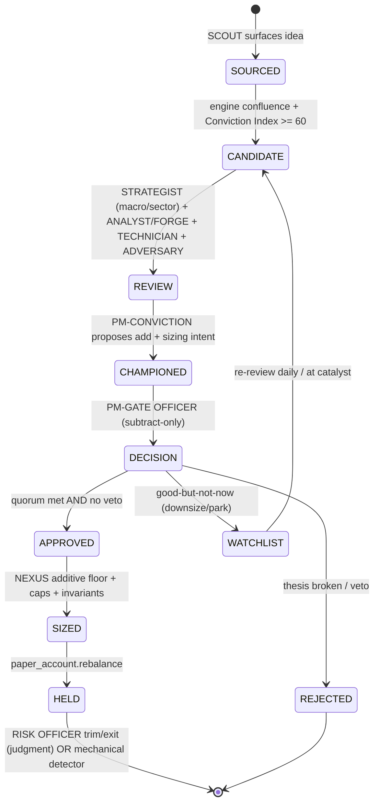

# Chapter 01 — Executive Summary, Design Philosophy & Diagnosis

## 1.1 Abstract

The Mastermind Flagship paper book today operates as a two-gate **auto-buy** machine: a regime-level rebuild trigger (`brain/gate.py:should_run`) opens the nightly book build, the **Conviction Index** (`round(0.5*engine_score + 0.5*research_score)`, `research_paper.py:127`) must clear **60**, and the moment both gates pass, `bot/phase2.py` underwrites a FORGE paper, sizes the name, and `paper_account.rebalance()` **buys it immediately at the live price**. No seat on the desk performs the human-analyst job of judging the *whole market* — sector rotation, baskets, breadth, crowding, short/medium-term technicals, price impulse — or **entry timing for this name right now**. Nor is there a judgment-based *exit*: held names are released only by mechanical detectors (D5 time-stop, hard vetoes, caps, hysteresis). This redesign converts a passing score from an **auto-buy into mere CANDIDACY**, then routes every candidate through an institutional review desk governed by **separation of powers** and **subtract-only safety**: SCOUT sources, MACRO STRATEGIST confirms the backdrop is supportive *now*, ANALYST/FORGE underwrites, TECHNICIAN rules on the chart, ADVERSARY/SENTINEL tries to break it, PM-CONVICTION champions, and PM-GATE OFFICER holds final APPROVE/VETO/WITHHOLD authority. An add requires a **quorum** of positive sign-offs and no Gate-Officer veto; good-but-not-now names are **parked on a first-class WATCHLIST**, never force-bought, never blown to cash. RISK OFFICER/EXIT MANAGER layers daily falsifier checks atop the mechanical detectors. Every decision — add, veto, withhold, size, trim, exit, watchlist promotion — is logged as a falsifiable, gradable thesis, graded leakage-free versus SPY, and fed back through per-role calibration, KPIs, attribution, reputation, and **self-mirror** memory, with a weekly CIO/META-PM tuning role influence *only* past statistical-significance thresholds.

## 1.2 Mission — What "Execution Perfection" Means

Investing here is treated as serious work with no room for errors. "Execution perfection" is not a single metric; it is the conjunction of four gates and one loop, each of which is presently unowned or under-owned:

| Pillar | The question it answers | Owned today by | Owned in the target desk |
|---|---|---|---|
| **Right name** | Is the underlying thesis sound, fairly valued, viable? | FORGE + engine confluence (exists) | ANALYST/FORGE, MACRO STRATEGIST |
| **Right time** | Should we enter *this name right now*, stage a starter, or wait? | **nobody** (catalyst gate only scales size, never blocks — `conviction.py:168-173`) | TECHNICIAN + MACRO STRATEGIST |
| **Right size** | How much, given conviction, caps, concentration discipline? | deterministic engine (`size_mult`, `name_cap=0.08`, `SECTOR_MAX_FRACTION=0.50`) | NEXUS (additive floor) + PM-CONVICTION (intent) + PM-GATE OFFICER (subtract) |
| **Right exit** | Has the thesis been invalidated; should we trim/exit *on judgment*? | **nobody** (only mechanical D5 time-stop, hard vetoes, hysteresis) | RISK OFFICER / EXIT MANAGER |
| **The loop** | Did each decision-type prove correct, and who was miscalibrated? | partial (`outcomes`/`scorer`/`calibration`/`predictions`/`shadow_books`) | the GRADER/CALIBRATION engine + CIO/META-PM |

Execution perfection means all five hold simultaneously, every decision is **falsifiable** (a probability, a check-by date, and an explicit invalidation condition), and **no behavior changes on noise** — a grade alters the desk only after it clears effective-n and MIN_N significance gates.

## 1.3 Design Philosophy — The Spine of the System

Seven principles, each binding and each mapped to a concrete mechanism. They are the load-bearing constraints every later chapter must honor.

### 1.3.1 Separation of powers
Distinct seats hold distinct, non-overlapping mandates. No single seat may both **pump size** and **approve** it. PM-CONVICTION may champion a name and state target sizing intent but **cannot self-approve**; PM-GATE OFFICER holds the only APPROVE/VETO/WITHHOLD authority and is structurally barred from sourcing or pumping. This is the organizational generalization of the existing **SENTINEL blindness** invariant (`brain/committee.py:44-127`, proven `test_committee.py:52-61`): an adversary that never sees the bull score. We extend that blindness discipline across the whole desk.

### 1.3.2 Subtract-only safety (both gates)
LLM judgment may **only de-risk**. On entry, a seat can REJECT, downsize, or send to WATCHLIST; it can never *force-add* a name the desk did not surface. On exits, a seat can TRIM or EXIT; it can never add to a loser on a hunch. The **deterministic engine (NEXUS) owns the additive sizing floor** and enforces caps, no-leverage, no-broad-ETF, and quorum. This generalizes the existing committee invariant (`committee.py:9`, enforced 139-146): `forge_confirmed==False → drop`, no rescue.

```
                 LLM judgment  ──can move──>  size DOWN / veto / park / trim / exit
                 LLM judgment  ──CANNOT──>    size UP / force-add / rescue a loser
                 NEXUS engine  ──owns──>      additive floor, caps, quorum, invariants
```

### 1.3.3 Confirmation over prediction
We cannot time ignition; we detect what has already turned. Every decision is falsifiable and probabilistic: a stated probability, a check-by date, and the specific condition that proves it wrong (`falsifier.check.kind=="rel_return"` makes it gradable via `brain/outcomes.py`). The TECHNICIAN's "enter now" is itself a confirmation call — base/breakout confirmed, RS confirmed — not a prophecy of the next tick.

### 1.3.4 Concentration for alpha
The alpha book holds few, high-conviction names — not "too many random things." Enforced by position-count discipline, the **no-broad-ETF mandate** (sector ETFs enter *only* via the separate Leadership sleeve, `phase2.py:193-209`, never the conviction sleeve), a **min-conviction floor** (≥60 new / 56 held), and the existing caps (`name_cap=0.08`, `SECTOR_MAX_FRACTION=0.50`). PM-CONVICTION argues *for* concentration into best ideas; PM-GATE OFFICER owns the discipline that prevents diffusion.

### 1.3.5 Watchlist as first-class state
A name that is right but not right *now* is **parked, not dropped and not force-bought**. The WATCHLIST is a real, persisted state re-reviewed daily and at anticipated catalysts (earnings `next_date`, options `gamma_flip`/expected-move windows). This closes the structural hole where today a non-buy simply vanishes from the build.

### 1.3.6 Accountability / learning loop closes on every decision type
Add, veto, withhold, size, trim, exit, and watchlist-promotion are **all** logged as falsifiable theses and graded leakage-free versus SPY (`rel_return` over a 21-bday horizon, both legs anchored to last close ≤ entry). Grades feed per-role calibration, KPIs, attribution (Brinson allocation/selection/interaction), reputation, and **self-mirror** memory injection — each role sees its own graded track record in its daily prompt.

### 1.3.7 Honesty over alpha
We never claim to know more than the market. **n=1 is noise.** No grade changes desk behavior until it clears `effective-n` (date-clustered, non-overlapping ~21-bday observations), `MIN_N=12` cold-start inertia, and shrinkage. The calibration multiplier `max(0.5, min(1.0, reliability/mean_conf))` can only *shrink* a seat's confidence, never inflate it, and is inert below MIN_N.

## 1.4 The Diagnosis

### 1.4.1 The trigger event — and why it is, by itself, noise
The autonomous **US Brain** outperformed the **Flagship** on **one day**. Per Honesty-over-Alpha this is **statistically meaningless** and must be treated as noise: a single sample cannot reject any hypothesis, and we explicitly refuse to redesign on it. The individual committee artifacts that surfaced — **IREN** (06-18), **KMT**, **FSS** — are **anecdotes, not evidence**, and this document forbids overfitting to them as named case studies. They are cited only as *existence proofs* of a structural gap, never as a sample to be optimized against.

> **Rule (binding on all chapters):** No threshold, weight, or mandate in this redesign may be tuned to make IREN/KMT/FSS or the one-day result come out "right." Tuning is permitted only against statistically significant, date-clustered track records.

### 1.4.2 The durable structural flaw (independent of the result)
Even setting the one-day result aside entirely, the Flagship has a real, durable defect: **passing the two gates IS an automatic buy.** The build path is mechanical end-to-end:

```
gate.should_run  ──run──>  conviction.build  ──confirmed (≥60, viability≠avoid, recommend)──>
   confirmed_sized  ──committee (subtract-only)──>  book verdict "add"  ──>
   position_log.update  ──>  paper_account.rebalance  ──BUYS AT LIVE PRICE NOW──
```

At no node does any seat judge the holistic, top-down, *right-now* picture:

| Judgment a human PM performs | Where it lives in the Flagship today |
|---|---|
| Whole-market / regime read at entry | gate.py uses regime only to decide *whether to rebuild the whole book*, not to vet a name |
| Sector rotation / leadership / baskets | not consumed at entry (Leadership sleeve is separate, equal-weight ETFs) |
| Breadth / divergences / crowding | available in `bot_mcp.get_divergences`/`get_intel_hub` — **no seat reads it at entry** |
| Short/medium-term technicals, RS, impulse | available in `get_fundamentals` tech block (`pct_vs_50dma`, `pct_vs_200dma`, `rsi14`, `off_52w_high_pct`) — **no seat reads it at entry** |
| Catalyst/anticipation timing | `get_anticipation` exists — only the size-scaling catalyst gate touches it, and it **never blocks a buy** |
| Entry timing for THIS name NOW | **nobody** |
| Judgment-based exit | **nobody** (only mechanical detectors) |

The only timing-adjacent voice is **SENTINEL**, and it is structurally inadequate for the job: (a) it is macro/portfolio-fit only — it sees no chart; (b) it is frequently **not run** (no LLM available → defaults to CONFIRM at full size); and (c) it is subtract-only at the *thesis* level, not a timing veto. The committee record bears this out: the single instance of any timing commentary was SENTINEL flagging contracting liquidity on one name — the desk **bought it anyway at 66%**. Other names received **zero** chart or timing scrutiny. The pipeline is constitutionally *thesis-quality-focused*; **entry timing is not a scored dimension anywhere**, and neither is judgment-based exit.

### 1.4.3 How the autonomous brain implicitly did the missing job
The autonomous US Brain is a free-form Opus paper book: a single reasoning pass holds the regime, sector picture, and name in one context and *implicitly* performs the holistic read — it can decline to buy a good name in a hostile tape, or wait. It is not better because it is smarter; it is differently structured. It fuses top-down and timing judgment that the Flagship's pipeline has *factored out and then never reassembled*. The Flagship's strength — explicit separation, deterministic sizing, gradability — is exactly what makes it omit the holistic call. The redesign keeps the Flagship's rigor **and** restores the holistic judgment as *explicit, separately-graded seats*, rather than collapsing back into an ungradable single pass.

### 1.4.4 The two faulty assumptions, named
1. **"Good on paper" == "buy now."** A high Conviction Index certifies the *thesis*, not the *entry*. The build treats them as identical; they are not.
2. **The engine/research scores are infallible.** `engine_score` and the deterministic `research_score` (and even an LLM-emitted one) can be **miscalibrated**, and today there is **no holistic override** — no seat may say "the number is high but the setup is wrong, withhold." The 50/50 blend (`combined = round(0.5*engine_score + 0.5*research_score)`) is a fixed, untuned weight with no human check on either input at decision time.

## 1.5 The Thesis of the Redesign

**Convert gate-pass into CANDIDACY, then run an institutional review before committing capital.** The new entry state machine:



The thesis in prose:
1. A passing score makes a name a **CANDIDATE**, not a buy.
2. **MACRO STRATEGIST** confirms the regime/sector/rotation/breadth/crowding backdrop is supportive *now*.
3. **ANALYST/FORGE** underwrites the thesis, fair value, viability, falsifier, check-by.
4. **TECHNICIAN** rules on the chart: **enter now / staged starter / wait-for-setup**.
5. **ADVERSARY/SENTINEL** (broadened beyond macro/portfolio fit) tries to break it; may argue REJECT/WITHHOLD.
6. **PM-CONVICTION** champions inclusion and states sizing intent — but cannot self-approve.
7. **PM-GATE OFFICER** holds final APPROVE/VETO/WITHHOLD, subtract-only on entries.
8. An add requires a **quorum** of positive sign-offs **AND** no Gate-Officer veto; **NEXUS** then owns the additive sizing floor and enforces caps/no-ETF/no-leverage.
9. Good-but-not-now → **WATCHLIST** (first-class, re-reviewed, never force-bought, never blown to cash).
10. A **judgment EXIT layer** (RISK OFFICER) lays daily falsifier checks atop the mechanical detectors.
11. Everything is wrapped in an **accountability loop**: KPIs, attribution, reward/reputation, weekly CIO review, and self-mirror memory.

### 1.5.1 Authority matrix (canonical — binding on Chapters 02 and 03)

| Seat | Source | Size UP | Size DOWN | Veto / Reject | Park (Watchlist) | Trim/Exit held | Final authority |
|---|---|---|---|---|---|---|---|
| SCOUT | ✅ | — | — | — | — | — | — |
| MACRO STRATEGIST | — | — | ✅ (down/withhold) | ✅ (withhold) | ✅ | — | — |
| ANALYST / FORGE | — | (states FV only) | — | implicit (viability=avoid) | — | — | — |
| TECHNICIAN | — | — | ✅ (staged starter) | ✅ (wait) | ✅ | — | — |
| ADVERSARY / SENTINEL | — | — | — | Contributes⁵ (REJECT/WITHHOLD) | — | — | — |
| PM – CONVICTION | proposes | intent only | — | — | — | — | — |
| PM – GATE OFFICER | — | — | ✅ | ✅ | ✅ | — | ✅ **APPROVE/VETO/WITHHOLD** |
| RISK OFFICER / EXIT MGR | — | — | — | — | — | ✅ | ✅ (on held only) |
| CIO / META-PM | — | — | — | — | — | — | tunes weights only, **does not trade** |
| NEXUS (engine) | — | **owns additive floor** | enforces caps | enforces invariants/quorum | — | enforces detectors | — |

⁵ ADVERSARY/SENTINEL **contributes** a bear stance; it does not *own* veto authority. NEXUS *enforces* the drop deterministically when SENTINEL fires OPPOSE@conf≥0.6 (matching Ch02 §2.3 footnote 4 / §2.4). The Gate Officer holds the only owned Veto authority.

**Tie-breaks and edge cases (all holes patched):**
- **No LLM available for a seat** → that seat defaults to its **safe/subtract-only** value, never to CONFIRM-full-size. (This corrects the current SENTINEL "no LLM → CONFIRM" default.)
- **Quorum tie / exactly at threshold** → fails closed: a name on the quorum boundary goes to **WATCHLIST**, not APPROVED.
- **Gate-Officer veto with otherwise-full quorum** → veto wins; subtract-only is absolute on entries.
- **PM-CONVICTION sizing intent above the NEXUS engine floor** → advisory only; NEXUS provides the *additive floor* (the minimum authorized size derived from engine sizing, up to `name_cap`). Realized size is capped at `name_cap` and `SECTOR_MAX_FRACTION`; intent may only be *reduced* by downstream subtract-only seats, never raised above engine caps.
- **Held name fails Risk-Officer falsifier but no mechanical detector fired** → judgment exit is permitted (trim/exit only); the two layers are additive, the stricter wins.
- **Watchlist name re-clears all gates at a later review** → promoted to CANDIDATE and re-runs the full funnel; it is never auto-bought on its prior pass.
- **Never to cash:** no path forces the book to liquidate; exits free capital to other candidates/watchlist, not to a forced all-cash state.

## 1.6 Scope

| Book | Treatment under this redesign |
|---|---|
| **Flagship** | Full desk: SCOUT → STRATEGIST → FORGE → TECHNICIAN → ADVERSARY → PM-CONVICTION → GATE OFFICER, quorum + subtract-only, WATCHLIST, judgment exits, full accountability loop. |
| **Heavyweight** (Flagship-subset) | Inherits the full desk by construction (it is a Flagship subset), with the same invariants. |
| **US Brain / CN Brain / HK Brain** | Remain **discretionary** free-form Opus books — *not* converted to the desk — but gain the **accountability loop**, a **RISK/EXIT overlay**, and **self-mirror** memory so their decisions are graded and they learn from their own track record. |
| **Self-Directed** | Manual; receives the accountability/grading loop only (no automated seats). |

The desk is built for the Flagship because that is the book whose *mechanism* — not whose one-day result — is structurally flawed. The discretionary brains already perform the holistic read implicitly; what they lack is *grading and memory*, which the loop supplies.

## 1.7 Forward References

This chapter is the thesis; the build spec unfolds across:

- **Chapter 02 — The Desk: Organizational Structure & Decision Rights:** the constitutional org chart, all per-seat role profiles (mandate/inputs/outputs/rights/tier/cadence/metric), the §2.3 authority matrix, the §2.4 conjunctive quorum, the §2.5 deadlock/tie-breaks, Flagship-vs-Brain-books, and the high-level NEXUS/`committee.py` mapping.
- **Chapter 03 — The Buy Pipeline & Watchlist Subsystem:** the seven-stage idea state machine, candidacy redefined (necessary, not sufficient), the `E_macro`/`E_tech` scores + decision table, concentration mandates (incl. `name_cap`), entry staging, the WATCHLIST subsystem, and the per-stage decision artifact.
- **Chapter 04 — The Sell Pipeline & Risk Officer / Exit Manager:** the Risk Officer mandate, the Exit Thesis written at entry, the mechanical⊕judgment daily review, trim ladder vs full exit, re-entry, the never-blow-to-cash floor, and the exit-grading overview.
- **Chapter 05 — The Accountability & Learning Loop:** the core loop, per-decision-type grading specs + counterfactuals, the mechanisms (calibration multipliers, shadow ablation books, universe predictions, self-mirror), the CIO weekly review, statistical honesty (effective-n, the 2026-07-17 first-resolution window), and cross-book application.
- **Chapter 06 — KPIs, Rewards / Reputation & Credit Assignment:** per-role KPI tables, reward/reputation levers (influence/budget/memory/authority), Goodhart defenses, and the Brinson-style attribution / credit assignment (incl. `brain/attribution.py`).
- **Chapter 07 — Data Contracts, Module Mapping & Phased Build Plan:** storage conventions, all artifact schemas, the role→module map, the `committee.py`/`nexus()` API extension, the scheduler order-of-operations, the phased build plan P1–P6, the watchlist state machine, the grader correctness table, and open questions.
- **Chapter 08 — Failure-Mode Register & Residual Risk:** the core invariants, the failure-mode register that stress-tests them, the phase gates, and defense-in-depth.
